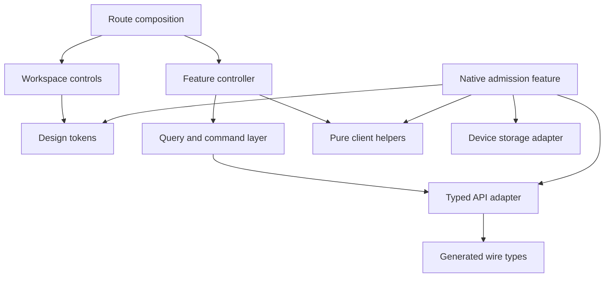
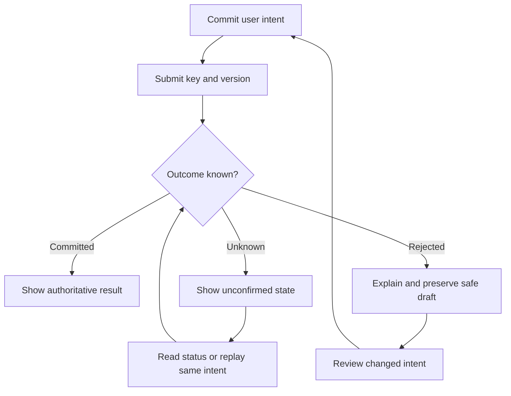

# Event Dynamics — Frontend Design

**Version:** 1.0  
**Date:** 20 September 2026  
**Status:** Frontend design baseline; implementation and user testing remain to be completed.  
**Scope:** Visual foundations, shared interaction standards, accessibility, client architecture and frontend delivery. No individual screen layouts, wireframes or mockups.  
**Delivery agreement:** Follow HLD §22 from Slice 0, the kernel. Design each slice’s workflow, database schema, LLD and screens when building that slice.

**Navigation:** [Start here](#1-start-here) · [Principles](#2-experience-principles) · [Three clients](#3-three-clients-one-product-language) · [Visual foundations](#4-visual-foundations) · [Components](#5-components-and-interaction-contracts) · [Accessibility](#6-accessibility-as-normal-implementation-work) · [Navigation rules](#7-information-architecture-and-navigation-rules) · [Code organization](#8-code-organization-and-dependency-decisions) · [State](#9-state-caching-and-freshness) · [API integration](#10-api-integration-and-command-safety) · [Sessions](#11-identity-permissions-and-session-recovery) · [Realtime](#12-realtime-and-notifications) · [Feature standards](#13-feature-behaviour-standards) · [Native admission](#14-native-admission-and-offline-operation) · [Security](#15-security-privacy-and-data-representation) · [Performance](#16-performance-and-weak-network-design) · [Testing](#17-testing-and-acceptance) · [Delivery](#18-delivery-and-learning-alongside-hld-22) · [Decisions and gates](#19-decision-record-integration-gates-and-document-maintenance) · [Glossary](#20-short-glossary-and-technical-references)

## 1. Start here

### 1.1 What this document gives us

Event Dynamics should feel calm, clear and dependable: a tool an organizer can learn gradually and a temporary staff member can use under pressure. Its public experience should make buying and retrieving a ticket straightforward. Its check-in experience must communicate whether an admission actually succeeded, including when the internet is unavailable.

This document establishes the decisions that should stay consistent as those experiences are built. A **design system** is the shared set of visual values, reusable controls and interaction rules. **Frontend architecture** is how the client code, data and responsibilities are organized. Both are needed: a consistent appearance cannot compensate for misleading payment or admission feedback.

The initial visual direction is **light neutral surfaces, dark readable text and a restrained indigo accent**. Status colours have specific meanings. Typography and spacing create hierarchy; decoration stays secondary. This is a new design decision, not a claim that an existing brand guide requires these colours.

### 1.2 How to read without studying everything upfront

Read §§1–4 first for the direction. Use the rest as a reference when the corresponding work begins.

| When you are working on… | Read here | Then consult the source only where needed |
|---|---|---|
| Kernel/foundations | §§8–11, 17–19 | HLD §§6.3, 8, 22; OpenAPI global conventions |
| Identity and tenancy | §§5–7, 9, 11, 15 | Core §3; FR 1–46; relevant authentication operations |
| Event planning | §§5–7, 9–10, 13.1 | Core §§4–6; FR 47–125 |
| Ticketing and payments | §§10–11, 13.2–13.4 | Core §7; relevant OpenAPI operations; provider gates |
| Admission | §§5.3, 6, 14, 16–17 | Core §8; HLD §§9.3–9.4; NFR §7 |
| Realtime | §12 | AsyncAPI; HLD §11 |
| AI | §13.5 | Core §9; FR 213–243; NFR §11 |
| Billing and reporting | §§7, 13.6–13.7 | Core §§10–11; FR 244–263 |

**At each slice, explain the workflow first, introduce its terms, then design and implement it.** A feature is small enough when its permissions, successful result and important failure paths can be explained and demonstrated together. We do not need every table, class or screen designed before starting the kernel.

### 1.3 Authority and source record

This document owns frontend-specific choices. It references existing business and quality rules rather than becoming a second requirements register. If two source documents disagree, record and resolve the disagreement in the document that owns the rule; do not silently choose whichever is easiest to implement.

| Source | Version inspected | What it owns |
|---|---|---|
| Product brief | Revised MVP Brief v2.1 | Product intent and scope |
| Finalized functional requirements | 263 numbered requirements; supplied file `85d7aaa1-e900-4fb2-96d4-e7031bac4d2c.md` | Required capabilities and actor boundaries |
| Non-Functional Requirements | `Event-Dynamics-NFRs-v1.0.md` | Quality, security, accessibility and measurement targets |
| Core Entities and Domain Integrity | `Event-Dynamics-Core-Entities-v1.1.md` | Domain meaning, relationships, states and invariants |
| HLD | `Event-Dynamics-HLD-v1.3.md` | System architecture, critical flows and §22 delivery order |
| Technology Stack | `Event-Dynamics-Technology-Stack-v2.2.md` | Existing technology choices and repository shape |
| REST API | `event-dynamics-openapi.yaml`, v0.2.0, including retention/awaiting-input updates | Endpoints, schemas, credentials, headers and errors |
| Realtime API | `event-dynamics-asyncapi.yaml`, v0.2.0 | SSE authentication, messages, replay and recovery |

The earlier `Event-Dynamics-FRs-and-NFRs.md` extraction is not the authority for the finalized FR numbering. The eight reviewed ADRs remain part of the architecture baseline; this frontend work consumes their reconciled decisions through HLD v1.3 and Stack v2.2 and does not claim a new independent ADR review.

**Inherited** means an existing source decides the behaviour. **FE decision** means this document settles a frontend choice. **Gate** means a named issue must be resolved before its affected feature can ship. No gate below blocks unrelated kernel work.

## 2. Experience principles

| Principle | Consequence for implementation |
|---|---|
| Show the truth | “Saving”, “saved” and “we could not confirm” are different states. A timeout is not proof of failure. |
| Make context obvious | Display the current organization and event where work depends on them. Confirm the target in consequential actions. |
| Make ordinary work learnable | Use task-oriented names and progressive disclosure: show common options first, reveal advanced options when relevant. |
| Make important consequences reviewable | Explain affected records, people, money and reversibility before committing a consequential action. |
| Make AI optional | Every normal AI-supported action has a standard manual path. AI failure must not block permitted manual work. |
| Work with limited connectivity | Keep pages small, preserve safe in-progress work and explain network uncertainty. Only approved native admission gets offline mutation. |
| Make access part of the experience | Show actions and information appropriate to current scope without exposing hidden records through counts, search or explanations. |
| Prefer consistency over novelty | Reuse terminology, control behaviour and status meanings across features. |

**Different users need different emphasis.** Organizers need relationships and consequences; team members need permitted assigned work; purchasers need price and delivery confidence; attendees need their own ticket; gate staff need unmistakable decisions. A single dense interface for everyone would undermine these needs.

## 3. Three clients, one product language

### 3.1 Preserve the accepted boundaries

| Client | Existing technology | Responsibility | Boundary |
|---|---|---|---|
| Public storefront | Astro | Public event/programme content, ticket selection, checkout, scoped order/ticket access | Public content and private credential-based views have separate caching rules. No organizer bundle. |
| Organizer workspace | Vite + React + TanStack Query | Organization/event administration, planning, permitted live operations, AI, reports and billing | Authenticated web application. No general offline editing or offline admission engine. |
| Installed check-in app | Expo / React Native | Device preparation, QR/manual admission, local durable records and sync | Native iOS/Android client with separately tested storage, camera and recovery. |

The same person may use several clients. This does not merge their credentials or permissions. Buying a ticket creates no team access. External event staff can enter their authorized event without becoming organization members.

### 3.2 What is shared

Share generated API types, portable formatting, token values and carefully tested pure helpers. A **pure helper** transforms input into output without reading a database or calling a service. Share behaviour contracts and terminology even when the visual components differ.

Workspace web components remain in `packages/design-system`. Astro uses its own light HTML/components; native uses native components. Do not import the workspace component barrel into the storefront or attempt to render DOM controls in the native app. Consistent tokens do not require identical pixels or identical component code.

Astro’s islands allow selected parts of a page to become interactive independently. Use that capability where interaction needs it; do not assume a framework alone proves the payload budget. [Astro islands documentation](https://docs.astro.build/en/concepts/islands/).

### 3.3 Rendering and delivery

Public event descriptions and published programme content use cacheable HTML with explicit publication invalidation. Dynamic inventory is fetched separately. Never inject attendee names, order status, secure-link tokens or draft programme content into publicly cached HTML.

Workspace uses route-level code splitting: load feature code when needed. Native starts its admission path without waiting for reports, AI or unrelated workspace functionality. Neither web application receives a service worker that queues protected writes in this baseline.

Private storefront views are non-cacheable and authenticate their API reads. Their shells can be public static assets, but user data, credentials and rendered private responses cannot enter shared caches. Search engine indexing is appropriate only for currently published public material.

Within checkout or secure access, keep the authenticated workflow inside one document/island while needed: an ordinary Astro full-page navigation discards in-memory credentials. Do not confuse public multi-page navigation with protected session continuity. Keep public descriptions useful without JavaScript; where ticket interaction requires JavaScript, provide a clear explanatory fallback instead of inert controls. A complete no-JavaScript checkout is not assumed by the present bearer API.

## 4. Visual foundations

### 4.1 Character and hierarchy

**FE decision:** establish one neutral, professional light theme for the first implementation. Prepare semantic tokens for later themes, but do not promise dark mode or organization theme customization for MVP.

Use strong text hierarchy, restrained borders and comfortable spacing. Use surface grouping only when it expresses a meaningful group. Avoid nesting every sentence inside a separate card. In dense operational content, clear alignment and headings should do most of the work.

Indigo identifies primary actions and selection. Green signals successful outcomes; amber signals attention; red signals blocked, destructive or failed states. AI features use an explicit AI label and the normal system—not a separate colour language that makes generated content appear more authoritative.

### 4.2 Colour tokens

A **token** is a named design value. Components use `text.primary` or `action.primary`, rather than scattering raw colour codes across files. One token source generates CSS custom properties for web and TypeScript values for native.

| Semantic token | Initial value | Use |
|---|---|---|
| `surface.canvas` | `#F8FAFC` | Overall background |
| `surface.base` | `#FFFFFF` | Main content and controls |
| `surface.subtle` | `#F1F5F9` | Quiet grouping or read-only background |
| `text.primary` | `#0F172A` | Primary text |
| `text.secondary` | `#475569` | Supporting text; not an excuse for low contrast |
| `border.subtle` | `#CBD5E1` | Decorative separation only |
| `border.control` | `#64748B` | Identifiable input/control boundaries |
| `action.primary` | `#4338CA` | Primary action background, links |
| `action.primary.hover` | `#3730A3` | Pointer hover on primary action |
| `action.primary.pressed` | `#312E81` | Pressed primary action |
| `action.onPrimary` | `#FFFFFF` | Text/icons on primary action |
| `selection.background` | `#EEF2FF` | Selected context, with text and explicit indicator |
| `focus.ring` | `#4338CA` | Visible keyboard focus with surface separation |
| `success.text` / `.background` | `#166534` / `#F0FDF4` | Confirmed success |
| `warning.text` / `.background` | `#92400E` / `#FFFBEB` | Attention or pending review |
| `danger.text` / `.background` | `#991B1B` / `#FEF2F2` | Error/restriction; destructive action uses dark red with white text |
| `info.text` / `.background` | `#1E40AF` / `#EFF6FF` | Informational status |

Only documented foreground/background pairs are approved. Subtle borders do not satisfy essential control-boundary contrast on their own. A focus ring needs a contrasting offset around filled buttons; test the entire rendered indicator. For status fills, pair the text colour with its own pale background, plus an icon and readable label.

Disabled controls use clear text and an explanation where useful; do not make whole panels faint. A disabled appearance communicates inability to act, never a reliable authorization decision.

Track colours are organizer-managed under FR 86. Render them as an accent with the track name, not as unrestricted text/background combinations. Automatically choose a contrasting label colour or fall back to neutral labels. Charts also need labels, patterns or markers when colour alone would be ambiguous.

### 4.3 Typography

**FE decision:** use the system sans-serif stack initially. This avoids a font download and respects platform rendering. Web uses `system-ui, -apple-system, BlinkMacSystemFont, "Segoe UI", sans-serif`; native uses the platform system font with font scaling enabled. A future brand font requires measured layout, language coverage and payload evidence.

| Token | Web size / line height | Intended role |
|---|---|---|
| `type.caption` | 12 / 18 px | Short secondary metadata only |
| `type.small` | 14 / 20 px | Dense supporting content |
| `type.body` | 16 / 24 px | Main text and form input text |
| `type.lead` | 18 / 28 px | Short explanatory emphasis |
| `type.heading3` | 20 / 28 px | Section heading |
| `type.heading2` | 24 / 32 px | Major section heading |
| `type.heading1` | 32 / 40 px | Main heading |
| `type.display` | 40 / 48 px | Rare public editorial emphasis, reduced on narrow widths |

Implement web sizes in `rem`; the table assumes a 16 px browser default, not a forced user setting. Use normal, medium and semibold weights; avoid thin text for operational information. Native values are logical size tokens, not a literal CSS import. Test large system text without clipping or hiding actions.

Use sentence case. Limit explanatory prose to roughly 65–75 characters per line when space permits. Use tabular numerals for comparable counts, money and timers. Technical identifiers may use monospace, but normal names and descriptions should not.

### 4.4 Spacing, shape and motion

| Foundation | Decision |
|---|---|
| Spacing scale | 4, 8, 12, 16, 24, 32, 48, 64 logical units; 2 only for fine alignment |
| Corners | 4 for small labels; 8 for controls; 12 for grouped surfaces; round only for circular controls or genuine status pills |
| Borders | 1 px standard; 2 px where state emphasis needs it |
| Elevation | Mostly flat. Shadow reserved for overlays and floating controls; use borders when shadow would blur hierarchy |
| Focus | At least a clear 2 px ring and 2 px separation where appropriate; never remove without an equally visible replacement |
| Motion | 120–180 ms for simple control transitions; up to 220 ms for overlays; no delay before an admission result |
| Reduced motion | Remove nonessential transitions, shimmer and movement; keep immediate state feedback |
| Icons | One consistent outline vocabulary per runtime; explicit accessible names for icon-only actions; never mix emoji into operational status semantics |

Prefer text labels for uncommon actions. A small visible icon may sit inside a larger target; hit area and visible size are separate. Branding images must never sit behind critical status text or QR codes. Ticket QR rendering uses a high-contrast neutral background, required quiet zone and tested size; no logo overlay, decorative clipping or animation.

Use one dominant primary action per local task group; secondary actions use a neutral outline, tertiary actions use a quieter text treatment, and destructive actions use an explicit destructive label. Reserve persistent elevation for overlays rather than every clickable surface. Separate layers through named tokens (`base`, `sticky`, `overlay`, `modal`, `notice`) with a fixed ordering; avoid arbitrary competing z-index values. These are reusable control standards, not page arrangements.

### 4.5 Responsive behaviour, without screen layouts

Use content-driven layout changes. Initial web test widths are 360, 768, 1024 and 1440 CSS pixels; these are FE test fixtures, not four approved device categories. Core flows must also satisfy WCAG reflow at the equivalent of 320 CSS pixels. A layout breakpoint exists because content needs it, not because a device name dictates it.

On narrow widths, reduce simultaneous columns before reducing text size. Preserve the most important identity, status and next action. Wide optional programme or reporting views need an accessible list/table alternative. Keep pagination, filtering and the current scope available; do not solve narrow space by loading all rows into a long feed.

Sticky controls must respect safe areas, keyboard appearance, zoom and focus. Their exact location belongs to the slice screen design. No sidebar shape, dashboard arrangement or checkout page composition is specified here.

## 5. Components and interaction contracts

### 5.1 Build controls when a slice needs them

The following catalogue defines behaviour, not an instruction to build an entire component library before the kernel.

| Component family | Required behaviour | First likely use |
|---|---|---|
| Button and link | Buttons perform actions; links navigate. Visible label, focus, loading and disabled state; no duplicate submission | Identity |
| Field group | Label, hint, required/optional meaning, input, error association; preserves valid input after errors | Identity |
| Checkbox, radio, switch | Checkbox for independent selection; radio for one of several choices; switch only for an immediate setting with clear save feedback | Identity/settings |
| Status label and notice | Text plus optional icon/colour; local message for local issue, persistent notice for unresolved critical state | All |
| Dialog and confirmation | Named purpose, focus handling, keyboard dismissal where safe, consequence and clear commit/cancel actions | Consequential changes |
| Select/combobox | Native select where sufficient; searchable control only where scale warrants it; keyboard and screen-reader support | Planning |
| Table/list | Semantic headers, named sorting, explicit scope and page selection, useful narrow-width alternative | Planning |
| Disclosure/tabs | Clear expanded/selected state, predictable keyboard behaviour; no hiding required errors | Planning |
| Date/time and money input | Explicit zone/currency; textual input remains available; no silent conversion or float arithmetic | Planning/ticketing |
| Progress and job status | Genuine stage or measurable progress; navigation does not cancel a job automatically | Files/AI |
| Change review | Exact subject, previous/proposed values, consequences, warnings and required approval | Access/planning/AI |
| Admission result | Outcome, mode, relevant permitted ticket identity and next action; success only after required commit | Admission |

**FE decision:** use semantic HTML and CSS Modules for workspace styling, with the shared tokens. Use narrowly imported Radix primitives for difficult workspace widgets such as dialogs or menus; wrap them in our components. Do not implement keyboard interaction from scratch merely to avoid a small dependency. Astro controls use semantic HTML and small scripts; native controls are separate.

Radix supplies accessibility-related behaviour for its primitives, but labels, contrast, composition and application testing remain our responsibility. [Radix accessibility documentation](https://www.radix-ui.com/primitives/docs/overview/accessibility).

### 5.2 Common states

Every data-dependent feature must explicitly decide how it handles these states. Not every feature needs a separate full-page presentation for each one.

| State | User-facing treatment |
|---|---|
| First load | Stable placeholder or concise loading message; no fake zero counts |
| Empty | Explain that no records exist and offer a permitted next action |
| No filter matches | Show active filters and how to clear them; do not imply the event has no data |
| Refreshing | Keep permitted current content with a refresh indication; avoid unnecessary screen replacement |
| Stale/disconnected | State freshness and relevant limitations; never claim cached money/admission totals are live |
| Submitting | Lock the same command against a second submission and show pending feedback |
| Confirmed | Reflect the authoritative result and meaningful next step |
| Unknown outcome | Explain that confirmation is missing; use safe status recovery rather than inviting a new payment/admission |
| Validation failure | Field-specific error and focusable summary where useful; retain other permitted values |
| Forbidden/unavailable | Explain only what the user is allowed to know; avoid revealing concealed resource existence |
| Version conflict | Preserve permitted edits separately and request review against the latest record |
| Partial completion | List completed and incomplete effects; retry only supported remaining work |
| Read-only | Explain the applicable restriction and retain permitted reading/recovery paths |

An operation taking over 300 ms needs visible pending feedback under NFR-PER-15. Short-lived success notices may dismiss; a failure, pending payment, unsynchronized admission or required review must remain findable until resolved. Screen readers need status announcements without repeated noisy updates on every tick.

### 5.3 Exact language matters

| Avoid | Prefer |
|---|---|
| “Something went wrong” alone | “We could not confirm whether this was saved. Check its status before trying again.” |
| “Refunded” for approval | “Refund approved — organizer completion pending” |
| “Refund confirmed” for uploaded evidence | “Organizer reported completion — verification pending”, unless independently confirmed |
| “Payment failed” after timeout | “Payment status is not yet confirmed” |
| “Inside venue” for admission totals | “Unique admissions” or the exact permitted aggregate name |
| “Offline success” with no caveat | “Admitted offline — waiting to sync”, with clear offline limitations available |
| “AI finished” after proposal creation | “Proposal ready for review” |
| “All saved” while one action failed | “3 changes saved; 1 needs attention” |

These are wording patterns, not final screen copy. Never show a raw stack trace or internal error payload. Offer a correlation reference for support when available.

### 5.4 Forms and editing

Use explicit Save for material changes in the initial baseline. Autosave is a later per-feature decision requiring clear saved/pending/error states and a suitable conflict model. Toggling a visible value is not itself proof it has been saved.

Validate easy formatting errors locally, then let the server enforce authority and domain rules. Use native input semantics, sensible autocomplete and paste support. Do not apply a Latin-only name pattern or presume one contact address identifies one person. Phone inputs should support the product’s permitted formats; Sierra Leone may be the sensible initial country selection, but validation must follow the API.

**FE decision:** workspace multi-field forms use React Hook Form with Zod adapters when built. Simple storefront forms need not acquire the same dependency tree. Form schemas map to generated request types and are checked against the API; they cannot quietly invent new required fields. Exact compatible package versions are pinned during setup.

For partial updates: omitted means unchanged, explicit `null` clears a nullable value, and arrays replace the selected set under the API contract. Build an allowlisted patch rather than submitting the complete read object. In a large form, separate the user’s unsaved draft from background-refetched server data.

Before navigation with unsaved work, offer Stay or Discard where technically possible. Browser unload warnings are a best-effort aid, not durable storage. Initial drafts remain in memory. Sensitive drafts do not go into browser storage. Reauthentication can preserve permitted in-memory draft values, then recheck access before displaying/reapplying them.

### 5.5 Warnings, approvals and destructive actions

Planning warnings and hard failures have different controls. A permitted scheduling warning may be acknowledged; an inventory, authorization or financial invariant cannot be bypassed by clicking “Continue”. Readiness approval with warnings must not imply all checks passed.

Consequential confirmation names the target and effect: archive, cancel, delete, approve, publish and reverse must not share a generic “Are you sure?” message. Ask for a reason only where the domain/API requires one. Preserve the server’s required named approver; a modal cannot grant authority.

For batch operations, selection means the explicitly selected records by default. Never infer “all filtered records” from one page’s checkbox. If the API supports a broader batch, its review must show exact scope and outcome semantics before submission.

## 6. Accessibility as normal implementation work

NFR-UX-01 selects WCAG 2.2 AA for controlled interfaces. Apply it from the first real slice, alongside native platform accessibility. A component library or automated scan alone cannot prove conformance. [W3C WCAG 2.2 reference](https://www.w3.org/WAI/WCAG22/quickref/).

| Concern | Implementation rule |
|---|---|
| Keyboard | All web actions reachable and operable; no unintended traps; visible logical focus |
| Navigation | Landmarks, meaningful heading hierarchy, skip link and route-change focus management |
| Dialogs | Name/describe the dialog; move focus in and restore it on close; contain focus only while modal |
| Errors | Associate messages with fields; identify the problem and how to correct it; do not rely on red borders |
| Status | Announce committed/pending/error transitions appropriately; critical admission result visible without audio |
| Contrast | At least 4.5:1 for ordinary text, 3:1 for qualifying large text and essential non-text indicators |
| Zoom/text | Reflow, text resizing, text spacing and native large-font tests without losing controls |
| Motion | Respect reduced-motion preferences; no essential meaning conveyed by animation alone |
| Alternative input | Manual admission lookup; accessible alternative to drag-and-drop; no gesture-only action |
| Authentication | Allow password managers, copy and paste; do not add a memory puzzle as a login requirement |

**FE decision:** target at least 44 × 44 CSS px for ordinary touch controls and 48 logical units for primary native admission controls. This is our usability baseline, not a claim that WCAG AA requires 44 px everywhere. WCAG 2.2’s minimum target criterion uses 24 × 24 CSS px with specified exceptions. Any dense control below our default needs an accessible hit area and explicit review. [W3C target-size explanation](https://www.w3.org/WAI/WCAG22/Understanding/target-size-minimum.html).

Sticky banners, overlays and the software keyboard must not entirely cover focused controls; aim to keep them fully visible. Test this after actual screen composition. [W3C focus-not-obscured explanation](https://www.w3.org/WAI/WCAG22/Understanding/focus-not-obscured-minimum.html).

Use VoiceOver and TalkBack on actual supported devices for admission. Scan results need a predictable reading order and controlled announcements. A permission denial for camera, disabled audio or unavailable haptics must leave a usable visible/manual path. Do not ask for unrelated device permissions.

## 7. Information architecture and navigation rules

### 7.1 Context before navigation

| Context | What it can organize |
|---|---|
| Personal account | Profile, preferred timezone and account sessions |
| Organization | Accessible events, members, organization settings, approved company knowledge and permitted billing |
| Event | Planning, team responsibilities, logistics, ticketing, live operations and event-scoped AI/history |
| External event membership | Only the invited event and permitted account functions; no forced organization directory access |
| Purchaser order grant | That order and capabilities explicitly granted to its purchaser |
| Attendee ticket grant | That ticket and its permitted actions; no sibling orders or purchaser financial details |
| Native device/operator | Registered installation, current operator, selected event, authorized gate/area and admission mode |

Feature groupings guide discoverability but do not prescribe a sidebar or screen inventory. Permission-aware navigation hides concealed areas. For a visible area where a user cannot act, show read-only content and a safe reason where helpful. Do not clutter interfaces with every possible disabled feature.

### 7.2 Routing decisions

**FE decision:** use React Router in the Vite workspace, Astro’s routing for the storefront and Expo Router for the native app. Workspace route composition and data fetching remain distinct: TanStack Query owns reusable server data. A routing library maps URLs to application views; it is not an authorization engine. [React Router routing documentation](https://reactrouter.com/start/declarative/routing).

Proposed frontend route namespaces are `/account/...`, `/organizations/:organizationId/...` and `/organizations/:organizationId/events/:eventId/...`. Public event/order/ticket routes are separate within the storefront. These are client conventions, not new API endpoints; exact feature routes are designed in their slices. Use browser history routing, not hash routing, because credential links already use URL fragments.

Deep links must resolve context and current authority before requesting/displaying private content. An event link must work for external event staff without first calling an organization-members-only route. Preserve a safe local return path after sign-in; never accept arbitrary external redirect URLs.

Store only non-sensitive filter/sort/page choices in URL parameters. Attendee names, phone numbers, emails, secret tokens and sensitive search terms stay out of URLs and telemetry. Opaque resource identifiers are not credentials but still need sanitization in analytics. Back navigation should restore permitted filters and list position. On a new route, update its accessible title and move focus deliberately; avoid shifting focus during a background refresh.

### 7.3 Context switching

Switching organization/event cancels old requests, closes old streams, clears scoped form/selection state and establishes new access before loading its private views. Never flash the previous tenant’s records while fetching the next. An old request resolving late must fail a context-generation check and be ignored.

Unsaved changes get a clear Stay/Discard choice before a deliberate switch. Native operator switching must lock the prior operator’s data and preserve pending encrypted records with their original identity; it cannot reassign them to the new operator.

## 8. Code organization and dependency decisions

### 8.1 Extend the existing monorepo gradually

| Location | Responsibility | Create when |
|---|---|---|
| `apps/workspace` | Routes, feature controllers/hooks, forms and workspace composition | Foundation/identity |
| `apps/storefront` | Astro pages/components, small interactive ticket/access features | Ticketing |
| `apps/checkin` | Native UI, device lifecycle, camera and admission/storage adapters | Admission |
| `packages/shared-types` | Generated wire types from the authoritative OpenAPI | Foundations |
| `packages/design-tokens` | Source values and web/native outputs | First frontend setup |
| `packages/design-system` | Workspace web controls and their behaviour examples | As needed |
| `packages/api-client` | FE addition: typed transport and error/header handling with runtime adapters | First API integration |
| `packages/client-core` | FE addition: small pure money/time/status helpers that actually have several consumers | On demonstrated reuse |
| `packages/kernel` | Existing optional backend kernel package | Kernel design; never import server infrastructure into clients |

Do not create empty packages to match a diagram. `client-core` can begin inside an application; extract it when reuse is real. A single repository does not mean every package is safe to ship to browsers. Database access, provider keys, signing keys and backend authorization enforcement remain server-only.

Within a workspace feature, keep its view composition, queries, command handlers, draft mapping and tests close together. Shared components must not import feature internals. Features communicate through explicit public exports or parent composition, not private files in another feature.

This is a dependency diagram, not a screen layout. Native storage is intentionally separate from the general query cache.

### 8.2 Small, explicit dependency set

| Area | Baseline choice | Reason / limit |
|---|---|---|
| Web styling | CSS Modules + semantic tokens; Astro scoped styles | Small dependency surface and inspectable CSS |
| Difficult workspace widgets | Radix primitives behind our wrappers | Reuse interaction behaviour; application still owns accessibility testing |
| Workspace routing | React Router | Explicit routes and nested context without replacing Vite |
| Native routing | Expo Router | Fits the selected Expo runtime; device access checks stay separate |
| Server state | TanStack Query in workspace; native for ordinary online reads where useful | One cache owner; not a durable admission queue |
| Forms | React Hook Form + Zod for workspace multi-field forms | Local draft state and useful field errors; API remains authoritative |
| Wire types | `openapi-typescript`; typed fetch adapter | Generate from OpenAPI rather than duplicate response interfaces |
| SSE | Shared protocol parser with platform-specific streaming transport | Header authentication and identical replay semantics |
| Global UI state | React state/reducers and small context providers | No Redux/Zustand requirement without demonstrated need |
| Tests | Existing Vitest and Playwright; native harness selected in admission slice | Test the actual runtime and risky behaviours |

No full dashboard template, rich-text editor, calendar engine, chart library or visual page builder is selected now. Choose a specialized dependency only when a slice’s workflow needs it. Pin compatible stable versions together during repository setup; this document does not infer compatibility from independently current documentation.

Generated TypeScript types help catch compile-time mismatches; they do not validate received JSON or prove server authorization. Critical boundaries require runtime validation and contract tests. [OpenAPI TypeScript documentation](https://openapi-ts.dev/introduction).

## 9. State, caching and freshness

### 9.1 Give each kind of state one owner

| Kind of state | Owner | Lifetime |
|---|---|---|
| Authoritative event, order, membership and job records | Backend; client holds an authorized projection | Refetch/reconcile through REST |
| Workspace server projection | TanStack Query | In memory, scoped to principal and context |
| Unsaved form values | Feature form state | Current permitted editing session |
| Dialog visibility, selection and disclosure | Local component/reducer | Current feature/context |
| Non-sensitive filters/sort | URL when useful | Shareable navigation |
| Browser bearer credentials | Private in-memory credential adapter | Current document/application lifetime |
| Native dataset and pending admission operations | Encrypted local SQLite through its adapter | Per lease/retention/recovery rules |
| Native key and recovery credential material | Platform-protected storage/key facilities | Device security and recovery lifecycle |

Do not copy an entire API record into both a global store and a query cache. Derived display values should come from one explicit mapping function. For independent dimensions—payment, fulfillment, ticket validity, assignment and delivery—preserve the dimensions rather than inventing one combined “status”.

### 9.2 Cache identity and lifecycle

A query key must include enough context to distinguish principal/session generation, organization, event or secure subject, resource, filters and page cursor. Include the known authorization revision where available; otherwise clear/recreate the context on access refresh. Never use a bare key such as `['attendees']` across events.

**FE default:** ordinary workspace queries use `staleTime: 0`, up to five minutes of inactive in-memory retention within the same authenticated context, and explicit invalidation after mutations. These are implementation starting values, not server freshness guarantees. Clear all affected entries immediately on logout, tenant switch or access loss. Do not persist private query data to localStorage, IndexedDB or a service-worker cache.

TanStack Query can refetch on mount, focus or reconnection and has retry defaults. Configure these deliberately; protected queries first pass the access-refresh barrier. Do not let automatic mutation retries or resumed paused mutations submit old work after an access change. [TanStack Query defaults](https://tanstack.com/query/latest/docs/framework/react/guides/important-defaults).

`Cache-Control: private, no-store` governs HTTP storage. An explicitly managed in-memory projection does not turn a private response into cacheable CDN/browser content. Private views must still be removed when authority is lost. Previously viewed information cannot be made unknown to a person.

### 9.3 Freshness classes

| Data | Client policy |
|---|---|
| Published event description | Use server public cache policy; invalidate/revalidate on publication changes; do not add a longer browser TTL |
| Ticket availability | Separate short-lived read; treat as an estimate until reservation succeeds; refetch before commitment |
| Standard workspace records | Scoped in-memory views; refresh on entry/confirmed mutation; realtime invalidation when available |
| Access and commercial restrictions | Refresh on entry/resume/reconnect; server rechecks each protected request |
| Orders, admission and approval eligibility | Current authoritative reads; never infer final state from an old cached result |
| Native offline validation | Only the approved prepared dataset plus valid lease and locally recorded operations |

Cache duration is not the access-revocation mechanism. Connected updates and streams must satisfy NFR-SEC-04’s five-second revocation boundary. Until the dedicated realtime slice is built, earlier development slices may demonstrate REST behaviour, but must not claim that live revocation/freshness acceptance is complete.

### 9.4 Reconnect barrier

On foreground resume or reconnection: disable protected commands temporarily, establish the current credential/context, refresh effective access and important state, reconcile pending outcomes, then re-enable permitted actions. Use an explicit generation counter so responses begun under an older context cannot restore stale data.

The operating system/browser’s “online” indication is only a hint; a reachable network does not prove the API is reachable. A failure to refresh authority keeps protected writes blocked. Native offline admission is a separate bounded mode, governed by §14.

## 10. API integration and command safety

### 10.1 One transport boundary

The typed API adapter handles the configured API origin, credential type, headers, cancellation, response parsing and normalized Problem errors. It exposes status and required response headers, including ETag, Location, Retry-After and X-Correlation-ID. A feature-specific command layer decides what a business outcome means.

Never read provider/database secrets from frontend environment variables. Client build variables are public configuration. Use separate credential adapters for team, checkout bootstrap, order/ticket grant and device recovery. A generic “attach whatever token exists” interceptor risks using the wrong principal.

No feature component constructs an ad hoc API route or bypasses the adapter to simplify a difficult operation. Test multipart uploads and streamed responses separately; neither behaves like ordinary JSON. Handle 204 without trying to parse an empty body as JSON.

### 10.2 Updates with versions

An **ETag** identifies the server version you read. **If-Match** tells the server: apply my change only if that version is still current. Read the resource specified by the operation’s `x-concurrency-resource`, which may be an aggregate rather than the edited child.

The command retains its exact strong ETag, request body and idempotency key. A collection ETag is never an individual record’s version. Missing preconditions produce 428; stale ones produce 412. On 412, preserve permitted draft edits, fetch the latest state and ask the user to review/reapply. Do not automatically resubmit with a fresh ETag, because that can overwrite a change the user never saw.

### 10.3 Retry identity and uncertainty

**Idempotency** means repeating the same logical command does not repeat its effect. Generate one key when the user commits an intent; retain it for retries of that same intent and exact material input. Do not generate a new key per network attempt. Edited input or newly approved preconditions form a new intent after resolving the old outcome.

**FE retry policy:** ordinary safe reads may retry at most twice with exponential backoff and jitter; stop on authentication, authorization and validation failures. Respect Retry-After. Ordinary mutations have no automatic framework retry. Their command handler may perform bounded same-intent recovery when the API supports it. Admission and payment get explicit operation-specific recovery; generic timeout middleware must never turn uncertainty into a second effect.

Browser command identity is held in memory in this baseline. If a full reload loses it, recover authoritative state through known resources/access recovery. Do not recreate an uncertain financial or admission command merely because its in-memory key disappeared. Durable retry identity across reload needs a reviewed storage/recovery design for that slice, not a hidden persistence shortcut.

The API guarantees HTTP replay records for at least 72 hours, not forever. After an unknown or elapsed retention window, recover business state before resubmission; financial/admission domain identities remain distinct from the temporary HTTP replay cache. Aborting a client request stops waiting, not necessarily the server effect.

Recovery attempts are bounded. If the outcome remains unknown, the user receives a stable recovery path and support reference; the diagram is not permission for an infinite retry loop.

### 10.4 Error mapping

| Response / condition | Client behaviour |
|---|---|
| 401 | Stop protected requests; show sign-in/access recovery; no refresh-token loop for an endpoint the API does not define |
| 403 | Explain a forbidden action only within visible scope; refresh access if it may have changed |
| 404 | Generic unavailable/not-found treatment; do not disclose cross-tenant existence |
| 409 | Inspect Problem `code`: in-progress waits/rechecks; idempotency conflict stops; changed offer/policy requires fresh review |
| 410 | Treat by operation: expired list cursor restarts pagination; expired grant needs recovery; never erase data indiscriminately |
| 412 | Version conflict and fresh review |
| 422 | Map field errors; retain permitted inputs; use a summary for unmapped errors |
| 428 | Block and report missing precondition; fetch required version before a new reviewed command |
| 429 | Respect retry timing and show a wait state; no aggressive background loop |
| 5xx / lost response | Distinguish unavailable reads from potentially committed writes; show recovery and correlation reference |
| Malformed/unsupported response | Fail the affected operation safely, report redacted diagnostics; do not treat parse failure as success |

An HTTP 2xx can mean durable job acceptance rather than completed work. A 202 or pending resource needs follow-up. Offline synchronization needs per-item acknowledgement, not merely batch HTTP success.

## 11. Identity, permissions and session recovery

### 11.1 Present server decisions; do not recreate authority

Use `getEffectiveEventAccess` for the current event’s permission/scope snapshot. It supports external event members. Organization-only access still follows its specific API checks; do not invent an organization effective-access endpoint because the event endpoint exists.

A permission-aware component can hide a button, but every API operation remains server-authorized. A UI “can edit” value cannot establish record-level scope, override ownership restrictions or authorize a stale approval. When a required field or capability is unavailable, do not guess from a role display name.

Aggregate counts, lookup suggestions, notification previews and related-record labels must all use filtered server projections. Receiving sensitive data and then hiding it in the browser is already a disclosure. Form defaults and debug tools must not retain fields the current actor cannot read.

### 11.2 Current session contract and its consequence

**Inherited:** browser bearer credentials live in memory. OpenAPI v0.2.0 defines sign-in and session revocation, but no browser refresh-token or cookie bootstrap flow. Therefore a hard reload/new document does not automatically regain a team session. The maximum server session lifetime is not a promise of browser persistence.

**FE baseline:** workspace navigation stays within the SPA while the session lives; a hard reload requires sign-in again. Secure order/ticket access can be recovered by reopening a valid emailed grant or requesting access recovery. Use ordinary passwords only during the explicit authentication request; never preserve passwords to simulate session restoration.

This is a usability cost, not a hidden implementation detail. Before completing Slice 1, test the reload/resume behaviour with the user journey. If durable browser sign-in is required, amend the API/security design explicitly—such as a reviewed HttpOnly-cookie bootstrap with its CSRF/origin protections—before implementing it. Do not quietly move bearers to localStorage/sessionStorage or claim an unimplemented refresh endpoint exists. Gate FE-G01 records this decision point.

### 11.3 Credential links

Use a minimal first-party link landing path. Capture the credential from the fragment, remove the fragment from visible browser history promptly and exchange the secret in the specified redacted POST body. Do this before analytics/error tooling can capture location. No third-party scripts on credential-entry or ticket-credential views.

The fragment is not a routing namespace. On exchange failure, keep the secret only in memory for the current recovery attempt; a reload can require reopening the source link. Render only the returned subject and capabilities. A ticket grant must never unlock its parent order’s sibling tickets or financial information.

Account verification, membership invitations, password recovery, checkout sessions, emailed access grants and QR credentials have different purposes and lifetimes. Do not use one general “token expired” recovery action that sends users to the wrong flow. Do not decode an opaque bearer or QR to infer permissions.

### 11.4 Logout, access loss and multiple tabs

Revoke the server session when reachable, clear local credentials/private queries/drafts, close streams and return to a safe unauthenticated context. If offline, local sign-out can complete, but do not claim server revocation was confirmed. Other tabs may receive a same-origin logout/context invalidation notice without sending credentials through that channel; every tab still relies on server enforcement.

On permission revocation, stop further fetches and remove inaccessible views. Pending local edits are no longer displayable merely because they were previously loaded. In-memory drafts can survive only where access remains permitted after reauthentication. Browser back/forward restoration must recheck access before showing a restored protected view.

Native recovery data is the exception to ordinary cache deletion: logout locks it and stops admission, but cannot delete unsynchronized encrypted records or the material needed for the authorized recovery path. The native slice must verify storage-key survival and operator boundaries explicitly.

## 12. Realtime and notifications

### 12.1 Match the existing SSE contract

SSE is a server-to-client update stream; commands still go through REST. OpenAPI defines the handshakes and AsyncAPI defines messages. Use fetch-based streaming with Authorization and Accept headers, not a credential in the URL or browser EventSource with an imagined custom-header option.

A platform adapter must prove streaming on the chosen native runtime. If native streaming is unsupported, bounded polling is a disclosed temporary/degraded mode, subject to freshness tests; do not declare parity without evidence. No new WebSocket transport is introduced.

Messages announce that records changed. Fetch the current authorized REST view; do not merge partial messages into a supposedly authoritative record. Deduplicate by `messageId`, coalesce repeated invalidations and ignore older record revisions. A liveness/control message is not a business change and does not advance the durable cursor.

The parser handles UTF-8 characters split across transport chunks, complete SSE frame boundaries, multiline data and comment heartbeats. Validate message type/schema before processing; malformed events trigger safe resynchronization, not arbitrary application dispatch. Unit-test framing independently from network reconnection and REST invalidation.

### 12.2 Connect without missing changes

1. Resolve current access while protected actions are disabled.
2. Open the scoped stream and buffer notices.
3. Refresh the relevant REST state.
4. Process buffered invalidations by fetching current projections; keep the newer revisions.
5. Re-enable permitted actions when required state and access are current.

This ordering avoids a change slipping between a REST read and a later subscription. A scope/context change discards the old stream and buffer.

Retain the last durable cursor per stream scope in memory. Send Last-Event-ID on reconnect. On `stream.resync_required`, discard it, close/reopen and perform the full authorized refresh; never silently skip a replay gap. Adopt the contract’s bounded buffer of 1,000 messages or 1 MiB and reconnection backoff of 1–30 seconds with jitter, respecting Retry-After. Stop on 401/403. Cursor persistence across reload is optional because a fresh REST refresh is required anyway.

### 12.3 Useful degradation

If the stream disconnects, say live updates are reconnecting. Keep still-permitted displayed data labelled with freshness and expose a refresh path. Poll only active relevant resources with bounded backoff; calibrate intervals against NFR freshness targets and aggregate load during Slice 7. Stop obsolete polling on route changes/backgrounding. Do not claim a 30-second degraded refresh satisfies a two-second connected freshness target.

An announcement’s dispatch, recipient visibility and email delivery are separate facts. Use persistent in-product history for missed updates. Audio is optional. This design adds no SMS, WhatsApp, native push or background delivery guarantee.

## 13. Feature behaviour standards

These contracts guide later workflow and screen design. They do not define page layouts or replace operation schemas.

### 13.1 Planning, schedules and change review

Show draft versus effective published programme clearly. A saved private edit is not a public agenda update. Publication requires the current server review/validation and authority. A client must not copy working sessions directly into public views.

Keep event lifecycle, publication, sales state, archive state and readiness separate. “Pause event” and “pause sales” must disclose the actual affected capability. Archive is not deletion. Keep access status, invitation/participation and work duty status distinct as well.

Change review identifies direct edits, affected dependencies, warnings, cost effects and notifications. Link only to records the user can read. Do not conceal unresolved conflicts behind a green “ready” score. Budget and expense presentations use server totals with partial payments reflected; unknown provider charges do not become zero.

### 13.2 Checkout and secure ticket access

Public availability can be stale; the server reservation decides inventory. Show current prices, currency, quantity and required policy versions for review. When an offer or policy changes, obtain renewed confirmation rather than silently accepting the new total. Keep required acknowledgements separate from optional marketing consent, which begins unselected. Purchaser consent does not automatically mean attendee marketing consent.

The hold countdown derives from server expiry and a server-time anchor; timers only display an estimate. Re-evaluate after suspension/resume. Reaching zero does not prove a payment failed or authorize creating another order. Payment review can outlive the hold.

Free and paid orders use distinct confirmation paths. `createOrder` creates the reservation and scoped access; it does not itself issue free tickets. The free-confirmation command must commit before showing usable tickets. Paid tickets wait for trusted server confirmation and fulfillment. Never manufacture a QR or success state from a provider redirect parameter.

Preserve deferred attendee assignment and the server’s assignment deadline/rules. Keep ticket access usable when the public event page is paused, where the grant remains valid. Public programme visibility never authorizes private session or attendee data.

### 13.3 Payment handoff and return

**FE baseline:** keep the Event Dynamics order context in its original tab when a permitted provider handoff can open separately. Offer an explicit user-activated payment link rather than relying on an automatic popup after an asynchronous response. Use an opener-isolated external context; never expose the bearer to the provider. The original page follows authoritative order status.

Mobile/provider behaviour may navigate the same tab or launch another app. Returning to a new document loses the in-memory bearer under the current contract. In that case, use the order’s secure-link recovery through the verified delivery channel. Order ID alone is not authorization. Explain how to return to tickets without suggesting another purchase.

This recovery is a valid baseline path but not a claim of seamless payment continuity. Gate FE-G02 requires actual provider/mobile return testing before paid checkout ships. If email-based recovery is too slow/unreliable for the acceptance journey, revise the session/return contract explicitly; do not persist bearer credentials as an undocumented fix. Monime wire/provisioning verification remains deferred to payment implementation as agreed.

Keep “payment received”, “tickets issued”, “under review” and “refund work required” distinct. A status recheck does not initiate another charge. An unresolved payment attempt must be reconciled before a new attempt is offered under server rules.

### 13.4 Refunds, cancellations and restrictions

Separate requesting, approving and recording refund evidence. MVP money movement remains organizer-executed in Monime. Approval disables affected tickets according to the domain contract even if money movement later fails. A refund obligation can exist without any issued ticket.

Show evidence provenance: organizer-reported, independently provider-confirmed, mismatch or unverified. Uploading a reference is not proof of provider completion. Display unresolved obligations durably and avoid “Retry refund” wording if the action only rechecks status or records evidence.

Normal cancellation of an admitted ticket needs the required online correction first. Provider restrictions and whole-event cancellation preserve earlier admission history. “Undo check-in” is not a refund or a way to erase evidence.

### 13.5 AI assistance, approval and learning

Keep the manual task path available when AI is declined, disabled, unavailable or out of units. Introducing AI must not make the existing manual route harder to find.

Before a user-initiated job, display estimated units, the explicit maximum authorized spend and applicable pricing version. Do not start paid work merely because text was typed. Distinguish approving the spending limit, approving plan content and approving record mutations.

| AI situation | Required presentation |
|---|---|
| Queued/executing | True stage, queue time and last activity; no invented percentage |
| `awaiting_input` | Ask which permitted record/action was intended; no changes until resolved |
| Research result | Distinguish verified facts, past-event facts, preferences, assumptions and suggestions; inspectable sources |
| Proposal | Exact revision, selected actions, before/after values, affected dependencies, recipients, cost, warnings and reversal limits |
| Changed proposal/dependency | Require updated review when the server invalidates approval |
| Applying/partly applied | Per-action committed, pending, failed or skipped outcome |
| Cancellation | Separate cancellation requested, recorded cancellation and effects already committed |
| Reversal | Describe a new authorized corrective action; never imply deleted history or universal undo |
| Automatic rule | Visible scope, trigger, authorizer, limits and end condition; organization/event pause controls where permitted |

Render AI output as untrusted content. Do not execute returned scripts, arbitrary HTML or proposed API calls from the browser. The server action registry and domain checks control execution. Links in research output need safe schemes and external-link treatment. Generated prose never becomes approval evidence by itself.

Personal organizer memory stays scoped to its organization and user. Promotion to company memory is explicit and reviewed; displaying an AI result must not silently share private memory.

### 13.6 Plans and financial displays

Use server-returned entitlements and prices. Do not hardcode commercial plans, exchange rates or limits in frontend logic. Ticket currency is SLE; platform billing has its own currency rules. Show currency codes and exact amounts without ambiguous dollar symbols.

Parse money input as decimal text into validated integer minor units; never multiply a floating-point input and hope rounding fixes it. Use shared safe-range formatting and overflow checks. Price snapshots already committed to an order remain unchanged by later ticket-type edits.

Plan expiry can make workspace actions read-only; it does not delete records or invalidate valid issued-ticket admission. Do not place an “upgrade required” overlay over every native check-in action or block valid ticket access with a workspace-wide entitlement check.

### 13.7 Files, imports and reporting

Treat uploading, quarantine/scanning, available and failed as separate states. A completed byte upload does not mean the file is ready for viewing/import. Use server-provided allowed types/limits from the contract; enforce helpful early checks without claiming that filename validation secures uploads.

For CSV import, show row validation, uncertain duplicates and the apply result separately. Do not silently merge people based on shared email/phone. For export, show accepted job, generating, ready, expired and failed states; reauthorization may be required at download.

Metrics retain their exact definitions: maximum capacity, expected attendance, valid issued entitlements and actual admissions are different quantities. Re-entries, effective corrections, unnamed admissions and conflicts cannot be folded into one unqualified number. No current-occupancy claim is possible without exit tracking. Tables accompany charts where needed for exact values and accessibility. Public or broad aggregates must not leak restricted financial or attendee information.

## 14. Native admission and offline operation

### 14.1 Separate preparation, authority and reachability

Having downloaded tickets does not authorize admission forever. A registered installation needs the correct operator, event, scope, intact prepared dataset and valid bounded lease. Preparing early is allowed; actual use must meet the lease at admission time.

| Operational state | Allowed behaviour |
|---|---|
| Online/current | Authoritative server admission; show final success only after its commit |
| Prepared offline with valid lease | Local validation and durable operation recording before offline-success feedback |
| Unprepared or invalid dataset | No offline admission; explain preparation or online/manual review path |
| Expired/uncertain lease | Stop new offline admissions; permit the restricted recovery/upload path |
| Reconnecting | Refresh access/restrictions and reconcile outcomes; do not silently treat old local state as current server authority |
| Storage/key/integrity failure | Stop new offline success; preserve recoverable pending data and explain escalation |

Keep current mode, event, operator, gate/area, remaining offline authorization, last sync and pending count discoverable throughout admission. “Connected” is not enough: staff need to know whether the last decision was authoritative online or locally accepted offline.

### 14.2 Every scan is one intentional operation

Generate a stable operation ID before an admission submission/local commit. Repeated camera callbacks for the same presentation must not initiate multiple admissions. Hold the result until the scanner is ready for a new deliberate presentation; a legitimate later re-entry creates a new operation ID. Manual search selects a ticket and calls the same validation path, recording its method.

If an online request loses its response, it may already have committed. Mark that operation uncertain and recover/replay its original identity. Do not immediately create a second offline admission for the same presentation. The exact uncertain-online-to-offline transition, provenance and reconciliation are an explicit Slice 5/6 LLD task; until proven, route that presentation to recovery/staff review rather than promise a fresh success. Subsequent deliberate offline work requires an explicit valid-mode transition.

Offline success requires a completed local transaction. The result remains visually different from server confirmation and explains that other devices’ admissions or recent restrictions may be unknown. A local duplicate check does not guarantee uniqueness across disconnected gates.

### 14.3 Local durability, keys and cleanup

Use encrypted local SQLite via the selected Expo runtime. Plain SQLite persistence is not encryption. Expo documents optional SQLCipher configuration, including the need for a suitable native build; evaluate it in the actual app build, not as an assumed Expo Go capability. [Expo SQLite documentation](https://docs.expo.dev/versions/latest/sdk/sqlite/).

Store small credential/key material in the appropriate protected platform facility. SecureStore is not the admission database and must not be the only recoverability story. Its uninstall/restore and authentication-related availability differ by platform. Test the chosen settings and recovery procedure explicitly. [Expo SecureStore documentation](https://docs.expo.dev/versions/latest/sdk/securestore/).

Lease expiry removes admission authority. It must not destroy the only key needed to read unacknowledged records for recovery. Separate expiring validation data from pending operational evidence and define key lifecycle accordingly. Exclude private payment information and sensitive attendee needs from the prepared dataset.

Install a new dataset atomically only after verifying integrity, identity, scope and version. Preserve pending operations and their original dataset/lease references. A failed refresh must not leave a partially applied dataset active. Keeping an old valid lease temporarily is a security-state decision; known revocation/expiry always blocks admission. Clock rollback or loss of a trustworthy elapsed-time anchor requires online reauthorization under Core §8.6.

Remove expired validation data on the next execution opportunity according to NFR-OFF-07. Unacknowledged admissions survive that cleanup. Do not claim a powered-off phone performs scheduled deletion. Physical device loss, destruction or uninstall before sync can lose unsynchronized evidence; server backups do not cover it.

### 14.4 Synchronization means per-item evidence

Send bounded batches using each original operation ID. A batch ID handles batch retries; it does not replace record identity across regrouped uploads.

| Item result | Meaning for the client |
|---|---|
| `accepted` | Server accepted the occurrence; require durable acknowledgement |
| `duplicate_replay` | Existing preserved result, not a second entry |
| `conflict_recorded` | Evidence preserved with a conflict; still needs its appropriate resolution |
| `rejected_for_review` | Evidence preserved for review if `durablyPreserved` is true; not automatically counted as valid admission |
| Missing result / `durablyPreserved: false` | Keep encrypted pending record and retry/recover; not safe to delete |

Only a corresponding durable item acknowledgement permits removing an item from the pending-upload queue. Keep enough local receipt/history metadata for user feedback and the documented retention policy. An HTTP 200 or “batch processed” does not authorize discarding every pending record.

Display pending count, oldest pending age, last successful sync and separate conflict/review counts. After 24 hours, show the NFR overdue-sync warning. Expired/revoked admission authority can still use the restricted upload recovery credential; this grants no new scanning or dataset-download authority.

Check-in undo stays online-only. Venue free-ticket issuance still needs server capacity protection; offline validation does not become an offline ticket-issuance feature.

### 14.5 Native lifecycle and updates

Do not require an operating system background task to complete a critical sync. Foreground resume and explicit sync are dependable workflow triggers; background opportunities are best effort. Battery, storage, camera permission and interruption states must have tested recovery paths.

Updates may download but must not silently reload an active admission operation or live admission session. Explicit update application requires a safe checkpoint: no uncertain scan, no unprotected pending data and a verified migration/recovery path. Respect the HLD’s live-event constraints. OTA JavaScript must match the installed native runtime; native dependency changes need the appropriate binary/runtime rollout. [Expo runtime-version documentation](https://docs.expo.dev/eas-update/runtime-versions/).

## 15. Security, privacy and data representation

### 15.1 Client security boundaries

Use deployment CSP and restricted origins; avoid inline executable content and unsafe HTML rendering. Escape/sanitize permitted rich content and restrict URL schemes. A frontend dependency or third-party script can read same-page memory, so in-memory tokens do not remove XSS risk. Selective first-party code and content handling are part of the design.

No third-party session replay on checkout, ticket access, sensitive incidents or native admission. Diagnostic events exclude tokens, QR payloads, contacts, payment details, unsaved form values and raw AI content. Redact location before reporting, including URL fragments and sensitive search parameters. Source maps and detailed stack traces belong in controlled diagnostics, not user-visible errors.

Avoid unnecessary clipboard exposure of credentials. User-requested ticket/link copy or download follows its specific permission and explains what is being shared. A temporary download URL is sensitive; never put it into analytics or publicly cached markup.

Private images/files must respect parent permissions on delivery. Do not fetch a hidden attachment just to show its thumbnail. Local query clearing cannot revoke screenshots or previously downloaded files; it can stop future unauthorized access.

### 15.2 Time and number handling

Display schedules in the event’s named timezone by default; label any alternative user timezone. Use `Africa/Freetown` for a Sierra Leone event when applicable, not a hardcoded UTC offset standing in for all timezones. User preference does not rewrite event validity.

Distinguish a local calendar date from an instant. A multi-day ticket’s eligible dates are interpreted in the event zone. Use explicit conversion for submitted date/time fields; test midnight and daylight-saving transitions even though a launch event may not encounter them.

Countdowns use server-derived anchors and elapsed time, recalculated after resume. Browser timers do not extend holds or access. Currency formatting uses validated exact minor-unit values and the declared currency. Do not use locale formatting as arithmetic.

### 15.3 Localization and content

English is the launch interface language. Keep interface strings outside business logic and avoid sentence fragments assembled in an order that prevents translation. Support Unicode names. Use full accessible labels for dates, numbers, abbreviations and technical IDs when the short form is ambiguous.

Write product copy for the task: “You cannot edit this event” is more useful than “authorization resolver rejected mutation”. Technical terms belong in developer notes and support references, not ordinary product flows.

## 16. Performance and weak-network design

### 16.1 Preserve exact measurement boundaries

| Area | Existing target | Frontend design response |
|---|---|---|
| Public ticket selection, initial load | ≤300 KB compressed **HTML + CSS + JavaScript**; ≤200 KB initial visible images (NFR-PER-17) | Astro HTML, selective interactivity, responsive images, no imported workspace bundle |
| Public experience | P75 LCP ≤2.5 s, INP ≤200 ms, CLS ≤0.1 (NFR-PER-14) | Stable dimensions, minimal main-thread work, critical image prioritization and measurement |
| Workspace navigation | Cold P95 3 s / P99 5 s; warm P95 1 s / P99 2 s on M1 | Route splitting, scoped cache and useful first data page |
| Pending feedback | Visible when action takes over 300 ms (NFR-PER-15) | Immediate local response followed by truthful progress |
| Online admission | Decoded payload to visible result P95 1.5 s / P99 3 s on M1 | Small request path; no premature success; camera measured separately |
| Offline admission | Decoded payload to durable record and visible result P95 500 ms / P99 1 s | Indexed local validation, short transaction and responsive native UI |
| Manual search | Useful results P95 2 s / P99 3 s (NFR-PER-04) | Bounded results and indexed search; report typing/debounce separately |
| Prepared native data | 10,000 tickets ≤10 MB compressed; data + 10,000 pending records within 50 MB | Bounded permitted fields, measured indexes, no general workspace cache |

The HLD/Stack summaries sometimes abbreviate the public budget as JS/CSS. The NFR includes HTML; this design uses the full definition without changing its value.

The native 750 KB executable/style budget has an unresolved measurement interpretation in HLD §13.2. Report native binary, compressed JavaScript, update payload and dataset separately. Do not count only a convenient subset and call the NFR passed. Close FE-G03 before offline-client acceptance.

### 16.2 Build budgets into the workflow

Measure the complete initial journey, including code lazily loaded before the first usable interaction. Use build reports to catch dependency growth and browser resource timing to include HTML, styles, images and actual request fan-out. Additional font payloads must be explicitly reported and budgeted if a brand font is introduced; the initial system-font choice avoids this cost.

Load heavy editors/charts only when used; do not choose virtualization from an arbitrary row threshold. Start with bounded pagination and profile actual interaction. Use workers only when measured CPU work justifies the complexity. Resize/compress uploaded public images on the server pipeline; never expect every organizer to upload optimized artwork.

On M2, maintain readable waiting/error states and safe retry behaviour without promising M1 timing. Do not discard an entire form when one request is interrupted. Avoid automatic aggressive polling, autoplay video, ornamental animation and repeated download of unchanged datasets.

These profiles are laboratory fixtures from the NFR, not claims about every connection in Sierra Leone. Acceptance records the actual device, network profile, workload and outcome. Lab Core Web Vitals checks provide prelaunch evidence; field measurements follow once real usage exists.

## 17. Testing and acceptance

### 17.1 Evidence by layer

| Layer | What to prove | Baseline mechanism |
|---|---|---|
| Pure helpers | Exact money conversion, timezone handling, state display mappings | Vitest boundary cases |
| Controls/forms | Keyboard/focus/error semantics, pending state and field mapping | Component tests plus manual accessibility inspection |
| API adapter | Correct credential, ETag, key reuse, Problem mapping and context cancellation | Contract fixtures with network faults |
| Web journeys | Real flows, narrow widths, browser history, session loss and recovery | Playwright plus actual browser/device checks |
| Native | Storage commit before success, camera, interruptions, key lifecycle and per-item sync | Native harness and physical-device fault tests |
| System | Concurrency, revocation, provider handling and freshness | Frontend journeys against real backend acceptance environment |
| Usability | First-time organizer and trained temporary-staff tasks | NFR-UX-04 exercises; record errors and repeat after fixes |

Mocked frontend tests do not prove inventory protection, payment correctness, RLS or native disk durability. They verify the frontend’s response to those outcomes. Backend and device acceptance remain necessary.

### 17.2 Risk scenarios to turn into tests in their slices

All statuses below begin **Not implemented / not tested**. They derive from the cited source obligations and this document’s frontend choices; they are not evidence of completed work.

| ID | Scenario and required outcome | First slice / source |
|---|---|---|
| FE-T01 | Slow organization-A request finishes after switching to B; A data never renders in B | 1; NFR-SEC-01; §7.3 |
| FE-T02 | External event member opens an event deep link without organization membership; only allowed event content loads | 1; FR 33; API authorization |
| FE-T03 | Access revoked while editing/streaming; commands stop and inaccessible data is removed; server still denies direct calls | 1 and 7; NFR-SEC-04 |
| FE-T04 | Browser reload loses memory bearer; explicit sign-in/recovery occurs, no fake auto-refresh or storage fallback | 1/3; §11.2 |
| FE-T05 | Sensitive action needs reauthentication; exact intent is reviewed again if relevant state changed | 1; NFR-SEC-08 |
| FE-T06 | Two editors update one record; stale editor receives conflict, keeps safe draft and cannot silently overwrite | 2; API If-Match contract |
| FE-T07 | Write commits but response is lost; same intent retries with same key and body, no duplicate effect | 0 onward; NFR-INT-04 |
| FE-T08 | Draft programme changes; public view stays on effective published revision until authorized publication | 2; Core §5.1 |
| FE-T09 | Final ticket is taken by another purchaser; displayed availability never overrides sold-out reservation result | 3; FR 143–144 |
| FE-T10 | Free order is created but not confirmed; no usable ticket shown until free confirmation commits | 3; FR 150–151; API createOrder |
| FE-T11 | Hold expires during uncertain payment; show review/recovery, never extend timer or claim failure solely from expiry | 4; Core §7 |
| FE-T12 | Payment succeeds but fulfillment is blocked; distinct truthful state, no invented QR | 4; Core §§7.3–7.6 |
| FE-T13 | Provider return enters new document; secure order recovery works without leaking credentials or creating another charge | 4; §13.3 |
| FE-T14 | Ticket-only grant opens sibling/order route; private data not exposed in content, caches or errors | 3; NFR-SEC-09 |
| FE-T15 | Refund approved/reported/confirmed; interface preserves each distinction and disabled ticket eligibility | 4; FR 165–166 |
| FE-T16 | Repeated camera callbacks or double tap; one operation; deliberate later re-entry has separate identity | 5; Core §8.5 |
| FE-T17 | Online scan response lost; no second untracked offline admission for the same presentation | 5/6; §14.2 |
| FE-T18 | Crash after local commit but before feedback; record survives and recovery does not duplicate admission | 6; NFR-OFF-04 |
| FE-T19 | Disk full/local commit failure; no success signal; pending records remain recoverable | 6; NFR-OFF-04 |
| FE-T20 | Two disconnected devices admit one ticket; preserve both occurrences and show conflict after sync | 6; NFR-OFF-05 |
| FE-T21 | Lease expires; new admissions stop, encrypted pending records still upload via restricted recovery | 6; NFR-OFF-08 |
| FE-T22 | Batch response partial/lost; remove only individually acknowledged durable items; preserve the rest | 6; API OfflineSyncItemResult |
| FE-T23 | SSE replay gap/duplicate/out-of-order notice; refresh current state without losing newer revision or leaking old scope | 7; AsyncAPI |
| FE-T24 | AI ambiguous request returns awaiting_input; user clarifies; no guessed record mutation | 9; FR 223 |
| FE-T25 | Approved proposal becomes stale or partly applied; updated review and precise per-action outcome | 9; Core §9.4 |
| FE-T26 | AI disabled/out of units; corresponding permitted manual operation remains available | 8/9; FR 214 |
| FE-T27 | Plan expires; permitted read-only views and valid issued-ticket admission continue | 10; FR 260–263 |
| FE-T28 | Required consent and optional marketing choices remain separate across retry and policy change | 1/3; Core §6.2 |
| FE-T29 | Quarantined upload and expired export; truthful availability, no unauthorized preview/download | 2/10; NFR-DAT-01/05 |
| FE-T30 | 360/320-width, zoom, large fonts, keyboard and screen reader; core actions remain usable and outcomes understandable | Each slice; NFR-UX-01/03 |
| FE-T31 | Reduced motion, no audio and denied camera; visible result/manual alternative still works | 5/6; NFR-UX-01/03 |
| FE-T32 | Expired browser restoration or native operator switch; old private state cannot flash or become another actor’s records | 1/6; §§11,14 |
| FE-T33 | Client diagnostics receive credential/QR/error fixtures; secrets and sensitive values are absent from emitted logs | Each slice; NFR-SEC-11 |
| FE-T34 | Foreground resume during new permissions/restrictions; commands remain blocked until access/state refresh completes | Each slice; NFR-FRE-07 |
| FE-T35 | Native update/dataset migration interrupts preparation; no partial dataset or lost pending admission becomes active | 6; §§14.3–14.5 |
| FE-T36 | Cold public ticket journey includes all needed assets; full HTML/CSS/JS and image budgets are met on measured build | 3/11; NFR-PER-17 |

### 17.3 Definition of done for a frontend slice

The slice has a clear workflow, source references and actual screen design where needed. It uses the current API and permissions; normal, empty, pending, rejected and uncertain paths are implemented as applicable. Its relevant risk scenarios pass. It meets accessibility checks and relevant performance/freshness targets in the stated environment. New dependencies and exceptions have reasons. A short demonstration explains what happened in the UI, request and durable backend/device state.

A visual snapshot match is useful for regression but does not prove meaning, accessibility or correctness. Screens cannot be declared visually approved from this document alone because no screens are designed here.

## 18. Delivery and learning alongside HLD §22

### 18.1 Keep the agreed order

| HLD slice | Frontend contribution when reached | Read here |
|---|---|---|
| **0. Foundations / kernel** | Contract types, transport/error conventions, money/time boundaries and test fixtures; establish tokens/build checks when needed. No customer screen required to prove kernel invariants | §§8–11,17 |
| **1. Identity and tenancy** | First real controls/routes/forms; account/context lifecycle, external-event entry and session recovery; resolve FE-G01 | §§4–7,9,11,15 |
| **2. Event core and planning CRUD** | Add each planning workflow with its schema/LLD/screens; drafts, conflicts, published-state distinction and file handling | §§5,7,10,13.1/13.7 |
| **3. Ticketing core** | Public Astro foundation, ticket selection/reservation, free confirmation and scoped access; measure initial payload | §§3–6,10–11,13.2,16 |
| **4. Payments** | Verified provider handoff, uncertain outcomes, fulfillment, refund evidence and dispute presentation; close FE-G02 | §§10,13.3–13.4 |
| **5. Admission online** | Native base, QR/manual lookup, authoritative results, history, online undo and permitted walk-ins | §§5.3,6,14 |
| **6. Admission offline** | Preparation, lease-aware mode, local commit, durable queue, sync/review and recovery; close device gates | §§14,16–17 |
| **7. Realtime and notifications** | Apply shared stream lifecycle to existing slices; prove connected freshness and revocation | §12 |
| **8. AI foundation** | Cost review, job lifecycle, unit/status visibility and cancellation | §13.5 |
| **9. AI agents** | Planning sections, effect review, proposal approvals, rules and memory with manual parity | §13.5 |
| **10. Billing, dashboards, reports, imports/exports** | Exact metrics, permissions, price/entitlement states and background work | §§13.6–13.7 |
| **11. Hardening and acceptance** | Integrated accessibility, usability, device/network measurements, operational readiness and regressions | §§16–17 |

This preserves the HLD order; it does not postpone accessibility or integrity testing until Slice 11. Each earlier slice tests its own obligations. Complete launch evidence includes the later integrated checks.

Frontends require some cross-cutting foundations earlier than their feature slice: error envelopes, operation identity, versions and access invalidation interfaces. Design those contracts in Slice 0/1; do not implement the full realtime, payments or offline engine there. A targeted technical experiment can retire a high-risk unknown early without moving the entire module ahead of the roadmap.

### 18.2 The repeatable slice workflow

1. **Explain the job:** user, purpose, relevant terms and observable successful result.
2. **Read the minimum:** identify the exact FRs, Core sections, NFRs and API operations needed.
3. **Walk the workflow:** normal path, permission boundary, important failures and recovery.
4. **Design the slice:** database schema, constraints, transactions and LLD; frontend state/data mapping and screens where needed.
5. **Implement a complete small path:** connect interface to authoritative behaviour; then add its required alternatives/failures.
6. **Verify and explain:** run acceptance cases, demonstrate the result and explain why each mechanism exists.

The order within step 4 is iterative: screen interaction may reveal a missing API field; database concurrency may change pending/retry behaviour. Resolve that before calling the slice complete.

### 18.3 One small handoff per slice

Use a short slice note with: purpose; actors and permissions; source references; workflow; data/transaction decisions; frontend states and screen references; acceptance cases; remaining issues. Put detailed schema/LLD material next to that slice. Do not copy entire requirements or this frontend document into it.

Finish with a few concrete learning checks: “Why does this command need an ETag?”, “What happens if its response is lost?”, “Which component owns this data?”, “What proves success?” These questions connect terminology to working behaviour without requiring months of preparatory reading.

## 19. Decision record, integration gates and document maintenance

### 19.1 Decisions introduced here

| ID | FE decision | Main reason |
|---|---|---|
| FE-D01 | Light neutral theme, restrained indigo accent, semantic status colours | Consistent readable starting identity without a brand dependency |
| FE-D02 | System fonts; token-based type/spacing and 44/48-unit touch defaults | Readability, platform fit and smaller public payload |
| FE-D03 | Shared tokens and pure helpers; separate Astro/workspace/native rendering | Preserve accepted runtime and bundle boundaries |
| FE-D04 | CSS Modules and selectively wrapped Radix primitives in workspace | Explicit styling with reusable complex interaction behaviour |
| FE-D05 | React Router / Astro routes / Expo Router | Fit each accepted application runtime |
| FE-D06 | Query cache for server projections; forms/local state for drafts; SQLite for offline evidence | One owner for each kind of state |
| FE-D07 | Typed API adapter with explicit credential classes, keys, versions and Problem mapping | Consistent safe command behaviour |
| FE-D08 | No generic browser offline write queue or private persistent query cache | Avoid silently extending offline scope and sensitive-data retention |
| FE-D09 | Current memory-only browser sessions with honest reload recovery | Honor the existing API until an explicit session amendment is made |
| FE-D10 | Build controls and feature details inside the HLD slices | Support delivery and learning without a speculative complete UI library |

These selections are baseline choices for implementation, not user-tested visual approval. Change a token centrally when justified; change a security/protocol assumption through the relevant source document and tests.

### 19.2 Gates with bounded scope

| ID | Issue | Closing evidence | Needed by |
|---|---|---|---|
| FE-G01 | Reload/session continuity under memory-only browser bearers | Demonstrate and explicitly settle the sign-in/recovery journey; if improved persistence is selected, amend API/auth/security before coding it | Slice 1 completion |
| FE-G02 | Provider/mobile navigation and order recovery | Verified Monime contract plus real return/app-switch/reload tests; no leaked credentials, duplicate charge or misleading ticket result | Paid checkout release, Slice 4 |
| FE-G03 | Native interpretation of 750 KB executable/style budget | Recorded measurement boundary agreed with NFR/HLD, actual binary/JS/update/data sizes reported separately | Native acceptance, no later than Slice 6 |
| FE-G04 | Device encryption, keys, trusted time and uncertain scan recovery | Native security LLD plus restart, clock, storage, lease-expiry and per-item recovery tests | Offline admission release, Slice 6 |
| FE-G05 | Runtime/dependency/device compatibility | Pinned lockfile and build matrix; native SSE/SQLCipher/runtime evidence; supported browsers/devices recorded | Relevant client qualification |
| FE-G06 | Actual visual quality and accessibility | Token/contrast checks now; later real screens, keyboard/screen-reader, large-text and first-time-user exercises | Each slice; integrated launch acceptance |

Monime documentation access and verification remain deferred to payment implementation. No provider endpoint, signing algorithm or payment return guarantee is invented here. Device cryptography stays with the native security design. Commercial prices stay with approved billing configuration.

### 19.3 Change discipline

Treat this as the frontend source for tokens, component behaviour and client-specific policies. Keep domain rules in Core, wire behaviour in API contracts and quality targets in NFRs. A feature may reference them without repeating all their prose.

A change record should say what changed, why, affected clients/slices and tests to repeat. Generated API types and token outputs are regenerated; they are not hand-edited sources. New screens reuse the established controls, and a new reusable component enters the design system only after its use and behaviour are clear.

Frontend releases also need their own pipeline steps alongside the backend deployment pipeline: type/contract checks, component/journey tests, payload reports, browser builds and native runtime qualification. Publish immutable hashed web assets with a revalidated app entrypoint; handle a missing old chunk with safe reload guidance that warns about drafts and authentication. Native updates follow §14.5. Source maps and deployment/environment configuration remain controlled.

### 19.4 Review boundary

This design is checked against the source versions in §1.3, with particular attention to client separation, session behaviour, cross-tenant caches, pending command truthfulness, offline durability, AI approval and HLD delivery order. Its acceptance table selects frontend risks; it is not a claim that all 263 requirements have completed screen designs or tests.

Document checks verified the finalized source register’s continuous 1–263 numbering, named API operation references, NFR IDs, section sequence and table structure. Calculated sRGB contrast is 7.90:1 for white on the primary indigo, at least 6.81:1 for the four status-text/background pairs, and at least 4.34:1 for the control border against the listed neutral surfaces. These checks validate the specified pairs only; real focus, disabled, hover, imagery and composed screens still need accessibility testing.

No product screens, complete physical schema, whole-system LLD or production app were created for this document. The next project work remains **HLD Slice 0: kernel and foundations**, using the frontend decisions only where they affect shared contracts.

## 20. Short glossary and technical references

### 20.1 Terms to look up while building

| Term | Plain meaning |
|---|---|
| Design token | A named visual value reused by components |
| Component | A reusable piece of interface with defined behaviour |
| Semantic HTML | HTML elements used for their actual meaning, such as button or heading |
| Projection | The permitted view of server data sent to a client |
| Server state | Data whose authoritative version lives on the backend |
| Draft | A user’s local, not-yet-committed edits |
| Cache | A temporary retained copy used to avoid unnecessary fetching |
| Invalidation | Marking that copy as needing refresh |
| SPA | A web application that can navigate without loading a whole new document |
| Hydration | Adding interactive JavaScript behaviour to rendered markup |
| Island | An independently interactive region within otherwise mostly static content |
| ETag / revision | Identifiers of a record version used to detect stale updates |
| Idempotency key | Identifier that keeps retries of one intent from repeating its effect |
| SSE | A one-way server update stream; commands use separate requests |
| Replay cursor | A position used to request missed stream notices |
| Authorization scope | Which records/actions a particular grant permits |
| Lease | Time-bounded permission to perform an operation, such as offline admission |
| Durable | Written so the operation survives the failures the design promises to handle |
| Optimistic display | Showing an anticipated change before server confirmation, visibly marked pending |
| LLD | The detailed design of how a slice’s parts and data work together |
| Runtime | The environment executing the code, such as browser or native app |
| OTA update | An over-the-air app-code update, constrained by installed native capabilities |

### 20.2 Technical reference notes

Official documentation was consulted on 20 September 2026 to check mechanisms, not to claim tested Event Dynamics compatibility. The chosen dependency versions will be pinned and verified in the repository.

- Astro’s [islands model](https://docs.astro.build/en/concepts/islands/) supports selective interactivity; it does not automatically establish our payload or timing results.
- [React Router routing](https://reactrouter.com/start/declarative/routing) and [Expo Router introduction](https://docs.expo.dev/router/introduction/) describe runtime-specific navigation capabilities.
- [TanStack Query defaults](https://tanstack.com/query/latest/docs/framework/react/guides/important-defaults) inform explicit stale/retry/refetch configuration.
- [React Hook Form useForm](https://react-hook-form.com/docs/useform) supports managing form state and submission; server acceptance remains separate.
- [OpenAPI TypeScript](https://openapi-ts.dev/introduction) supplies generated types; runtime boundary validation remains required.
- [Radix accessibility](https://www.radix-ui.com/primitives/docs/overview/accessibility) informs workspace primitive selection.
- [WCAG 2.2 reference](https://www.w3.org/WAI/WCAG22/quickref/), [target size](https://www.w3.org/WAI/WCAG22/Understanding/target-size-minimum.html) and [focus not obscured](https://www.w3.org/WAI/WCAG22/Understanding/focus-not-obscured-minimum.html) guide accessibility implementation and review.
- Expo’s [SQLite](https://docs.expo.dev/versions/latest/sdk/sqlite/), [SecureStore](https://docs.expo.dev/versions/latest/sdk/securestore/) and [update runtime versions](https://docs.expo.dev/eas-update/runtime-versions/) document mechanisms whose actual device behaviour still needs testing.

### 20.3 Version history

| Version | Change |
|---|---|
| 1.0 — 20 September 2026 | Initial frontend design: three-client boundaries, visual foundations, interaction/accessibility standards, data/session/retry rules, native admission contracts, risk scenarios and slice-based reading/delivery guidance |
