# Event Dynamics — High-Level Design

**Company:** Tabempa Engineering
**Document:** System Architecture / High-Level Design (HLD)
**Version:** 1.3
**Date:** 19 September 2026
**Status:** Reconciled design baseline; supplied ADRs reviewed and amended; implementation/provider evidence remains outstanding.
**Author role:** Principal / Lead Architect
**Changed in v1.3:** reviewed and amended ADR-0003/0004/0005/0007/0008/0009/0011/0012. Reconciled inventory lock order, layered tenancy, outbox crash recovery, urgent payment routing, native-client evidence, offline key handling and transactional audit guarantees. These are design decisions; performance and recovery acceptance remain to be demonstrated.

**Baseline inputs (normative):**

| Input | Version | Authority over |
| --- | --- | --- |
| Event Dynamics — Revised MVP Brief | v2.1 | Product scope, roles, commercial rules |
| Functional Requirements | 263 items, 14 Sep 2026 | Capabilities |
| Non-Functional Requirements | v1.0, 14 Sep 2026 | Quality targets, integrity invariants |
| Capacity Estimation and Learning Guide | v1.0, 15 Sep 2026 | Workload arithmetic, sizing inputs |
| Core Entities | v1.1, 16 Sep 2026 | Domain model, invariants |
| OpenAPI — unified main contract | v0.2.0, 19 Sep 2026 | Synchronous wire contract; authoritative over generated planning views |
| AsyncAPI — Realtime | v0.2.0, 19 Sep 2026 | Fetch-authenticated SSE and replay/control contract |
| Provider Integration Gates | Applies to API v0.2.0, 19 Sep 2026 | External provider evidence required before enabling payment/refund paths |
| ADR 0001 — API Paradigms and Protocols | accepted | REST + SSE choice |

---

## 1. Document control

### 1.1 Purpose

This document specifies **how** Event Dynamics will be built to satisfy the requirements already agreed. The preceding documents established *what* the system must do and *how well*. This one establishes structure: the parts of the system, their responsibilities, their boundaries, the data they own, how they communicate, how they fail, and how they recover.

An HLD is a **decision record with a shape**. Its value is not the diagrams; it is that every significant choice is written down with the constraint that forced it and the alternatives that were rejected. A future engineer who disagrees should be able to find the reasoning and challenge it with evidence, rather than rediscovering it.

### 1.2 What this document decides

- Deployment topology and the units that are separately deployed and scaled
- Module boundaries inside those units, and the rules governing dependencies between them
- The data architecture: storage engine, tenancy model, partitioning, retention mechanics
- Mechanisms for every architecturally significant NFR, with traceability
- Designs for the seven flows where correctness is hardest
- Failure modes, degradation behaviour, and recovery design
- Initial capacity allocation and the triggers that change it

### 1.3 What this document deliberately does not decide

- Concrete vendor selection (cloud provider, managed database SKU, email provider). Section 17 gives the shape of the requirement and the quantities to put in a quotation; the choice follows procurement and measurement.
- Class-level design, schema DDL, or API field-level detail. The OpenAPI/AsyncAPI documents already hold the interface contract; a Low-Level Design will hold the schema.
- UI visual design and interaction detail.
- Final numeric sizing. Every number in Section 17 is a *starting hypothesis to be measured*, per the capacity estimation document's own instruction. Provisioning is an experiment, not a commitment.

### 1.4 Notation and reading conventions

- **NFR-XXX-nn** references the non-functional requirement of that ID. These are binding.
- **FR n** references a numbered functional requirement.
- **ADR-nnnn** references an Architecture Decision Record in Section 20.
- **[R]** marks a requirement this design imposes on implementation that is *not* already in the baseline documents. These are new engineering obligations introduced here.
- **[O]** marks an open question carried to Section 21 with a named closing condition.

Diagrams use C4-style layering (context → container → component). A *container* here means an independently deployable/runnable process, not a Docker container specifically — though in practice they will be containers.

---

## 2. Architectural drivers

Not every line of the NFR corpus shapes the architecture. Most are quality gates that any competent implementation satisfies. A minority are **architecturally significant requirements (ASRs)** — the ones that, if you get them wrong, no amount of later optimisation rescues you, because they are structural.

The following table is the honest short list. Everything in Sections 5 onward exists to serve it.

| # | Driver | Source | Why it is structural |
| --- | --- | --- | --- |
| D1 | **Tenant isolation is absolute and has no error budget** | NFR-SEC-01, NFR-MET-06 | A leak is not a latency miss you remediate; it is a company-ending event. Isolation must be enforced by a mechanism that is *on by default and hard to bypass*, not by developer discipline on every query. |
| D2 | **Inventory must never oversell, under concurrency, with expiring holds** | NFR-INT-01, NFR-CAP-02 | Forces a single authoritative serialization point per ticket type. Rules out eventual-consistency inventory, cache-authoritative counters, and multi-writer designs. |
| D3 | **Payment truth comes only from the provider, exactly once** | NFR-INT-03, NFR-INT-04, NFR-INT-06 | Forces an idempotent, durable, replay-safe ingestion pipeline separated from business processing, plus reconciliation as a first-class component, not a script. |
| D4 | **Admission must work with no network, then reconcile honestly** | NFR-OFF-01..09 | Forces a genuine offline-capable client with its own durability boundary, a cryptographic validation scheme that works without the server, and conflict *preservation* rather than resolution. |
| D5 | **Authorization outcomes must be identical across REST, AI, exports, aggregates, files, and push** | NFR-SEC-03 | Forces one policy engine as a shared kernel that every access path calls. Rules out per-surface permission logic. |
| D6 | **Revocation takes effect within 5 seconds on live connections** | NFR-SEC-04 | Bounds how long any authorization decision may be cached, and forces push connections to re-evaluate continuously. |
| D7 | **AI must not be able to exceed the requesting human's authority, ever** | NFR-AI-01/02/03/05 | Forces the AI to act *through* the same application service layer as a human, never against the database. Retrieved content is data, never instruction. |
| D8 | **AI and bulk work must never degrade ticketing or admission** | NFR-CAP-03, NFR-AVL-04 | Forces resource bulkheads: separate execution pools, separate queues, admission control. Shared unbounded worker pools are prohibited. |
| D9 | **Every important action is attributable and immutable** | NFR-AUD-01/02 | Forces audit to be produced on the write path transactionally, not reconstructed from logs. |
| D10 | **Retention is heterogeneous: 24 months vs 7 years, in the same order** | NFR-PRI-02/03/04 | Forces data classification at design time and physical layout that makes expiry cheap (partition drop) rather than a 7-year table scan. |
| D11 | **99.9% availability with RPO ≤ 1 minute and RTO ≤ 60 minutes for critical services** | NFR-AVL-01, NFR-REC-02/03 | Forces point-in-time recovery, a standby, and rehearsed reconciliation — and rules out a design whose recovery story is "restore last night's backup". |
| D12 | **Hostile network conditions are the normal case, not the edge case** | M1/M2 profiles, NFR-PER-17 | Forces strict payload budgets, separate client bundles, aggressive edge caching for public pages, and offline-tolerant clients. |
| D13 | **Small team, unproven load, measured capacity of ~3–8 cores** | Capacity §10, §15 | Forces the simplest topology that satisfies D1–D12. Complexity must follow measured need, not anticipated need. |

### 2.1 The tension that defines this architecture

D1–D11 read like a large distributed system. D13 says the entire sustained foreground workload is **3.15 core-equivalents**, bursting to **7.53** (Capacity §10), against a database modelled at **1,184 / 2,796 QPS** and **~23 GB after a year**.

That is a small system with severe correctness requirements.

The failure mode to avoid is **mistaking the severity of the requirements for a need for scale-out architecture**. Microservices do not deliver tenant isolation, do not prevent overselling, and do not make payments idempotent. They would, however, convert every one of those invariants into a distributed-transaction problem — introducing sagas, compensations, and eventual consistency where the requirements explicitly demand transactional atomicity (*"must be enforced transactionally"*, Core Entities §4).

The architecture therefore optimises for **correctness through locality** and **isolation through explicit bulkheads**, not through network boundaries.

---

## 3. Architectural principles

These are the tie-breakers. When two designs both satisfy the requirements, these decide.

1. **Invariants live in one place.** Capacity, payment, admission, and permission rules are enforced in the domain layer, in a transaction, against current records. Never in the UI, never in the AI, never duplicated in a second code path (NFR-ENG-01, NFR-AI-05).
2. **Make the safe thing the default and the unsafe thing hard.** Tenant scoping, deny-by-default authorization, and idempotency are framework-level, not call-site-level. A developer must *opt out* deliberately and visibly.
3. **Prefer one durability boundary.** When work must be atomic with a business fact, keep it in the same transaction (outbox pattern) rather than coordinating two systems. This is the cheapest available answer to NFR-INT-07.
4. **Truthful states over optimistic states.** The system says "pending", "uncertain", "needs review", and "conflict" out loud. A timeout is not a failure; a fast rejection is not a success (NFR-MET-04, NFR-INT-06).
5. **Separate the critical path from everything else.** Ticketing and admission get dedicated capacity. AI, reports, imports, exports, and PDF rendering are tenants of leftover capacity and are shed first (NFR-CAP-03).
6. **Design for the measurement.** Every budget in the NFRs must be observable per-operation in production, or the target is unenforceable (NFR-MET-01).
7. **Complexity must be earned by evidence.** Introduce a new deployable unit, datastore, or protocol only when a measurement shows the current structure cannot meet a requirement. Record the measurement in the ADR.
8. **Reversibility over prediction.** Prefer designs that can be changed later cheaply (a module boundary) over designs that guess at future scale (a service boundary).

---

## 4. System context

### 4.1 Actors and external systems

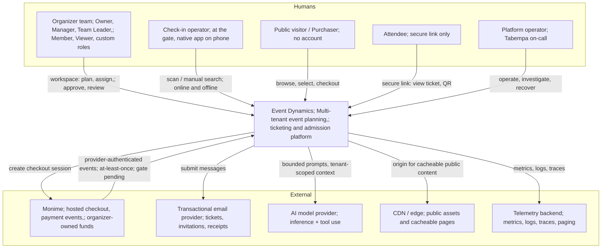

### 4.2 Trust boundaries

Five boundaries matter, and each has a different authentication mechanism. Application credentials are defined by the API contract; provider-inbound authentication remains integration-gated until Monime evidence is captured:

| Boundary | Credential | Lifetime | Blast radius if compromised |
| --- | --- | --- | --- |
| Organizer workspace | `teamSession` bearer | 12h idle / 7d absolute; 10-min reauth for sensitive ops (NFR-SEC-08) | One user's permitted scope in one organization |
| Purchaser / attendee | `secureLink` bearer, ≥128 bits entropy | 24h session; 30d emailed link (NFR-SEC-09) | One order or ticket set. **Never** workspace data |
| Gate device | `deviceLease` bearer | ≤12h from last refresh, bounded by operator access end (NFR-OFF-02) | Admission decisions for one event, within the prepared dataset |
| Payment provider inbound | Provider-specific authentication verified on raw bytes plus trusted connection context; exact Monime mechanism is a gate | per-request | Ability to inject payment events — hence verification **before** any processing |
| Platform operator | separate, least-privilege, attributable | session + audited | Cross-tenant. Therefore: scoped access with activity recording, never shared admin credentials (NFR-OPS-05) |

**[R] Boundary rule.** A credential of one class must never be exchangeable for a credential of another class. A secure-link holder cannot escalate to a team session; a device lease cannot mint a team session. These are separate issuance paths with no upgrade edge between them.

### 4.3 The geographic reality

Sierra Leone is the launch market. This is not a footnote; it is a design input.

- **Latency to origin is unavoidable and large.** There is no viable in-country cloud region for a managed Postgres with the durability guarantees NFR-REC demands. Origin will sit in a European region (typically the lowest-RTT well-connected option to West Africa), giving a realistic 120–200 ms RTT before any application work.
- **This consumes a large share of every client-side budget.** NFR-PER-02 allows 1.5 s P95 from decoded payload to visible admission decision on M1, of which the backend may use 1 s (NFR-PER-01). The M1 profile alone injects 150 ms added RTT on top of real-world baseline. The client budget is therefore thin, and round-trip *count* matters more than payload size on the admission path. **One request per admission decision. No chatty pre-flight.**
- **Edge caching is mandatory, not an optimisation.** The public storefront must be served predominantly from CDN edge, or NFR-PER-06 (500 ms P95) and NFR-PER-14 (LCP ≤ 2.5 s at P75) are unreachable for a real Freetown user on a real handset.
- **Offline is the product's differentiator here.** Venue Wi-Fi and cellular capacity at a crowded event is the *expected* failure, not the rare one. The offline path (Section 9.4) must be treated as a first-class flow with first-class testing, not a fallback.

---

## 5. Container architecture

### 5.1 The topology decision

**Decision (ADR-0002): a modular monolith for the synchronous application, deployed into multiple independently scaled pools, with a separate worker fleet, one PostgreSQL primary with a streaming standby and a read replica, and object storage.**

The same build artifact is deployed into different pools with different configuration. A pool answers a defined subset of traffic. This gives resource isolation (D8) without distributed-transaction cost (D2, D3).

Rejected alternatives, with reasons:

| Alternative | Why rejected |
| --- | --- |
| **Microservices per bounded context** | Every core invariant in Core Entities §4 spans contexts: capacity spans Event + TicketType + Order + Ticket; payment integrity spans PaymentAttempt + Order + Ticket; authorization cascades span Org + Event membership. Splitting these turns single-transaction invariants into sagas with compensations. NFR-MET-06 gives these invariants *no error budget* — a compensating transaction is by definition a window of incorrectness. At 3–8 cores of measured demand, the cost is paid for no capacity benefit. |
| **Single monolith, single pool** | Violates D8. One 100,000-row export, one PDF burst (7.2 core-equivalents at burst, Capacity §11.2), or one runaway AI job would contend directly with admission. NFR-CAP-03 forbids exactly this. |
| **Serverless functions per endpoint** | Per-invocation cold start is hostile to the 500 ms and 1 s P95 budgets over an already-expensive RTT; connection management against a single Postgres primary becomes the bottleneck (Capacity §6 explicitly warns against a connection per session); and long-lived SSE connections do not fit the model. |
| **Cache-authoritative inventory (Redis counters)** | Directly violates D2 and Core Entities §7: *"Atomic decrement or row-level lock; not optimistic-only"*, and NFR-INT-01's requirement that expired holds stop reserving inventory *even if cleanup has not run*. A second source of truth for money-adjacent state is the classic way to oversell. |

**The boundary that actually matters is the module boundary, not the process boundary.** Section 6 makes those boundaries explicit and enforceable so that if evidence later justifies extracting a service, the seam already exists. This is the reversibility principle (P8) applied.

### 5.2 Container diagram

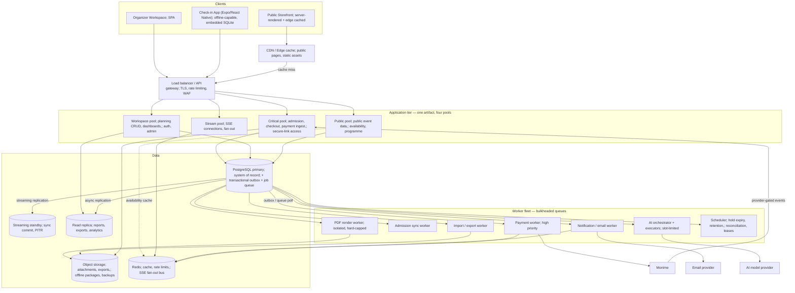

### 5.3 Pool responsibilities and isolation contract

| Pool | Serves | Latency budget | Isolation rationale |
| --- | --- | --- | --- |
| **Critical** | `POST /admissions`, checkout/hold creation, payment session creation, Monime webhook ingest, offline sync batch receipt, secure-link order access | NFR-PER-01 (1s), PER-07 (1s), PER-12 (500 ms) | These are the operations with no error budget and hard event-day deadlines. They get reserved capacity and are never co-scheduled with bulk work. |
| **Workspace** | Authenticated organizer CRUD, dashboards, readiness, admin, billing | NFR-PER-09 (500 ms) | Highest endpoint variety, most permission complexity, most change churn. Isolating it means a regression in planning CRUD cannot slow a gate. |
| **Public** | Unauthenticated event data, availability, programme | NFR-PER-06 (500 ms) | Highest and spikiest request volume (240–720 RPS, Capacity §4.4), lowest trust, mostly cacheable. Isolating it means a viral event page cannot exhaust workspace or admission capacity. |
| **Stream** | SSE connections for all six channels | NFR-FRE-01/02/04/06 | Long-lived connections have a fundamentally different resource profile (memory per connection, not CPU per request — Capacity §9.2: 64 KB × connections). Mixing them with request/response work makes both harder to size and to deploy. |

**[R] Isolation contract.** Each pool has its own database connection pool with an explicitly configured maximum. The sum of all maxima must remain below the database's safe connection ceiling with headroom, and the Critical pool's share is reserved — it is never reallocated to another pool under pressure. Capacity §6 is explicit: size the pool from measured transaction concurrency, not from session count.

**[R] Deployment ordering.** Deployments roll Workspace → Public → Stream → Critical, and the Critical pool is not deployed during a scheduled live-event admission window without an explicit exception recorded (NFR-AVL-03 counts deployment interruptions against availability, and requires per-event admission-window outage reporting).

### 5.4 Why Redis is present, and its strict limits

Redis appears for three jobs only:

1. **Read-through cache** for public event descriptions and expensive permission-resolution results (bounded TTL — see §8.1).
2. **Rate limiting and abuse control** counters (NFR-SEC-10), which are per-identity and per-network and must be fast and shared across pool instances.
3. **Pub/sub fan-out bus** for SSE, so that a mutation committed by any pool instance reaches subscribers connected to any Stream instance.

**[R] Redis is never authoritative.** No inventory count, admission decision, payment state, permission grant, or balance is ever *decided* from Redis. Loss of the entire Redis instance must degrade the system to "slower and chattier", never to "incorrect". Specifically: cache miss falls through to Postgres; rate-limit backend failure fails **closed** for authentication endpoints and **open** for read endpoints; SSE bus failure degrades clients to REST polling with a visible freshness indicator. This is the direct implementation of Capacity §9.1's warning: *"Keep authoritative inventory/admission correctness independent of stale cached views."*

---

## 6. Module architecture

### 6.1 Bounded contexts

Inside the single artifact, the code is partitioned into modules with enforced dependency rules. A *module* owns its tables, exposes an application service interface, and may not be reached around.

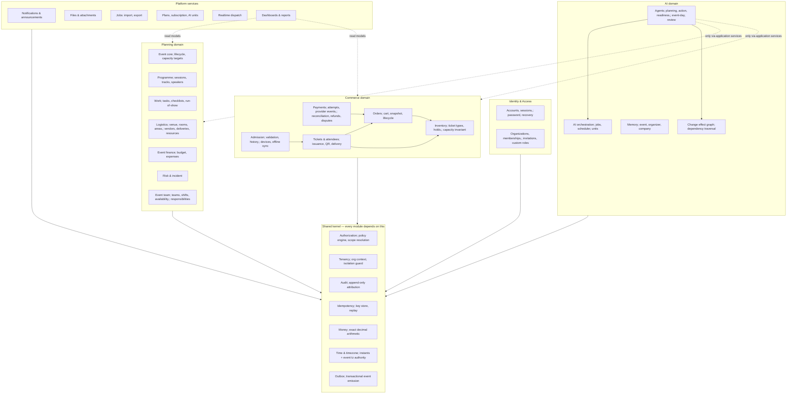

### 6.2 Dependency rules

These are enforced mechanically (module-boundary linting, package visibility, CI check), not by review alone. Rule violations fail the build.

**[R] MOD-1 — No cross-module table access.** A module reads and writes only its own tables. Cross-module data is obtained through the owning module's application service. This is what makes future extraction possible, and what makes a permission bypass impossible to introduce accidentally.

**[R] MOD-2 — Dependency direction is acyclic and downward.** Commerce may depend on Identity; Identity may not depend on Commerce. Where a cycle seems needed, the dependency is inverted through a domain event on the outbox.

**[R] MOD-3 — Everything passes through the kernel's tenancy guard.** No repository may construct a query without an organization context. The guard is a required constructor argument, not an optional filter (see §8.1).

**[R] MOD-4 — The AI domain has no privileged path.** `M_AGENT` invokes exactly the same application service methods that an HTTP handler invokes, with a principal derived from the requesting user. There is no "AI service layer". This is the structural implementation of NFR-AI-01 and NFR-AI-02 — the AI physically cannot exceed the user's permissions because it is calling the same permission-checked code.

**[R] MOD-5 — Two modules are designated *integrity-critical*: Inventory and Payments.** Changes to them require the concurrency/retry/failure test suite (NFR-ENG-02), a named second reviewer, and may not be combined with unrelated changes in the same deployment.

### 6.3 The shared kernel in detail

The kernel is small and stable on purpose. It contains the seven concerns that, if implemented per-module, would drift and produce the exact failures the NFRs forbid.

| Kernel component | Responsibility | NFR served |
| --- | --- | --- |
| **Tenancy** | Establishes and propagates organization/event context; guards every query; conceals cross-tenant records with 404 while allowing 403 for a reachable resource with a forbidden operation | NFR-SEC-01; OpenAPI tenancy convention |
| **Authorization** | Single policy engine: resolves principal → effective permissions + scope predicates; consulted identically by REST, AI, exports, aggregates, files, SSE | NFR-SEC-02/03 |
| **Audit** | Writes attributable, append-only entries in the *same transaction* as the mutation | NFR-AUD-01/02 |
| **Idempotency** | Key + request-fingerprint store; replays stored responses; guards every protected POST | NFR-INT-04 |
| **Money** | Integer minor-unit arithmetic only; forbids float; one currency/rounding policy; BigInt is internal and safe JSON integers are used on the wire | NFR-INT-02; OpenAPI money convention |
| **Time** | Stores instants + named zones; enforces event timezone as schedule authority; no naive local times | NFR-UX-06 |
| **Outbox** | Emits domain events transactionally with the state change; drives workers, SSE, and notifications | NFR-INT-07, NFR-REC-01 |

---

## 7. Data architecture

### 7.1 Storage engine selection

**Decision (ADR-0003): PostgreSQL as the single system of record for all business data.**

The requirements that force a relational, transactional engine:

- **Transactional multi-table invariants** (Core Entities §4). Capacity protection coordinates Event, TicketType, Order, OrderUnit, and InventoryAllocation atomically.
- **Exact money** (NFR-INT-02). Integer minor units are stored as `BIGINT`; no floating point or implicit decimal conversion is allowed near a charge.
- **Row-level locking for inventory** (Core Entities §7). `SELECT ... FOR UPDATE` on the event and ticket-type guards, in a deterministic order, is the serialization primitive; allocations remain the authoritative state.
- **Row-Level Security** as a defence-in-depth tenancy mechanism (§7.3).
- **Point-in-time recovery** to satisfy RPO ≤ 1 minute (NFR-REC-02/05) — WAL archiving plus a synchronous standby gives this natively.
- **Declarative partitioning** to make heterogeneous retention (D10) a partition drop rather than a mass delete.
- **Data volume is trivial for the engine**: ~23 GB at year one, ~82 GB at retained steady state (Capacity §7.3). This is comfortably single-node territory for years.

**Rejected:** document stores (no cross-document transactions for the invariants above, no exact decimal discipline), a separate ledger service (unearned complexity at this volume), and NewSQL/distributed SQL (solves a scale problem the capacity model says does not exist, at a cost in latency per transaction that the 1 s admission budget cannot absorb over an already-long RTT).

**[O-1] Revisit trigger:** when measured sustained database CPU exceeds 60% at the tested safe envelope, or the retained working set no longer fits the buffer pool with the modelled 500 MB working set (Capacity §9.1). Action then is *first* read-replica offload and partition pruning, *then* engine reconsideration — in that order.

### 7.2 Data classification

Every table is assigned a class at design time. The class determines retention, replication priority, RPO, encryption handling, and export treatment. This is the mechanism that makes D10 executable instead of aspirational.

| Class | Contents | Retention | RPO | Notes |
| --- | --- | --- | --- | --- |
| **C1 — Financial** | Order, OrderItem, OrderUnit, PaymentAttempt, PaymentConnection, ProviderOperation, Refund, RefundItem, FinancialException, PaymentDispute, BillingRecord, financial AuditEntry, consent evidence | ≥ 84 months from latest associated activity (NFR-PRI-02) | ≤ 1 min | Never hard-deleted by retention job; legal hold supported; minimised identity fields (NFR-PRI-04) |
| **C2 — Admission-critical** | Ticket, QRCredential, TicketRestriction, AdmissionEvent, TicketType, InventoryAllocation, Attendee (admission fields), DeviceAuthorization, OfflineDatasetManifest | Ticket issuance reference 84 months; attendee profile/attendance 24 months after event end | ≤ 1 min | Ticket validity must survive plan expiry (NFR-AVL-06, brief decision 263) |
| **C3 — Access & authority** | UserAccount, OrganizationMembership, EventMembership, CustomEventRole, Invitation, Subscription | Account lifetime; membership history preserved (NFR-AUD-02) | ≤ 1 min | Recovery must not restore *revoked* access (NFR-REC-04) |
| **C4 — Planning** | Session, Task, RunOfShowItem, Venue, Room, Vendor, Delivery, Resource, Budget, Expense, Risk, Incident, PlanningSection | 24 months rolling | ≤ 15 min | Expense rows carry a C1 financial reference and follow C1 where linked |
| **C5 — AI & derived** | AIJob, EventMemory, OrganizationMemory, AutomaticActionRule history | 24 months | ≤ 15 min | Raw prompts excluded from broad history (NFR-AUD-03); debug traces off by default, ≤ 7 days (NFR-PRI-05) |
| **C6 — Ephemeral / operational** | Response replay cache, package bytes, expired sessions and disposable diagnostics | Purpose-bounded; HTTP replay at least 72 hours | Rebuildable data only | Acknowledged provider events, processing obligations, allocation/effect identities and unsynced admissions inherit C1/C2 recovery requirements and remain until safely resolved |

**[R] Every new table declares its class in a migration annotation.** CI rejects a table with no class. The retention job is generated from the classification, so an unclassified table can never quietly accumulate forever.

### 7.3 Tenancy model

**Decision (ADR-0004): shared schema with organization_id on tenant-owned tables, enforced by complementary application and database controls and verified by isolation tests. These are not three independent runtime barriers.**

Options considered:

| Option | Assessment |
| --- | --- |
| Database per tenant | 500 organizations in the fixture (Capacity §3.1) means 500 databases; migrations, connection pooling, backup, and cross-tenant platform operations all become operationally hostile. Rejected. |
| Schema per tenant | Same migration and connection problems at lower cost; still poor at 500+ and unbounded growth. Rejected. |
| **Shared schema + row-level scoping** | Standard for this tenant count and data volume; the entire isolation burden falls on the enforcement mechanism — which is why application scoping and database enforcement are both required and tested. **Selected.** |

**Runtime controls and verification:**

1. **Application layer — the tenancy guard.** Every repository requires an `OrgContext` at construction. There is no default-constructible repository. Queries are built through a wrapper that injects `organization_id = :ctx`. A raw query escape hatch exists, is named `unscopedQuery`, is greppable, and every use is annotated and reviewed.
2. **Database layer — Row-Level Security.** Establish transaction-local context on the same pooled connection; missing context fails closed. Runtime roles must not own tables or have superuser/BYPASSRLS privileges; migration roles remain separate. Use read/write policies and owner enforcement where appropriate. Test context reuse, raw SQL and non-HTTP paths. RLS does not replace action, field or event-scope authorization (ADR-0004).
3. **Test layer — the isolation suite.** A required-to-pass suite (NFR-ENG-02) that, for every endpoint, attempts unauthorized access to a concealed second organization's resource and asserts a 404, verifies permitted external event membership, then tests reachable event resources with forbidden operations and asserts 403. Adding an endpoint without an entry in this suite fails CI.

**[R] Authorization outcomes are contextual, not a blanket 404 rule.** A cross-tenant or deliberately concealed record returns *not found*. A principal who can legitimately reach the event or record but lacks the requested operation receives *forbidden*. An external `EventMembership` may authorize an event without an `OrganizationMembership`; it must not be rejected by an organization-membership-first check. The central resolver establishes tenant/event context, evaluates membership and scope, then checks capability, access period, commercial entitlement, and reserved approvals. Handlers do not choose these status semantics independently.

**Caches, files, jobs, exports, notifications, AI retrieval, and SSE messages are equally in scope** (NFR-SEC-01). Concretely: every cache key is prefixed with `organization_id`; every object storage path is prefixed with `organization_id`; every queued job payload carries and re-verifies `organization_id` at execution time; every AI retrieval query runs through the same scoped repositories.

### 7.4 Physical design for the hot paths

The capacity model's hot paths (Core Entities §6) dictate physical layout. Three deserve specific design.

**Admission validation — lookup by QR.**
The ticket's QR secret is stored hashed (`qr_secret_hash`) and never logged (NFR-SEC-11). Validation must be a single indexed lookup:

- Unique index on `qr_secret_hash` (the lookup key is the hash of the presented secret, computed in the application).
- The validation transaction reads ticket + type + event + prior admission history for that ticket. To avoid four round trips inside the 1 s budget, this is **one query returning a composed row** (ticket joined to type and event, plus a lateral aggregate of prior admissions for that ticket).
- `admission_events` is indexed on `(ticket_id, created_at)` to make the history read a narrow index scan, and partitioned by month for retention and for keeping the live partition small.

**Checkout — inventory.**
See §9.1. `OrderUnit` and `InventoryAllocation` are authoritative. The transaction locks the event and the affected ticket-type guard rows in a deterministic order, expires no business fact by cleanup, and evaluates consumed quantity as effective unexpired `held` allocations plus `issued` and `withheld` allocations. Stock snapshots, counters, and availability projections are rebuildable read models only; they can accelerate reads but never decide whether a unit may be sold. The event overall sales limit and per-type limits are checked in the same transaction (NFR-INT-01).

**Public availability.**
This is the highest-volume read (120–360 RPS, Capacity §4.3) and is the one public read that can never be served from a long-lived cache, because it changes with every sale. Design: a very short TTL (1–2 s) cache in Redis with single-flight (one origin query per key per TTL window, not one per request), which collapses 360 RPS into ~1 QPS per event while staying well inside NFR-PER-06. The event *description* — which is stable — is cached at the CDN edge with explicit invalidation on publish/update, matching assumption A4's 95% hit rate.

### 7.5 Partitioning and retention mechanics

These partition layouts are candidates for the schema deep dive. Dropping a partition is permitted only when every row satisfies retention, legal-hold and unresolved-work rules; creation date alone cannot implement retention measured from latest associated activity. Preserve cross-partition uniqueness for provider events, order-unit tickets and admission operation IDs. These constraints must be demonstrated before adopting each partition scheme.

| Table | Partitioning | Why |
| --- | --- | --- |
| `admission_events` | Range by month on `created_at` | 120k rows/month; 24-month retention becomes a partition drop; live event reads touch one small partition |
| `audit_entries` | Range by month, **split by class** into operational and financial audit | Two different retention classes (24 months vs 84) in what looks like one concept. Separating them physically is what makes NFR-PRI-02 executable |
| `orders`, `payment_attempts`, `refunds` | Range by quarter on `created_at` | 84-month retention; keeps recent-quarter indexes small while the archive grows |
| `provider_events` | Candidate monthly partitions | Preserve acknowledged events and recoverable processing obligations; durable effect uniqueness survives payload cleanup |
| `notification_deliveries`, `idempotency_keys` | Candidate daily/weekly partitions | Cleanup follows replay/recovery obligations; InventoryAllocation history retains its business classification |

**[R] Retention is executed as a daily job evaluating expiry per class (NFR-PRI-03), removing or anonymising eligible live data within 7 days.** Two rules with teeth:

1. **Anonymisation, not deletion, where a financial reference must survive.** An attendee profile reaching 24 months is anonymised in place — identity fields cleared, the row and its financial linkage retained. The transformation itself is recorded (NFR-AUD-02).
2. **Restored data reapplies deletions.** After any restore, the retention and deletion-request log is replayed *before* ordinary user access resumes (NFR-REC-07). This is a rehearsed procedure, not a manual promise.

### 7.6 Read/write separation

- **Writes and all correctness-critical reads go to the primary.** Inventory, admission validation, payment state, permission resolution. A replica read for any of these is a correctness bug, because replication lag would let a refunded ticket admit.
- **The read replica serves** exports (100,000 rows, NFR-DAT-04), reports, dashboard aggregate recomputation, AI retrieval, and analytics. These tolerate seconds of lag and are exactly the workloads that would otherwise consume primary I/O during an event.
- **[R] Replica reads are opt-in and explicit at the call site**, never a default routing rule. A default that silently routes reads to a replica will eventually route an admission check there.

### 7.7 Caching strategy

| Layer | Contents | TTL | Invalidation | Authorization stance |
| --- | --- | --- | --- | --- |
| CDN edge | Static assets, public event description pages | Long, content-hashed assets immutable | Explicit purge on publish/update | Public only. **Never** any authenticated response |
| Redis | Public availability (single-flight), resolved permission sets, rate-limit counters | Availability 1–2 s; permissions ≤ 5 s | Permission cache invalidated by revocation epoch bump | Keys org-prefixed; permission entries bounded by NFR-SEC-04 |
| Application in-process | Immutable reference data (plan definitions, permission catalogue, unit schedule versions) | Process lifetime with version check | Version bump on deploy | Non-tenant data only |
| Client | Workspace data for warm navigation (NFR-PER-11) | Short, with revalidation | Refreshed on reconnect before enabling protected actions (NFR-FRE-07) | Must follow authorization and freshness rules |

**[R] No authorization decision may be cached for longer than 5 seconds** — the hard ceiling from NFR-SEC-04. The mechanism is a per-user *revocation epoch* integer: cached permission entries carry the epoch they were computed under; any membership, role, suspension, or access-period change increments the user's epoch, and a mismatch forces recomputation. This gives correct revocation *faster* than the TTL in the common case, with the TTL as the backstop.

---

## 8. Cross-cutting mechanisms

### 8.1 Authorization architecture

This is the single most reused mechanism in the system and the one with the widest blast radius. It is designed once, in the kernel, and every access path calls it (D5).

**The permission model, as the brief and v0.2.0 API define it, is a hybrid:**

- **Fixed organization roles** (Owner, Admin, Member) — coarse, inherited authority.
- **Fixed event roles** (Owner, Manager, Team Leader, Member, Viewer) — per-event.
- **Custom event roles** — composed from the approved event permission catalogue, org-scoped definition, event-scoped assignment.
- **Scope limits** — team, operational area, location, assigned work, and time period (brief §4.9).
- **Owner-only approvals** — certain actions are reserved regardless of permission composition.
- **External event authority and commercial entitlement** — an event member can be authorized without organization membership; plan coverage, issued-ticket validity, and read-only/operational exceptions are evaluated separately from organizational roles.

In the proper terms: this is **role-based access control (RBAC) for the permission set, combined with attribute-based access control (ABAC) for the scope**, plus **hierarchical inheritance** from organization to event.

**Resolution pipeline:**

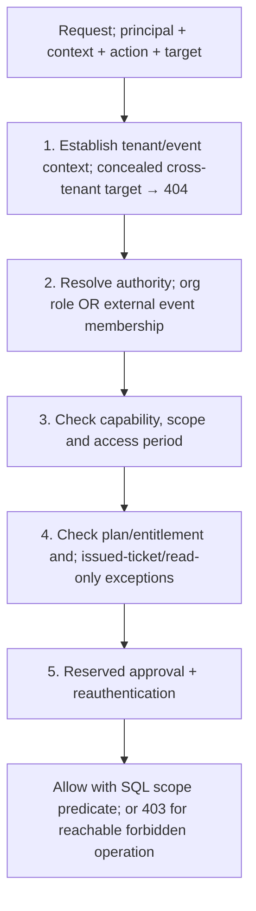

Four design points matter more than the pipeline itself:

**(a) Scope becomes a query predicate, never a post-filter.** If a Team Leader is limited to the AV team and two locations, the resolver returns a *predicate* that the repository composes into the SQL. Fetching rows and filtering them in application code is both slower and the classic source of "the count says 40 but the list shows 12" bugs — and it leaks through aggregates, which NFR-SEC-03 explicitly covers.

**(b) One engine, every execution surface.** REST handlers, worker/provider handlers, the AI agent's tool layer, export generation, dashboard aggregation, file download, offline-package preparation, and SSE per-message filtering all call the same resolver. NFR-SEC-03 requires *identical outcomes* across these; the application-service kernel, not a transport interceptor, is the authority.

**(c) Revocation is epoch-driven** (§7.7). For SSE specifically, the Stream pool re-evaluates the subscriber's epoch on every fan-out batch and at a fixed interval; on change it re-resolves, and on revocation emits `access.revoked` and closes the stream — inside the 5 s ceiling (NFR-SEC-04).

**(d) Custom roles cannot escalate.** Per brief §4.8 rules 6–8, a custom role may not contain organization-level permissions, may not become Event Owner, and may not contain ownership/cancellation/deletion/custom-role-management. **[R]** These are enforced as validation on the role *definition* — a role that cannot be constructed cannot be assigned. A denylist checked at assignment time would be weaker; a malformed role should not exist in the first place. NFR-SEC-03's requirement that *"a custom event role shall never acquire organization administration through a differently named permission"* is served by the permission catalogue being a closed enumeration, not free text.

### 8.2 Idempotency and exactly-once effects

At-least-once delivery is a fact of the environment: browsers retry, gate devices retry after timeouts on venue Wi-Fi, and Monime delivers payment events repeatedly. Exactly-once *delivery* is impossible; exactly-once *effect* is achievable and is what the NFRs actually demand (NFR-INT-04).

**Mechanism.** An `idempotency_keys` table stores the authenticated principal or checkout session, organization/event scope, operation and target identity, canonical request digest (including material `If-Match`/precondition data), state (`in_progress` | `completed` | `failed_retryable`), response snapshot, correlation ID, lease/heartbeat, effect identity, and expiry. Protected committing commands require the key; the HTTP replay record is retained for at least 72 hours from first acceptance. Domain uniqueness (admission operation ID, order-unit ticket identity, provider operation identity, and ledger/effect identity) outlives that cache window.

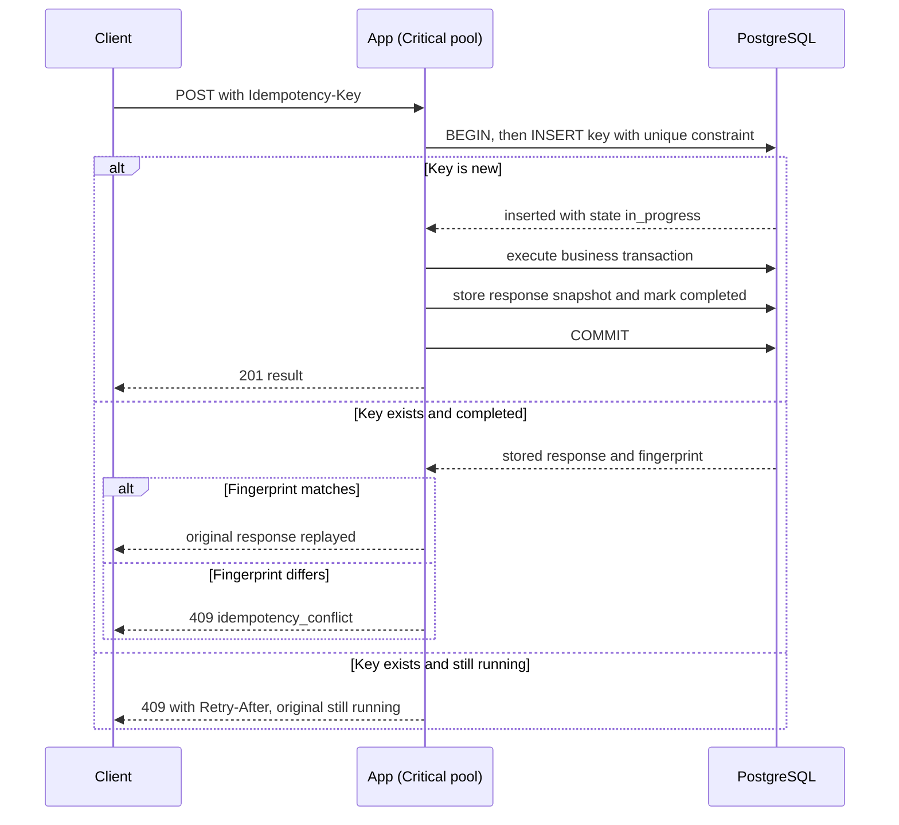

Three subtleties that a naive implementation gets wrong:

1. **The key row and the business effect commit in the same transaction.** If they are separate, a crash between them produces either a duplicate effect or a permanently poisoned key.
2. **The fingerprint check is not optional.** A client reusing a key with a different body is a bug that must surface loudly, not silently return someone else's result.
3. **Idempotency is not deduplication of business meaning.** NFR-INT-04 is explicit: *"a repeated legitimate re-entry is distinct from retrying the same admission submission."* The key distinguishes them — same key means retry, new key means new intent. The client is responsible for generating a new key per genuine scan.

**[R]** Idempotency keys are mandatory for every protected creating/committing command in the v0.2.0 API, including admission validation/undo, holds and orders, payment-session creation, refund approval, offline-sync submission, walk-in registration, imports, and AI mutations. Read-only requests do not use them. A provider call is not made transactionally with the local database: the payment path creates a durable `ProviderOperation` with the original provider idempotency key and recovers it by lookup/reconciliation after timeout; it never generates a second charge merely because the first call was uncertain.

### 8.3 Optimistic concurrency

Every mutable resource carries a **strong** version, surfaced as an `ETag`. Protected updates require one strong `If-Match`; missing returns 428 and a mismatch returns 412. Replay lookup occurs after current access is checked but before a stale-precondition rejection for the same committed key, so a retry cannot repeat an effect or be turned into a false conflict (NFR-INT-09).

Two escalations beyond plain optimistic locking:

- **Stale high-impact approvals are revalidated, not just version-checked.** NFR-INT-09 requires that an approval prepared against older state be re-evaluated against current records, and that *material* differences require renewed approval. Design: an approval artifact (AI action proposal, refund approval, cancellation proposal) stores a snapshot digest of the records it depends on. At apply time the digest is recomputed; a difference in a material field invalidates the approval and returns the user to review. A version bump on an immaterial field does not.
- **Multi-record actions report partial completion truthfully.** A bulk apply that changes 12 of 15 records returns a per-record outcome list, not a success flag. NFR-INT-09 forbids *"falsely reporting full success."*

### 8.4 Audit architecture

**Decision: audit entries are written in the same transaction as the mutation, by the kernel, from a declarative annotation on the application service method — not by a listener, not from logs, not asynchronously.**

Rationale: NFR-AUD-01 requires attributable retention of *"important user, agent, provider-driven, and automatic-system activity"* including previous/new values. An asynchronous audit pipeline can drop entries on crash; a log-derived audit cannot be trusted as evidence for a seven-year financial record.

| Field | Source |
| --- | --- |
| actor, authorizer | Principal; for AI, both the agent and the requesting/approving human (brief §7.4) |
| organization, event | Tenancy context |
| action, target | Service method annotation + entity identity |
| previous / new values | Diff computed in the domain layer, **field-filtered** |
| device / admission provenance | Admission path only |
| rule reference | Automatic-action rule ID where applicable |
| outcome, timing | Transaction result |

**[R] Audit minimisation.** NFR-AUD-03 forbids copying unrestricted attendee notes or complete raw AI prompts into broadly accessible history. The diff is produced through a per-entity field policy: sensitive fields (`emergency_notes`, `access_requirements`, `food_requirements`, raw prompt text) record *that they changed*, not *what they changed to*. Restricted investigation access to fuller traces is separate, time-boxed, and itself audited.

**Append-only enforcement:** runtime roles receive scoped SELECT/INSERT only; no UPDATE/DELETE/TRUNCATE or ownership privileges. A separate controlled retention role performs authorized minimization/expiry with evidence. These grants do not prevent privileged database administrators from altering data. Required audit failure rolls back the mutation. Required failed-attempt audit uses a separate minimized record after rollback; annotations must cover HTTP, worker, provider, AI and scheduler paths (ADR-0012).

### 8.5 Observability

The NFRs are unusually specific about measurement (NFR-MET-01, NFR-OPS-01/02). The design consequence: **observability is a requirement of the API surface, not an afterthought.** Every operation carries its governing NFR ID as an `x-nfr-latency` extension already in the OpenAPI document — that identifier is emitted as a metric dimension so production data is directly comparable to the acceptance target.

| Signal class | What | Why it is the right signal |
| --- | --- | --- |
| **Per-operation latency histograms** | Keyed by operation ID, never pooled (NFR-MET-01) | A pooled P95 hides a failing admission path behind fast cache hits |
| **Queue age** | Oldest unstarted item per queue | Capacity §11.1 shows a queue can be small in bytes and still catastrophically late. Age predicts deadline misses that depth does not |
| **Business rejection counters, separated from errors** | Sold-out, already-admitted, invalid ticket | NFR-AVL-02/MET-04: these are successful service. Mixing them corrupts the error budget in both directions |
| **Integrity counters** | Oversell attempts blocked, duplicate issuance prevented, cross-tenant access blocked, unresolved offline conflicts | These should be zero or explainable. A nonzero blocked-oversell count is *healthy*; a nonzero *successful* oversell is an incident |
| **Saturation** | Pool utilisation, DB connection pool wait time, lock wait time, replication lag | Capacity §15: review at 70% of measured safe throughput |
| **Dependency health** | Monime/email/model latency and error rate, provider-event backlog age | Attributed separately but never removed from end-to-end journey reporting (NFR-AVL-02) |
| **Cost** | Per event, per ticket workflow, per retained GB, per AI job | NFR-ENG-05 requires notification at 80% and 100% of budget |

**Correlation.** One request/job correlation ID propagates from client through API, queue, worker, and external call. Traces are sampled, but errors and all financial/admission operations are always traced (NFR-OPS-01).

**[R] Synthetic probes at 1-minute interval** against the five critical journeys (public page, checkout start, payment ingest, online admission, secure-link ticket access), from a vantage point representative of the launch market — not only from the origin region (NFR-AVL-02).

---

## 9. Critical flow designs

Seven flows carry essentially all the correctness risk. Each is specified here with its failure behaviour, because the failure behaviour is the design.

### 9.1 Checkout and inventory hold

**The invariant:** consumed quantity never exceeds the event or ticket-type limit, and a hold stops consuming capacity when its expiry instant passes, regardless of whether cleanup has run (NFR-INT-01). In Core Entities v1.1, `OrderUnit` and `InventoryAllocation` are the authoritative records; counters and stock snapshots are rebuildable projections.

**Design: serialize the guards, then write explicit allocations.**

```mermaid
sequenceDiagram
    participant P as Purchaser
    participant API as Critical pool
    participant DB as PostgreSQL

    P->>API: POST order/hold with protected Idempotency-Key
    API->>DB: BEGIN; replay lookup and access/entitlement checks
    API->>DB: lock Event guard, then affected TicketType guards in stable ID order
    API->>DB: evaluate effective allocations; held (unexpired) + issued + withheld
    alt Capacity and price snapshots pass
        API->>DB: INSERT Order + immutable OrderItems + one OrderUnit per requested ticket
        API->>DB: INSERT InventoryAllocation(state = held, expires_at = server instant)
        API->>DB: append audit/outbox; advance guarded revision; COMMIT
        API-->>P: 201 with server-authoritative hold expiry and strong ETag
    else insufficient or entitlement denied
        API->>DB: ROLLBACK
        API-->>P: business decision (sold_out / unavailable), not a technical error
    end
```

**Design notes:**

- **Lock ordering is explicit.** Every transaction locks the event guard first and ticket-type guards sorted by stable ID. The same order is used by payment issuance, release, and withholding paths; it is tested under multi-type contention (ADR-0008).
- **Consumed is a query over authoritative allocations.** Effective unexpired `held` allocations plus `issued` and `withheld` allocations count. `released` allocations do not. A scheduler may archive expired holds, but expiry is evaluated from the allocation's server timestamp and never depends on the scheduler.
- **An order is not a single status.** Workflow state, financial display state, and fulfillment state advance independently. A paid order with a capacity problem cannot create an arbitrary partial ticket subset: the worker either reacquires all required units or creates a visible financial exception and no tickets.
- **Prices and quantities are snapshotted.** `OrderItem` stores the agreed price/currency/quantity; later TicketType edits cannot change an existing order.
- **Every retry follows the idempotency rules in §8.2.** A new legitimate re-entry uses a new key/operation ID; a retry uses the same key and returns the committed result.

**[O-2]** If measurement shows the event guard is the limiting factor at the 72/s simultaneous burst, the next step is bounded reservation batching or a different lock partitioning strategy — never a cache-authoritative counter. Evidence and a new ADR are required before changing the serialization point.

### 9.2 Payment confirmation and ticket issuance

**The invariant set (NFR-INT-03/04/06/07):** issuance requires trusted provider confirmation matching the order, amount, currency, merchant/destination context, and provider identity. Browser return is never proof. Repeated or delayed provider messages must not duplicate tickets or move an order backward. A timeout is not proof of failure.

The API package deliberately leaves provider wire details behind `Provider Integration Gates`. Until the Monime gate verifies the actual signature/authentication scheme, event payload, credentials, release behavior, status lookup, and refund/reconciliation evidence, this HLD must not name a header, HMAC algorithm, or invented webhook field.

**Three sources converge on one local state machine:** browser return (untrusted and refresh-only), an authenticated provider event (durable receipt, at-least-once), and provider status/reconciliation (slower recovery path). Only the latter two can advance financial state.

```mermaid
sequenceDiagram
    participant P as Purchaser
    participant API as Critical pool
    participant PSP as Payment provider
    participant W as Payment worker
    participant DB as PostgreSQL

    P->>API: POST payment session with protected Idempotency-Key
    API->>DB: create PaymentAttempt and ProviderOperation; bind historical PaymentConnection
    API->>PSP: create operation using original provider idempotency key
    alt response or known operation
        PSP-->>API: provider operation identity + checkout reference
        API->>DB: record pending operation; return redirect
    else timeout / uncertain
        API->>DB: record pending/uncertain ProviderOperation
        API-->>P: recoverable pending state; hold is not extended
    end

    PSP-->>API: provider callback/event
    API->>API: verify using the provider gate on raw bytes and trusted connection context
    API->>DB: durably insert provider event, unique provider identity, and outbox entry
    API-->>PSP: acknowledge durable receipt only
    W->>DB: claim durably dispatched job from fresh or replay lane
    W->>DB: BEGIN; re-check order/amount/currency/destination/provider identity
    W->>DB: re-check current entitlement, capacity, and whole-order unit set
    alt all checks pass and no issuance effect exists
        W->>DB: advance PaymentAttempt; transition each allocation to issued; issue each OrderUnit once
        W->>DB: update workflow, financial and fulfillment projections
        W->>DB: append audit, outbox notifications/SSE; COMMIT
    else duplicate or terminal observation
        W->>DB: record observation only; no new tickets or charge
    else provider paid but amount/capacity/identity mismatch
        W->>DB: create FinancialException and operator obligation; no arbitrary partial tickets
        W->>DB: if excess/duplicate funds are confirmed, create Refund/RefundItem work
        W->>DB: COMMIT
    end
```

**Why receipt and business processing are split.** NFR-PER-12 gives a short acknowledgement budget, while NFR-PER-13 allows the issuance worker to complete later. Acknowledgement means only that the provider event and its deduplication identity are durable. QR generation, allocation, PDF rendering, and email are never prerequisites for receipt.

Payment observations remain durable even if plan coverage or the initiating user's access changes. Reconcile them under the provider/system principal; do not discard paid evidence or restart a charge because a workspace permission check fails.

**Payment identity is historical.** `PaymentConnection` snapshots the merchant/provider context used for the attempt; later connection changes cannot rewrite history. `ProviderOperation` holds the stable external operation identity and original provider idempotency key. Local retries recover that operation by lookup/reconciliation rather than creating a second charge.

**Issuance is whole-order.** A late provider success either reacquires all required `OrderUnit`s and allocations or issues no tickets and creates a visible `FinancialException`. A duplicate success cannot produce duplicate tickets. If money must be returned, the platform records a `Refund`/`RefundItem` obligation and evidence; it does not fabricate an outbound refund API or move organizer funds in the MVP.

**Queue sizing and routing (ADR-0009).** Retain payment.fresh and payment.replay. New fulfillment work and ambiguous urgent events use fresh capacity. Restriction-producing refunds, reversals and disputes need protected urgent handling, not a relaxed replay deadline. Only known completed duplicates and proven nonurgent work enter replay. Re-delivery of unfinished work recovers its original obligation. A terminal order may still receive an actionable second charge. Verify mixed-event latency and database contention; the modelled burst alone does not prove the issuance deadline.

### 9.3 Online admission

**Budget:** 1 s P95 / 2 s P99 backend, decoded payload in to committed decision out (NFR-PER-01). Validly processed business decisions return 200 with a `decision` field. Authentication, malformed-input, conflict, and infrastructure failures retain the HTTP errors specified in OpenAPI.

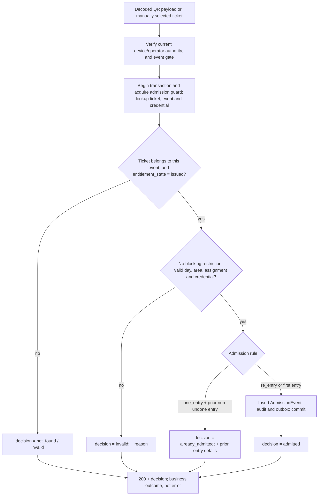

**Design notes:**

- **Admission uses the Core Entities state model.** `Ticket.entitlement_state` is `issued|cancelled|voided`; checked-in, refunded, refund-pending, delivery, and replacement labels are projections/restrictions, not a single status field. A ticket is admissible only when the entitlement is issued, the credential version is active, the event/day/area gate passes, and no active restriction blocks it.
- **One round trip, one transaction, one composed query.** The decision is emitted only after the `AdmissionEvent`, audit, and outbox record commit. Prior admissions are returned as evidence; aggregates are projections updated from the outbox.
- **Serialize admission with validity changes.** Hold the per-ticket admission guard while checking prior non-undone entries and committing the new occurrence. Coordinate event cancellation, restrictions and credential replacement with these checks so concurrent one-entry scans cannot both succeed. Return no foreign ticket or attendee details for wrong-event credentials.
- **Undo appends a correction.** The original event is never mutated or deleted. Re-entry uses a new operation ID; retrying the same submission reuses its idempotency key. Undo remains online-only; preserve separate counts for unique attendees, total entries, re-entries, corrections and unresolved conflicts.

### 9.4 Offline admission

This is the most intricate flow in the system, because it deliberately operates without the authority that every other flow depends on.

**Four phases:**

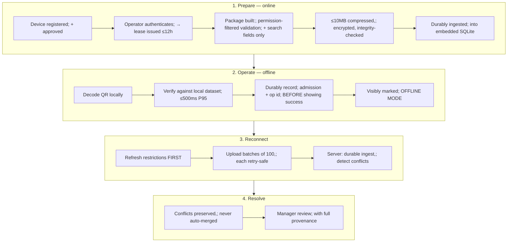

The online preparation response is a signed `DeviceAuthorization` claim bound to the exact device, operator, event/area scope, issue/expiry instants, authorization generation, and allowed operations. The encrypted package is accompanied by an `OfflineDatasetManifest` containing its digest, dataset cutoff, record count, encryption-key reference, and delete-after time. The device verifies both before activation; a package without a matching claim and manifest is unusable.

**The hard design problems and their answers:**

**(a) How does a device validate a QR without the server, without holding forgeable secrets?**
The prepared package contains credential hashes and minimal permitted fields, not original QR secrets or server signing private keys. Devices may hold public verification keys, protected decryption/recovery credentials and transient scanned QR input. A hash match recognizes a prepared credential; it does not prove current server validity or prevent copying a presented QR. Encryption and a signed manifest protect the package within the supported device trust model (ADR-0011).

**(b) What is the package actually allowed to contain?**
NFR-OFF-07: only validation and search fields permitted for that operator's admission work. **Explicitly excluded: financial data, food requirements, access requirements, emergency notes.** This is a filtered projection produced through the same authorization resolver as any other read (§8.1), not a table dump. The 10 MB budget for 10,000 tickets (NFR-OFF-09) allows roughly 1 KB per ticket, which is comfortable for the permitted fields and would be impossible for full attendee records — the budget and the privacy rule agree.

**(c) What does the device honestly not know?**
Refunds, cancellations, QR replacements, newly issued tickets, server-side revocation, and other devices' admissions (NFR-OFF-03). The client must *display* this limitation. An unknown ticket is routed to online validation or staff review — never invented as valid. This is a product behaviour that is also a design constraint: the offline decision surface is deliberately narrower than the online one.

**(d) Durability before feedback.**
NFR-OFF-04: the admission record — unique operation ID, ticket, event, operator, device, admission time, location, authorization claim ID, dataset manifest ID, credential version, trusted-time basis, and sync state — is durably written to the device's embedded SQLite database *before* success is shown. App reload or restart must not discard pending records. The client uses a trusted server-time anchor plus a monotonic clock and records rollback/clock uncertainty; device wall-clock time is evidence, not authority. The selected SQLite implementation must demonstrate this guarantee on supported devices; see §13.2 and ADR-0007. The residual risk (physical device loss before sync) is explicitly out of scope of server RPO and must be stated in operator training, not engineered around.

**(e) Reconnect is a heavier load than the live burst.**
Capacity §8.3 models 100 devices × 1,000 pending records = **1,666 records/s over 60 s** — far heavier in record count than the 48/s online admission burst. Design responses: batches of 100 (NFR-FRE-03 deadline is per batch, from complete receipt); **[R] server-directed pacing** — the sync response carries a `next-batch-after` hint so devices reconnecting simultaneously self-stagger; bounded server-side concurrency per event; and each batch idempotent by operation ID. Each item receives a durable acknowledgement (`accepted`, `duplicate`, `conflict`, or `review`) and the original claim/dataset/credential provenance is retained.

**(f) Conflicts are preserved, not resolved.**
Two devices admitting the same one-entry ticket offline both produce valid local records. NFR-OFF-05: preserve both, retain reported device time *and* server receipt time without assuming clocks agree, and route to manager resolution with provenance intact. **[R] The sync pipeline has no auto-merge path.** The temptation to "pick the earlier timestamp" must be resisted — device clocks are not trustworthy, and the product requirement is human review.

**(g) Lease expiry does not strand data.**
NFR-OFF-08: expired authority grants no new admission rights, but restricted authenticated recovery must still upload pending records even when fresh authorization/download fails. Keep pending evidence encrypted and recoverable until acknowledged; do not destroy its only usable key at lease expiry. Purge expired searchable data separately. Retain the 24-hour overdue warning and NFR-OFF-09 budgets: ≤10 MB compressed before encryption, ≤50 MB local footprint, preparation ≤30 s P95 B1 / ≤120 s P95 M1.

### 9.5 Refund

Short flow, sharp invariants (NFR-INT-05, brief decisions 20–22). A `Refund` is an obligation and evidence record, not an outbound money-movement command in the MVP. Each `RefundItem` identifies a whole `OrderUnit` or a documented no-ticket/excess/unfulfilled payment amount; the platform never invents a fractional ticket refund that is not represented by an item.

```mermaid
stateDiagram-v2
    [*] --> requested: staff requests
    requested --> approved: Event Owner approves; (reserved approval, reauth)
    approved --> refund_required: tickets DISABLED immediately
    refund_required --> completed: organizer moves money in configured provider,; records evidence/reference
    refund_required --> needs_attention: money movement failed
    needs_attention --> completed: retried successfully
    needs_attention --> failed: abandoned
    requested --> cancelled: withdrawn before approval
    note right of approved
        Ticket becomes unusable at APPROVAL,
        not at money movement.
        Failed money movement does NOT
        restore ticket validity (NFR-INT-05).
    end note
```

**Key points:**

- **Event Dynamics never moves organizer money in the MVP.** The organizer performs the refund in the configured provider account and records the reference. Provider-confirmed evidence is distinct from organizer-recorded evidence; a report is not silently presented as provider truth. The platform's job is state, authority, and evidence.
- **Ticket disablement is atomic with approval**, in the same transaction, and creates/persists `TicketRestriction` records for all affected units. Restrictions are additive and immediate; later money failure does not restore validity. Offline devices prepared before the refund will not know, so reconnection refreshes restrictions before normal online admission resumes.
- **Approval is a reserved action:** Event Owner, Organization Owner, or a current owner-approved custom Approve Refund Work grant. An Organization Admin cannot self-assign it. Bind approval to the exact refund revision, amount and unit set.
- **Stock and ticket validity are separate.** Apply the explicit stock-return or withhold decision once under inventory guards. An ordinary admitted-ticket refund requires authorized online undo first; event/provider exception paths preserve occurrence history. Excess-payment and no-ticket refunds do not disable valid tickets funded by the primary payment.
- **Reversals and disputes** restrict the affected unused tickets while preserving prior admissions. Duplicate charges and excess payments create exception/refund obligations without duplicating issuance or restricting unaffected primary tickets.

### 9.6 AI job lifecycle

Covered architecturally in Section 12; the flow-level shape:

```mermaid
sequenceDiagram
    participant U as User
    participant API as Workspace pool
    participant EX as AI executor
    participant SVC as Application services
    participant LLM as Model provider

    U->>API: request with job class and scope
    API->>API: check AI enabled, agreement current, plan allows
    API->>API: estimate units and show range
    U->>API: approve upper bound
    API->>API: admission control on slots,; per-org caps and start budget
    alt cannot start within budget
        API-->>U: queue-full / retry, NO unit charge
    else accepted
        API->>API: reserve units and create AIJob
        API-->>U: acknowledged within 1s P95
        API->>EX: enqueue through durable scheduler with class and fairness key
        EX->>EX: claim scheduled slot; preserve interactive reservation
        EX->>SVC: retrieve context via scoped repositories
        EX->>LLM: bounded prompt, retrieved content treated as data
        LLM-->>EX: proposed actions
        EX->>SVC: DETERMINISTIC VALIDATION; capacity, permissions, arithmetic,; transitions against current records
        alt mutating and mode requires approval
            EX->>SVC: create action proposal + preview
            EX-->>U: preview for approval
        else permitted direct low-risk action
            EX->>SVC: apply via same service a human calls
        end
        EX->>SVC: settle units consumed
    end
```

### 9.7 Change effect review — the product's core promise

The brief's central promise is: *"When something changes, it finds what is affected, explains the likely results, and carries out the changes you approve."* Architecturally this is a **dependency graph traversal over the connected record model**, and the brief is explicit that the AI *"should work through them rather than searching unrelated text fields alone"* (§11).

**Design: an explicit relationship graph, maintained by the domain, queried deterministically, with the model used for explanation and proposal — not for discovery.**

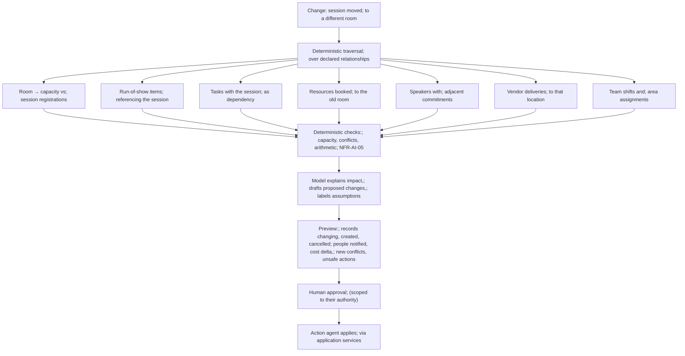

**Why the traversal is deterministic and not model-driven:** NFR-AI-05 requires that capacity, permission, arithmetic, valid transitions, and known scheduling constraints be validated by *application logic against current records*, and that an AI assertion never substitutes for these checks. A model asked "what does this affect?" will produce a plausible list, which is not the same as a correct one. The traversal produces the correct affected set; the model's job is to explain it well and propose good remedies — which is what models are actually good at.

**[R] Relationship declaration.** Each module declares its outbound relationships in a registry (source entity, target entity, relationship kind, traversal cost). The traversal is bounded (depth and node count — NFR-AI-07 caps a bounded direct instruction at 100 related records) and anything exceeding the bound is reclassified as a background job rather than truncated, per NFR-AI-07.

---

## 10. Asynchronous architecture

### 10.1 Queue substrate

**Decision (ADR-0005): transactional outbox in PostgreSQL, with PostgreSQL-backed work queues, for the MVP.**

Rationale:

- **One durable obligation.** Commit the domain/provider receipt and its outbox obligation atomically. An outbox can feed either PostgreSQL queues or a separate broker safely; the selected Postgres queue reduces operating surfaces. Never acknowledge provider receipt before the recoverable obligation exists.
- **Volume is a sizing input.** The modelled provider burst is 150/s plus other work. Queue throughput, tail latency and database interference require measurement. The queue library owns its schema; handwritten partitioning is not a prerequisite.
- **Operationally cheap for a small team.** One system to back up, one to restore, one to monitor, one to reason about during a live event at 2 a.m.

The transaction boundary is explicit: domain mutation, required audit and outbox commit together. The dispatcher may enqueue separately, but must mark delivery only after durable enqueue. A crash between enqueue and marking can duplicate publication; stable identities and idempotent consumers prevent duplicate effects. Use atomic enqueue/mark when the selected adapter supports it, otherwise use the replay-safe handoff in ADR-0005.

**Rejected:** a dedicated broker as the primary MVP queue, because an additional operating surface is not yet justified. A separate broker fed by an outbox is a valid alternative, not an inherent durability violation. **[O-3] Revisit** when measured queue work consumes approximately 20% of database write capacity or independent replay requirements justify it.

### 10.2 Queue lanes and bulkheads

This is the concrete implementation of D8 and NFR-CAP-03. **[R] There is no shared general-purpose worker pool.** Each lane has its own workers, its own concurrency limit, and its own deadline.

| Lane | Work | Priority | Deadline | Concurrency stance |
| --- | --- | --- | --- | --- |
| `payment.fresh` | New fulfillment, ambiguous urgent work and protected restriction-producing events | **P0** | NFR-PER-13 for issuance; prompt restriction enforcement | Reserved workers; test the full mixed burst |
| `payment.replay` | Proven completed duplicates and nonurgent status work only | P2 | minutes for nonurgent work | Recover unfinished obligations; never delay safety-critical restrictions |
| `admission.sync` | Offline batch ingestion, conflict detection | **P0** during event windows | NFR-FRE-03: 5 s P95 per batch | Bounded per event; server-paced |
| `notify.transactional` | Ticket delivery, invitations, recovery emails | P1 | NFR-FRE-05: 30 s P95 submission | Retried with backoff; failures exposed |
| `notify.operational` | Announcements, operational notifications | P1 | NFR-FRE-04: 3 s P95 to connected clients | Fan-out via SSE bus + email fallback |
| `render.pdf` | Ticket PDF bundles | P2 | best effort | **Hard-capped.** 36 jobs/s × 0.2 s CPU = 7.2 cores at burst (Capacity §11.2) — this lane must never be allowed to consume critical capacity |
| `bulk.io` | CSV imports, exports | P3 | NFR-DAT-03/04 | Serialised per organization; reads from replica |
| `ai.*` | AI job execution | P3 | NFR-AI-06/07/08 | Slot-limited: 10 platform / 2 per org (§12.3) |
| `scheduler` | Hold expiry, retention, reconciliation, lease expiry, aggregate refresh | varies | varies | Leader-elected; idempotent; skippable without corruption |

**[R] Admission control at enqueue, not just at dequeue.** When a lane's queue age exceeds its deadline threshold, new low-priority work is rejected with a clear retry response rather than accepted and delivered late (NFR-CAP-03: *"produce clear responses rather than corrupting records or accepting unbounded work"*). For AI specifically, NFR-AI-11 makes this explicit: accept work only when its start budget can be met, and a job waiting 10 minutes without starting fails visibly and releases reserved units.

### 10.3 Retry, backoff, and poison handling

- Bounded retries with exponential backoff **and jitter**. Capacity §11.4 warns that synchronised retries amplify; jitter is not optional.
- Per-lane maximum attempts, then a dead-letter table with an operator work item — never a silent drop.
- **[R] Retry must be safe by construction, not by luck.** Every job handler is idempotent on its business key (provider event ref, admission operation ID, order ID). A handler that cannot state its idempotency key does not pass review.
- External calls carry finite connect/read/overall timeouts (NFR-AVL-07). Monime session creation: 3 s connect, 15 s overall.

### 10.4 The scheduler

Leader-elected (advisory lock in Postgres) so exactly one instance runs periodic work. Jobs:

| Job | Interval | Purpose |
| --- | --- | --- |
| Hold expiry sweep | 1 min | Reclaim rows (optimisation only — §9.1) |
| Pending payment recheck | 5 min | NFR-INT-08 |
| Daily payment/refund reconciliation | daily | NFR-INT-08 |
| Device lease expiry | 5 min | NFR-OFF-02 |
| Retention evaluation | daily | NFR-PRI-03 |
| Aggregate/readiness recompute | event-driven + 5 min safety net | NFR-FRE-01 |
| Invitation and token expiry | hourly | NFR-SEC-07 |
| Quota and budget checks | hourly | NFR-DAT-02, NFR-ENG-05 |
| Backup health verification | hourly | NFR-REC-06 alert within 15 min |

**[R] Every scheduled job is idempotent and safe to skip.** A missed run must never cause incorrectness — only delay. This is what lets the scheduler be restarted during an incident without fear.

---

## 11. Realtime architecture

ADR-0001 already fixed SSE over WebSocket. This section designs the delivery path.

### 11.1 Fan-out design

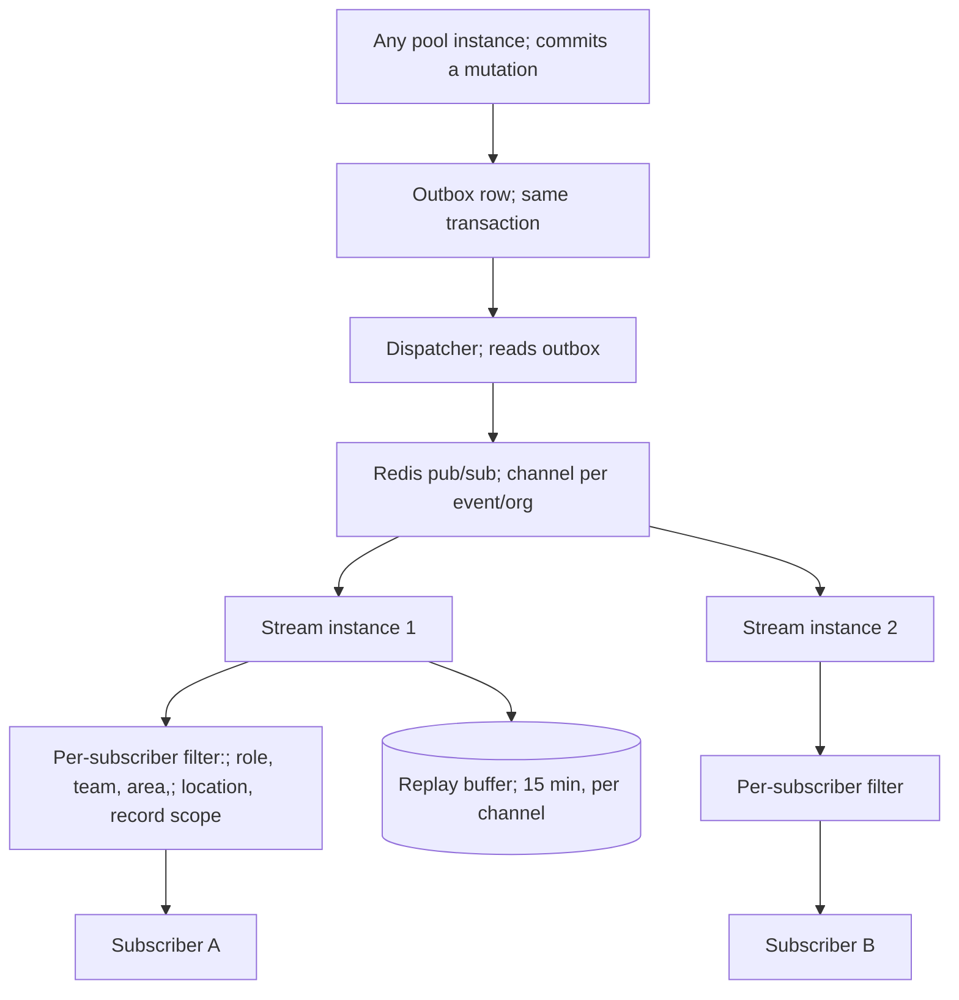

**Design points:**

- **Messages originate from the outbox, not from a service call.** A push that is not tied to a committed transaction can announce a change that was rolled back.
- **Filtering is per-subscriber and uses the shared authorization resolver** (NFR-SEC-03). A subscriber receives only what they could have read via REST. Capacity §8.4 makes the cost of getting this wrong concrete: broadcasting every change to all 300 sessions produces 9,000 deliveries/s versus 600 when scoped — recipient scope is both a privacy control and a capacity control.
- **Replay history and connection buffers are separate.** Retain durable channel history for at least 15 minutes. A connection buffers at most 1,000 messages or 1 MiB; overflow sends `stream.resync_required` if possible and closes. Cursors bind channel, scope, authorization generation and log generation. A missing cursor starts fresh with `stream.ready` and mandatory REST refresh; expired, foreign, invalid or unavailable cursors cause `stream.resync_required` followed by close.
- **Close the subscription/refresh race.** Open and buffer the stream before refreshing authorized REST state, then consume buffered invalidations. Deduplicate notices by message ID. Heartbeats and control messages never advance the replay cursor. Redis pub/sub is a wake-up bus; replay history must survive stream-instance restarts.
- **Authentication is fetch-based bearer authentication.** The client sends the bearer token explicitly and supplies `Last-Event-ID` on reconnect; credentials are not assumed to be ambient cookies. Authorization is rechecked per message and at revocation, with `access.revoked` and immediate close within five seconds even if the control message cannot be delivered.
- **Push is a freshness mechanism, never a source of truth or an authorization.** A client that missed messages re-reads, and a pushed invalidation never enables a protected action. Messages are invalidations/control notices, not authoritative state patches.

### 11.2 Connection budget

Capacity §9.2 models 1,000 connections at 64 KB = 64 MB, and a growth case of 10,000 at 640 MB. The organizer collaboration scenario is 300 connected sessions across two busy organizations. The Stream pool is sized on **connection count, buffered bytes and memory**, not request rate — which is exactly why it is a separate pool (§5.3).

**[R] Connection admission control.** A per-instance maximum connection count, with a clear refusal and a documented client fallback to polling. An unbounded connection count converts a popular event into an out-of-memory event.

### 11.3 Degradation

| Failure | Behaviour |
| --- | --- |
| Redis bus down | Do not use an unsafe direct-instance shortcut. The dispatcher retains durable outbox work; clients receive a visible freshness warning and use bounded REST polling/reconnect until the bus recovers |
| Stream pool saturated | New connections refused with retry-after; existing connections preserved; clients poll |
| Client backgrounded/disconnected | On resume, explicit bearer reconnect with `Last-Event-ID`; replay within 15 min only when cursor bindings still match, otherwise `resync_required` and full REST refresh; access re-verified before enabling protected actions (NFR-FRE-07) |

---

## 12. AI architecture

The AI is the product's differentiator and its largest risk surface. The architecture's job is to make the AI *useful* while making it *structurally incapable* of exceeding its authority.

### 12.1 The containment model

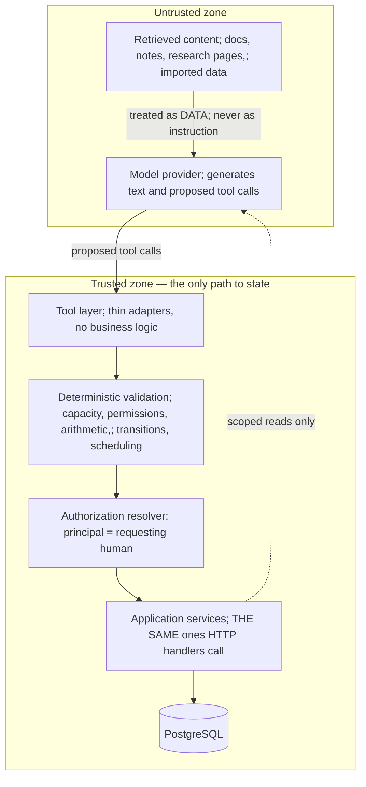

Four containment properties, each mapping to a requirement:

1. **No privileged path** (NFR-AI-01, MOD-4). The agent calls the same services a human calls, with the requesting human's principal. There is no service account with elevated rights. If a user cannot do it manually, the agent cannot do it for them — structurally, not by policy.
2. **Retrieved content is data** (NFR-AI-01). Documents, attendee notes, imported rows, and research pages are wrapped and clearly delimited in the prompt, and the tool layer ignores any instruction-shaped content originating from retrieval. This is the prompt-injection defence, and it is a *design* control: the agent's authority comes from its principal, not from its prompt, so an injected "grant me admin" cannot succeed even if the model is persuaded by it.
3. **Deterministic rules are never delegated** (NFR-AI-05). Capacity, permission, arithmetic, valid transitions, and scheduling constraints are validated in code against current records. The model may *propose*; only application logic *decides*.
4. **Reserved approvals are unreachable** (NFR-AI-02). Financial approval, cancellation approval, role/access changes, payment-account changes, and material ticket-sales changes are gated by reserved-approval checks that require a specific human role plus recent reauthentication. A general AI agreement can never satisfy them.

**Closed action registry.** The model can propose only typed actions registered by the application (operation name, input schema, readable/writable entities, risk class, approval mode, and scope). The registry does not expose arbitrary SQL, scripts, URLs, provider calls, or free-form mutation payloads. Tool adapters validate shape, but the application service remains the final authority and repeats authorization, plan/entitlement, current rule revision, and domain invariants inside the mutation transaction.

### 12.2 Agent composition

The five agents in the brief are **job classes over one orchestration runtime**, not five services. They differ in tools, prompt, retrieval scope, budget, and output artifact — not in infrastructure.

| Agent | Job class | Output artifact | Budget class |
| --- | --- | --- | --- |
| Planning | `background_plan`, `interactive_question` | Planning sections in explicit states | NFR-AI-08: accept ≤1 s, start ≤5 min P95, useful draft ≤10 min, stop at 15 min |
| Change effect / review | `effect_review` | Effect preview over the deterministic traversal (§9.7) | NFR-AI-07: ≤30 s P95 for bounded, ≤100 records |
| Action | (executes proposals/instructions) | Action proposal + preview, or applied change | NFR-AI-07 |
| Readiness | `readiness_check` | Itemised checks and deficiencies | NFR-AI-04: derived from *visible checks*, not opaque judgement |
| Event-day | `event_day_assist` | Operational suggestions | interactive budgets |
| Review & learning | `post_event_review` | Memory candidates | background |

**[R] The readiness score is computed, not generated.** NFR-AI-04 requires it to derive from visible checks. The score is arithmetic over a checklist evaluated in code; the model narrates it. A model-produced number would be unexplainable and unstable across runs.

### 12.3 Scheduling and admission control

The capacity document leaves this as an explicit open question (§12.1): ten long jobs occupying all slots would make a simple question wait ~5 minutes, violating the 60 s P95 start target. **This design resolves it.**

**Decision (ADR-0006): class-partitioned slots with reserved interactive capacity and weighted fair queueing across organizations.**

Of the 10 platform-wide execution slots (NFR-AI-11):

| Reservation | Slots | Rule |
| --- | --- | --- |
| Interactive-only | **4** | Never occupied by `background_plan`. Guarantees the 60 s P95 start target for short work |
| Background | **4** | Long jobs only |
| Flex | **2** | Either class; allocated to whichever queue has the older head-of-line item |

Per organization: max 2 executing, 20 waiting (NFR-AI-11). Within a class, selection is **weighted fair queueing keyed by organization**, so one organization submitting 20 jobs cannot delay another organization's first job.

**Admission control before acceptance.** A job is accepted only if its start budget can be met given current queue state; otherwise the caller receives a clear retry/queue-full response **with no unit charge** (NFR-AI-11). A queued job that waits 10 minutes without starting fails visibly and releases its reserved units.

Sanity check against the model: weighted mean service time 68 s across the 80/20 mix, ten slots → 8.82 jobs/minute ideal, ~5.29 at 60% occupancy (Capacity §12.1). The 50-job mixed test needs 3,400 slot-seconds → 340 s lower bound. With 4 interactive slots reserved, the 40 simple jobs (400 slot-seconds) complete on reserved capacity in ~100 s while the 10 background jobs (3,000 slot-seconds) run on 4–6 slots in 500–750 s. **The model supports this split, but does not prove tail-latency or starvation targets.** Mixed-load tests must establish those outcomes.

### 12.4 Unit accounting

**Reserve-then-settle**, which is the only pattern that survives retries:

1. **Estimate** and show a range before every user-initiated job; obtain explicit approval of an upper bound (NFR-AI-12).
2. **Reserve** the upper bound at acceptance. Reserved units are unavailable to other jobs.
3. **Settle** actual consumption at completion; release the remainder.
4. **Refund** on Event Dynamics failure (NFR-AI-13, FR 257).

**[R]** Spend order is included-monthly first, then purchased (NFR-AI-13). Purchased units are preserved at least 12 months. Deduction is idempotent on job ID so a retried settlement cannot double-charge. Automatic rules carry per-run and daily unit ceilings set by their authorizer; no automatic top-up purchase, ever.

### 12.5 Automatic-action rules

The background execution path is the highest-risk AI surface, and the brief constrains it tightly (§7.3.1). Architecturally:

- A rule is a **persisted authorization artifact** naming scope, trigger, readable records, writable records, allowed actions, propose-only actions, approval requirement, recipients, authorizer, validity window, and unit caps.
- The artifact stores an immutable rule revision and a typed action registry reference; it cannot name arbitrary code, URLs, or unregistered provider operations.
- **[R] Every mutating step rechecks** rule validity, the authorizer's current permissions, plan state, AI-enabled state, and the rule revision — *immediately before* the mutation, not at job start (NFR-AI-03, NFR-SEC-04's requirement to recheck authority before delayed/background mutations).
- Each step has its own execution ID and durable outcome. Cancellation prevents new mutations but does not erase committed partial effects; the job moves to a truthful `cancelled` or `partly_completed` state and exposes the affected set.
- **Pause controls stop new mutating steps within 5 seconds** at both organization and event level, while retaining history and pending proposals (NFR-AI-03, FR 228/229). Implemented as a pause flag checked in the pre-mutation gate, plus immediate signalling to running executors.
- A rule can never grant more authority than its authorizer holds; if the authorizer loses permission, the rule stops.

### 12.6 Memory architecture

Three scopes with different trust levels: **event memory** (this event), **organizer memory** (belongs to one user), **company memory** (org-wide, approved).

**[R] Memory is retrieved as tenant-scoped, permission-filtered data and is never authority.** Promotion from event/organizer to company memory requires explicit human approval (FR 240–242). A memory entry records its origin and the approval that promoted it, so a wrong entry can be traced and removed. Memory must distinguish confirmed facts, prior-event facts, preferences, suggestions, and assumptions (NFR-AI-04) — these are typed fields, not prose conventions.

### 12.7 Evaluation harness

NFR-AI-14 requires ≥100 representative cases before launch and before material model/prompt/tool changes, covering planning, ambiguity, permissions, cross-organization retrieval, malicious retrieved instructions, capacity changes, partial failure, and cancellation — with **zero** unauthorized mutations or data disclosure, **zero** fabricated successful tool actions, and ≥90% task-appropriate outcomes.

**[R] The evaluation fixture is a versioned artifact in the repository and a required CI gate for the AI module.** The zero-tolerance categories are assertions, not scores: a single unauthorized mutation in the fixture fails the build. This is the only AI quality control that is not subjective.

---

## 13. Client architecture

### 13.1 Three separate applications

**Decision (ADR-0007, amended): three separately built and deployed clients, not one application with routes.**

NFR-PER-17 makes the storefront/workspace split arithmetic, not preference. The check-in client's *isolation* from the other two is still forced by the same NFR-PER-17 reasoning; its *implementation* changed after this HLD's first draft — see the note under §13.2.

| Client | Initial compressed budget | Rendering strategy | Why separate |
| --- | --- | --- | --- |
| **Public storefront** | ≤300 KB JS/CSS + ≤200 KB initial images | Server-rendered, edge-cached, minimal hydration | Must hit LCP ≤2.5 s / INP ≤200 ms / CLS ≤0.1 at P75 on mobile (NFR-PER-14) over a Freetown connection. Shipping the organizer workspace's dependency tree here makes the budget unreachable |
| **Check-in app** | 750 KB target; native measurement boundary requires explicit resolution (§13.2) | Native app (Expo/React Native), embedded SQLite, native camera API | Needs offline install, durable local storage, camera, and reconnect-triggered sync. Completely different runtime requirements from the other two, and durability acceptance tests — see §13.2 |
| **Organizer workspace** | not budgeted by NFR-PER-17 | SPA with route-level code splitting | Feature-rich, authenticated, warm-navigation budget NFR-PER-11 (1 s) |

They share generated types from the OpenAPI document and, where the runtime allows it, business logic and validation schemas — sharing *portable TypeScript* is fine wherever the two runtimes (web and native) both support it; sharing a *rendered UI bundle* is what the budgets forbid, and is also no longer possible between the check-in app and the workspace since they render through different UI runtimes (native components vs. HTML).

### 13.2 Check-in app design — native (Expo/React Native), amended from the original PWA design

**Amendment note.** ADR-0007 is now supplied and amended. Retain three clients and Expo/React Native check-in. Its previous iOS incident claim referred back to this HLD, so that claim remains unsubstantiated and is not the rationale. The native decision rests on the selected storage/runtime fit and remains subject to device durability/recovery tests. Record native binary, compressed JS, downloaded updates and dataset sizes separately; resolve the native measurement interpretation of the 750 KB NFR budget without silently changing it.

The highest-stakes client. Key decisions:

- **Embedded SQLite (via `expo-sqlite`) for the prepared dataset and pending admissions**, within the 50 MB measured footprint (NFR-OFF-09) — a genuine database file on the device, not a browser storage API.
- **Encryption at rest on device**, key bound to the lease. Pending records remain encrypted until acknowledged (NFR-OFF-08).
- **Durable write before visible success** (NFR-OFF-04) — the SQLite transaction must complete before the success screen renders.
- **Native camera scanning** (via `expo-camera`, bridging to ML Kit on Android / AVFoundation on iOS), decoding measured separately from validation (NFR-MET-03). ≥95% of readable codes decode within 2 s on the supported device matrix — scanner performance remains an acceptance measurement, not an assumed benefit.
- **Manual search is a first-class path, not a fallback**: 2 s P95 over 10,000 attendees, working offline against the local index (NFR-PER-04). Damaged codes route here — never to invented validation.
- **Mode is always visible.** Online vs offline, remaining offline authorization, last successful sync, pending record count, overdue-sync warning after 24 h. An operator must never be unsure which mode they are in.
- **App update strategy must not interrupt an event.** **[R]** Updates (delivered via EAS Update, Expo's over-the-air mechanism) are downloaded but applied only on explicit operator action or on next cold start outside an admission window — a silent reload mid-gate would be a serious operational failure. This is the same rule the original service-worker design had; only the delivery mechanism changed.

### 13.3 Public storefront

- Event description page: statically rendered, edge cached, purged on publish/update.
- Availability: fetched client-side from the short-TTL endpoint so the cached page stays cacheable while the count stays live (§7.4).
- Checkout: progressive, minimal JS, works on the M2 degraded profile with honest waiting states (NFR-UX-03).
- **Hold countdown derives from the server timestamp**, never from a client-started timer (NFR-PER-16).
- 360 CSS pixels without two-dimensional scrolling (NFR-UX-03); WCAG 2.2 AA (NFR-UX-01).

### 13.4 Universal client rules

- **[R] Any operation over 300 ms shows pending feedback, and a pending protected action is never displayed as successful** (NFR-PER-15). Optimistic display must visually distinguish pending from committed and must visibly recover from rejection.
- **[R] On reconnect or resume, refresh effective access and current state before re-enabling protected actions** (NFR-FRE-07). Browser timers are display conveniences, never authority.
- All times stored as instants with named zones; event timezone is the schedule authority; displayed zones are labelled (NFR-UX-06).

---

## 14. Deployment architecture

### 14.1 Region and topology

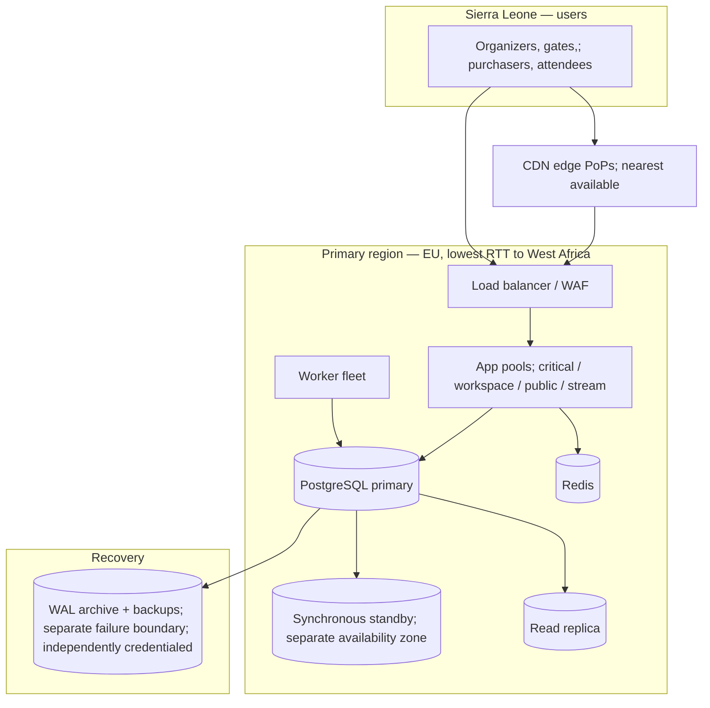

**Single region, multi-AZ for serving traffic.** Another-zone standby covers instance/AZ failure, not entire-region loss. Regional recovery needs independently accessible backup/WAL copies and a rehearsed restore destination. Record archive lag, restore/provisioning and reconciliation time in ADR-0003; regional RPO ≤1 minute / RTO ≤60 minutes remains unproven until that drill passes. **[O-4]** Revisit recovery topology if the drill misses the objectives.

### 14.2 Environments

| Environment | Purpose | Data |
| --- | --- | --- |
| Development | Local, ephemeral | Synthetic fixtures |
| CI | Automated gates | Generated fixtures including large-event and archived-history sets |
| Staging | Production-representative configuration; performance and DR rehearsal | Synthetic at production scale — **never** copied production data |
| Production | Live | Real |

**[R] Staging must be production-representative for the acceptance runs** (NFR-MET-05: three consecutive passing runs on a production-representative configuration). A staging environment sized differently from production makes the acceptance evidence worthless.

**[R] Configuration, dependency versions, infrastructure definitions, migrations, and recovery procedures are version-controlled and reproducible; secrets are not** (NFR-ENG-04).

### 14.3 Release strategy

- **Rolling deployment by pool** (§5.3), critical last, never during a scheduled admission window without recorded exception.
- **Expand/contract migrations**: add nullable column → backfill in bounded batches → dual-write → switch reads → drop old. A deployment must be rollback-safe for at least one version (NFR-ENG-03: recoverable within 15 minutes).
- **[R] Irreversible migrations require a verified recovery procedure**, not an untested rollback claim (NFR-ENG-03). They are executed as their own deployment, with nothing else in it.
- **Releases preserve** existing tickets, valid sessions within policy, pending payments, and queued work (NFR-ENG-03). A migration that invalidates issued tickets is not shippable at any urgency.

---

## 15. Availability, failure modes, and recovery

### 15.1 Degradation ladder

The system degrades in a defined order. This is a design artifact, not an incident improvisation.

| Level | Trigger | Shed / degrade | Preserved |
| --- | --- | --- | --- |
| **L1** | Sustained load > 70% safe capacity | AI job admission tightened; exports queued; PDF rendering deferred | Everything user-visible |
| **L2** | Critical lane queue age rising | Bulk imports/exports rejected with retry; dashboard refresh interval relaxed; announcements batched | Admission, checkout, payment ingest, ticket access |
| **L3** | Critical pool saturation | Public browsing served stale-while-revalidate from edge; workspace reads relaxed to replica; non-essential writes rejected with clear messages | Admission, payment ingest, ticket access |
| **L4** | Database primary degraded | Read-only mode: browsing, ticket viewing, admission *recording via offline path* | Evidence integrity; no incorrect writes |
| **L5** | Region loss | Restore into the rehearsed recovery destination and reconcile; promote a standby only if it survived the failure | Measured RPO/RTO; restricted until safe |

**[R] Degradation never sheds integrity.** At every level, the system prefers refusing an operation to performing it incorrectly. NFR-CAP-03 states this directly: throttle or queue lower-priority work and produce clear responses *rather than corrupting records*.

### 15.2 Dependency failure matrix

| Dependency | Failure | Design response | Requirement |
| --- | --- | --- | --- |
| **Monime** | Timeout on session creation | Order stays pending and recoverable; original hold deadline preserved; no automatic new charge; retry reuses the original operation via idempotency key | NFR-INT-06, NFR-AVL-07 |
| **Monime** | Webhook delivery stops | Reconciliation poller (5 min) becomes the primary path; backlog age alerted | NFR-INT-08 |
| **Monime** | Fully unavailable | Paid purchase suspended **truthfully**; free registration, existing tickets, admission, and manual operations continue | NFR-AVL-05 |
| **Email** | Provider down | Ticket access preserved through the secure order page; delivery queued and retried; failure exposed to organizer | NFR-AVL-05, NFR-FRE-05 |
| **AI provider** | Down, slow, or quota-exhausted | Jobs fail visibly with units returned; **all manual operations unaffected** | NFR-AVL-04, NFR-AI-06 |
| **Redis** | Down | Cache misses fall through; rate limits fail closed on auth, open on reads; SSE degrades to polling | §5.4 |
| **Read replica** | Lagging or down | Exports/reports queue or fall back to primary with reduced concurrency; **never** used for correctness reads anyway | §7.6 |
| **Object storage** | Down | Attachment upload/download fails clearly; **ticket, payment, admission, and audit records unaffected** | NFR-DAT-02 |
| **Venue network** | Down | Offline admission path (§9.4) | NFR-OFF-01..09 |

### 15.3 Recovery design

| Objective | Target | Mechanism |
| --- | --- | --- |
| Instance failure / restart | No loss of acknowledged work | Outbox + queue in the same database; idempotent handlers (NFR-REC-01) |
| RPO — critical (C1/C2/C3) | ≤ 1 minute | Synchronous commit to standby + continuous WAL archiving (NFR-REC-02) |
| RPO — planning (C4/C5) | ≤ 15 minutes | Same infrastructure; the stricter objective governs the shared store (NFR-REC-02) |
| RTO — critical ticketing/admission | ≤ 60 minutes | AZ failure: standby promotion; regional failure: independent recovery copy and restore destination. Both include endpoint cutover and reconciliation (NFR-REC-03) |
| RTO — remaining workspace | ≤ 4 hours | Follows the same restore |
| RTO — AI and analytics | ≤ 8 hours | Restored last; lowest priority |
| Routine incident | ≤ 15 minutes | Rollback or safe forward-fix (NFR-ENG-03) |

**Reconciliation is part of RTO, not after it** (NFR-REC-04). Before reopening mutations the system must: reconcile provider-confirmed payments against restored orders; reconcile device-held admissions; re-apply revocations and access changes so stale permissions are not restored; and re-apply recorded deletions/anonymisations (NFR-REC-07). Where safety cannot be established, the affected area stays in restricted/review mode rather than reselling uncertain inventory.

**[R] Rehearsal cadence:** full restore-and-reconcile exercise before launch, quarterly, and after material recovery changes, recording actual recovery time, recovered point, integrity checks, and exceptions (NFR-REC-06). A backup-success message is not evidence of recoverability.

---

## 16. Security architecture

### 16.1 Asset-led threat summary

| Asset | Primary threat | Control |
| --- | --- | --- |
| Another organization's data | Query without tenant scope; cache/file/job/AI/export leakage | Three-layer isolation (§7.3); org-prefixed cache and storage keys; job payload re-verification; isolation test suite as CI gate |
| Ticket validity | QR forgery; replay of a scanned code; stolen offline package | QR secret ≥128 bits, stored hashed, never in URLs or logs; offline package holds hashes not secrets; replacement invalidates the old code |
| Payment integrity | Forged provider event; replayed event; browser-return spoofing | Provider-specific authentication is verified on raw bytes and trusted connection context only after the Provider Integration Gate; unique provider identity dedup; browser return can never advance state |
| Purchaser/attendee access | Guessable or leaked link | ≥128-bit entropy, revocable, scoped; 24 h session / 30 d link; never grants workspace access |
| Account credentials | Credential stuffing, brute force | Argon2id ≥19 MiB / 2 iterations / p=1; progressive delays after 5 failures in 15 min; recovery limited to 3/address/hour; no permanent lockout by unauthenticated traffic (NFR-SEC-06/10) |
| Authority escalation | Custom role composed to reach org admin | Closed permission catalogue; escalation-prohibited combinations rejected at role definition (§8.1d) |
| AI-mediated escalation | Prompt injection via retrieved content | Agent authority derives from principal, not prompt; retrieved content delimited as data; deterministic validation gate; reserved approvals unreachable (§12.1) |
| Uploaded files | Malware; active content; formula injection in CSV | Content-type and size validation; quarantine until scanned; no active-content delivery; spreadsheet formula neutralisation in exports (NFR-DAT-01/05) |
| Sensitive attendee notes | Over-broad access; leakage into audit or offline packages | Parent-record permissions; field-filtered audit diffs; excluded from offline packages (NFR-OFF-07, NFR-AUD-03) |

### 16.2 Secrets and data protection

- TLS on all public and internal transport carrying credentials or private data (NFR-SEC-05).
- Encryption at rest for production data, files, backups, and offline device payloads, with key access separated from ordinary data access.
- Secrets never in client bundles or source control; supplied through the platform secret store.
- **[R] A `no-secrets-in-URL` rule enforced by lint and by a log-scrubbing middleware.** Sessions, QR secrets, secure-link tokens, and payment credentials must never reach analytics, ordinary logs, or error messages (NFR-SEC-11). This is a class of leak that appears through innocent refactors, so it needs an automated guard, not a convention.
- Support/operator access is least-privilege, attributable, time-boxed, and itself audited (NFR-SEC-11, NFR-OPS-05).

---

## 17. Capacity plan

Every number here is a **starting hypothesis to be replaced by measurement**, exactly as the capacity document instructs. They are recorded so that a measurement can contradict something specific.

### 17.1 Initial allocation

| Component | Initial hypothesis | Derived from | Replace with |
| --- | --- | --- | --- |
| Application tier, total | 16 available cores across ≥5 instances, so losing one node leaves ≥12.55 | Capacity §10: 3.15 sustained / 7.53 burst core-equivalents at 60% ceiling | Measured CPU-seconds per operation |
| Critical pool | ~35% of app capacity, reserved | Admission + checkout + payment ingest share of the mix | Measured per-pool utilisation |
| Public pool | ~30% | 240–720 RPS, mostly cacheable | Measured edge hit rate |
| Workspace pool | ~25% | 130 RPS reads + mutations | Measured |
| Stream pool | ~10%, sized on memory | 300–1,000 connections × 64 KB | Measured per-connection memory |
| Database | 4 vCPU / 16 GiB / 100 GB to start | Capacity §10 provisional benchmark config | Query plans, lock waits, I/O, tail latency |
| Database storage | 100 GB (year-one 33.36 GB at 70% occupancy); model 200 GB for retained case | Capacity §7.3 | Actual growth by class |
| Redis | Small; working set ~500 MB modelled | Capacity §9.1 | Measured hit rates and key cardinality |
| Object storage | 270 GB typical at 12 months; 5.4 TB if every event fills its 2 GB quota | Capacity §7.4 | Measured bytes per event |
| Payment workers | Sized for the full 150/s burst on the `fresh` lane | Capacity §11.1 + the two-lane design (§9.2) | Measured service time distribution |
| PDF workers | Hard-capped; 7.2 core-equivalents at burst if uncapped | Capacity §11.2 | Measured render cost; consider on-demand generation |
| AI slots | 10 platform / 2 per org, split 4 interactive / 4 background / 2 flex | NFR-AI-11 + ADR-0006 | Measured job durations |

### 17.2 Scaling triggers

**[R]** A capacity review is triggered by any of:

- Sustained use exceeding **70% of measured safe capacity** (NFR-OPS-06)
- Queue age on any P0 lane exceeding **50% of its deadline**
- Database connection pool wait time becoming non-trivial, or lock wait time on the inventory rows rising
- An upcoming event exceeding tested conditions (more than 10,000 attendees, more than 50 devices, or more than two simultaneous busy sales)
- Replication lag approaching the RPO boundary

Review cadence: after the first three live events, then monthly (NFR-OPS-06). Any target revision records evidence, impact, and a new document version.

---

## 18. Performance budget allocation

A P95 target on an operation is not actionable until it is decomposed. These decompositions are the acceptance instrument: when an operation misses, the sub-budget that blew is immediately visible.

### 18.1 Online admission — NFR-PER-01 (1 s P95 backend)

| Segment | Budget | Notes |
| --- | --- | --- |
| TLS/gateway/routing | 30 ms | Connection warm |
| Authentication + lease verification | 40 ms | Cached principal within 5 s epoch |
| Authorization resolution | 30 ms | Cached; epoch-checked |
| Idempotency key insert | 30 ms | Single indexed write |
| Composed validation query | 120 ms | Ticket ⋈ type ⋈ event + history, one round trip |
| Decision logic | 10 ms | Pure computation |
| Admission + audit write, commit | 150 ms | Includes synchronous standby commit |
| Outbox insert | included | Same transaction |
| Serialisation + response | 40 ms | |
| **Subtotal** | **450 ms** | |
| **Reserve** | **550 ms** | Absorbs GC, contention, replication hiccups, and the P95 tail |

The reserve is deliberately over half the budget. On this path the dominant uncontrolled variable is the synchronous commit to the standby — the price of RPO ≤ 1 minute. **[R] Measure commit latency independently**; if it consumes more than 200 ms at P95, the RPO mechanism must be re-examined before the application is optimised.

### 18.2 Checkout hold — NFR-PER-07 (1 s P95)

| Segment | Budget |
| --- | --- |
| Gateway + validation | 60 ms |
| Idempotency insert | 30 ms |
| Lock acquisition — Event + TicketType guards | **200 ms** (contention-dominated, not compute-dominated) |
| Allocation/entitlement computation | 60 ms |
| Order + OrderUnit + allocation + audit insert, commit | 180 ms |
| Response | 40 ms |
| **Subtotal** | **570 ms** |
| **Reserve** | **430 ms** |

Lock acquisition is the budget line to watch, and the one the capacity document warns about explicitly.

### 18.3 Public event data — NFR-PER-06 (500 ms P95)

| Path | Budget |
| --- | --- |
| Edge hit (target: ~95% of description requests) | <50 ms, does not reach origin |
| Origin miss, description | 250 ms |
| Availability (short-TTL cached, single-flight) | 150 ms |
| **Reserve** | 100–250 ms |

### 18.4 Payment issuance — NFR-PER-13 (5 s P95 / 15 s P99)

| Segment | Budget |
| --- | --- |
| Webhook signature verify + durable insert + ack | ≤500 ms (this is NFR-PER-12's own budget) |
| Outbox → queue claim | ≤500 ms |
| Verification (order, amount, currency, destination, capacity) | ≤500 ms |
| Ticket generation + QR + inventory + commit | ≤1.5 s |
| **Subtotal** | **~3 s** |
| **Reserve for queue wait** | **~2 s at P95, ~12 s at P99** |

The reserve *is* the queue wait, which is exactly why the two-lane split (§9.2) exists — the capacity model shows a single lane consuming ~30 s of it.

---

## 19. Engineering governance

### 19.1 Required CI gates

Per NFR-ENG-02, every release passes:

| Gate | Scope | Blocking condition |
| --- | --- | --- |
| Tenant isolation suite | REST, SSE and background access, including external event membership | Any unauthorized cross-tenant disclosure; missing concealment or incorrect rejection of an authorized external event member |
| Authorization suite | Fixed/custom roles, inherited access, secure links, revocation, file/export, AI retrieval, background rules | Any unexpected allow |
| Financial/admission integrity | Final-stock races, repeated/delayed provider events, duplicate submission, free issuance, re-entry, refund approval and failure, cancellation | Any invariant violation — no percentage allowance (NFR-MET-06) |
| Migration safety | Forward migration and tested rollback or safe forward-fix on a production-shaped dataset | Failure to recover a failed deployment within 15 min; irreversible migration without verified recovery |
| Core journeys | Registration → event → sale → issuance → admission → refund | Any break |
| Concurrency/retry/failure | Required for changes to Inventory or Payments modules | Any duplicate effect or lost update |
| AI evaluation fixture | ≥100 cases | Any unauthorized mutation, any data disclosure, any fabricated tool success, <90% task-appropriate |
| Module boundary lint | MOD-1..MOD-5 | Any violation |
| Dependency vulnerability scan | All | Any known exploitable critical issue (NFR-ENG-04) |
| Payload budget check | Client bundles | Exceeding NFR-PER-17 limits |

### 19.2 Launch readiness

Beyond CI, launch requires the acceptance evidence enumerated in NFR §15: three passing runs of the sustained/burst/simultaneous/mixed scenarios with sufficient samples; the offline scenario set including two-device duplicate conflict and restricted recovery upload; the dependency failure set; a timed restore-and-reconcile; the physical device/browser and accessibility matrix; and functioning alerts, runbooks, quotas, dashboards, and named live-event coverage before the first supported live event.

**Stated plainly: the architecture is not "done" when the code runs. It is done when the evidence exists.**

---

## 20. Architecture Decision Records

The eight requested ADRs were supplied and reviewed on 19 September 2026. Their amended records are in this package. Receipt closes the missing-document issue; it does not establish performance, provider behavior or recovery results.

| ADR | Review outcome |
| --- | --- |
| 0003 | PostgreSQL topology retained; durability failure scope and retention limitations clarified |
| 0004 | Shared-schema controls retained; independence claim and external membership semantics corrected |
| 0005 | Outbox/Postgres queues retained; dispatcher crash window and library schema ownership clarified |
| 0007 | Three clients/native selection retained; circular iOS evidence removed; payload interpretation remains to resolve |
| 0008 | Allocation formula and event-first lock order amended to match Core Entities/HLD |
| 0009 | Two lanes retained; urgent restrictions protected and deadline claim made testable |
| 0011 | Hash package retained; device key/provenance/expiry recovery boundary clarified |
| 0012 | Transactional audit retained; privileged access, failure and non-HTTP limits clarified |

ADR-0001, ADR-0002 and ADR-0006 remain referenced by the existing design but were not part of this eight-record review. Detailed schema/algorithms belong in implementation deep dives; ADRs record the choices and trade-offs.

---

## 21. Risk register and open questions

| ID | Risk / question | Impact | Response | Closing condition |
| --- | --- | --- | --- | --- |
| **R1** | Event-level sales-limit lock becomes the checkout bottleneck under the 72/s simultaneous burst | Checkout P95 miss; sold-out rate distortion | Measure first; if limiting, implement bounded reservation batching — **not** a cache-authoritative counter | Load test at 72/s with final-ticket contention; lock wait measured |
| **R2** | Synchronous standby commit consumes a large share of the admission budget | NFR-PER-01 miss with no application-level fix | Measure commit latency independently; if >200 ms P95, re-examine the RPO mechanism (e.g. quorum configuration) before optimising the application | Commit latency distribution recorded on production-representative hardware |
| **R3** | RLS predicates cause unindexed scans | Broad latency regression, hardest to find under load | Every RLS predicate reviewed against an index; query plans inspected in CI on a large fixture | Plans verified on the 1M-record archived fixture |
| **R4** | Real Sierra Leone network behaviour is worse than the M1/M2 lab profiles | Client budgets missed in the field despite passing lab tests | Field measurement from Freetown on real handsets and networks before launch; RUM after launch | Field results compared against lab profiles; NFR-PER-14 measured with real-user data |
| **R5** | AI unit-to-work schedule is unvalidated; estimates may be systematically wrong | Users approve bounds that do not reflect reality; trust damage | Instrument actual token and tool usage per job class from day one; version the schedule; revise with evidence | 200+ real jobs measured across classes |
| **R6** | Monime authentication, status, release, refund, and duplicate/timeout behaviour is not yet verified against provider evidence | Payment integrity edge cases discovered in production | Complete every Provider Integration Gate; then run sandbox matrix including delayed events, duplicates, replays, and uncertain timeouts; use a controlled live pilot | Gate evidence complete; sandbox matrix passed; first three live events reviewed |
| **R11** | Hosting may exceed the small team's budget | Cost/operability may block launch | Cost the isolated topology; reduce sizes with evidence; consolidation requires HLD/ADR amendment | Representative acceptance tests and cost envelope recorded |
| **R12** | Provider callback or refund evidence is treated as truth before its integration gate closes | Forged or misclassified financial state | Keep provider paths disabled or pending until raw-wire/auth/status/refund evidence is verified; distinguish organizer-recorded from provider-confirmed evidence | All required gate fields have captured source evidence |
| **R7** | PDF rendering cost (7.2 core-equivalents at burst) is an assumption | Capacity surprise during a sale | Measure render cost; strongly consider on-demand generation over pre-rendering, with the secure ticket page as the primary delivery | Measured cost per bundle; decision recorded |
| **R8** | Offline reconnect storm (1,666 records/s) exceeds the online burst by a wide margin | Sync backlog, missed NFR-FRE-03 | Server-directed pacing implemented and tested with 100 simulated devices | Reconnect scenario passes with 100 devices × 1,000 records |
| **R9** | Retention across 7-year financial and 24-month attendee data in the same order is intricate | Regulatory and privacy exposure; accidental deletion of evidence | Data classification is a required migration annotation; retention job generated from classification; anonymisation-in-place for linked records | Retention job verified against a synthetic 7-year dataset |
| **R10** | Module boundary discipline erodes under delivery pressure | Gradual return to a tangled monolith; extraction becomes impossible | MOD-1..5 enforced by build-failing lint, not review | Lint in place before the second module is written |
| **[O-1]** | Database engine revisit threshold | — | See ADR-0003 | Measured |
| **[O-2]** | Inventory contention mitigation choice | — | See R1 | Measured |
| **[O-3]** | Queue substrate revisit threshold | — | See ADR-0005 | Measured |
| **[O-4]** | Single-region sufficiency | — | See §14.1 | Availability objective change or regional incident |
| **[O-5]** | Whether ticket PDFs are generated at all, versus secure page only | Storage and CPU | Product decision informed by R7 | Before ticketing launch |

---

## 22. Delivery roadmap in architectural slices

Sequenced so that each slice ends with something demonstrably correct, and so that the highest-risk mechanisms are validated earliest — not so that the easiest work is done first.

| Slice | Contents | Exit criteria |
| --- | --- | --- |
| **0. Foundations** | Kernel: tenancy guard, authorization resolver, audit, idempotency, money, time, outbox. Module lint. Isolation test harness. Migration and deployment pipeline. | Isolation suite green with two seeded organizations; audit written transactionally; module lint blocking |
| **1. Identity and tenancy** | Accounts, sessions, recovery, organizations, memberships, invitations, fixed roles, custom event roles, scope limits, access periods, revocation epoch | Authorization suite green across fixed, custom, inherited, and time-bounded cases; revocation measured <5 s |
| **2. Event core and planning CRUD** | Event lifecycle, sessions, tasks, run-of-show, venue/rooms/areas, vendors, resources, budget/expenses, risks, incidents, teams/shifts, attachments | Workspace P95 <500 ms on the large-event fixture; scope predicates verified in aggregates and exports |
| **3. Ticketing core** *(highest risk)* | Ticket types, inventory, holds, orders, price snapshots, free issuance, invitations | **Final-ticket contention test passes with zero overselling**; expired holds verified to release without cleanup |
| **4. Payments** *(highest risk)* | Monime session creation, webhook ingest, two-lane processing, issuance, refunds, disputes, reconciliation | Duplicate/delayed/replayed/timeout matrix passes; issuance P95 <5 s, P99 <15 s under the 150/s burst |
| **5. Admission online** | Validation, history, undo, walk-ins, manual search, attendance aggregates | Admission P95 <1 s backend under the 48/s aggregate burst; five counters verified distinct |
| **6. Admission offline** *(highest risk)* | Device registration, leases, package preparation, offline validation, sync, conflict preservation, manager resolution | Package ≤10 MB / ≤50 MB footprint; two-device conflict preserved; expired-lease recovery upload works; 100-device reconnect passes |
| **7. Realtime and notifications** | SSE channels, fan-out, per-subscriber filtering, replay, announcements, email pipeline | Freshness targets met; revocation closes streams <5 s; scoped fan-out verified |
| **8. AI foundation** | Job orchestration, scheduler with reserved slots, unit accounting, containment, evaluation fixture | 50-job mixed test meets both class targets; evaluation fixture green with zero unauthorized mutations |
| **9. AI agents** | Planning, effect review with deterministic traversal, action with previews, readiness, event-day, review, memory | Effect traversal verified against hand-computed affected sets; previews complete per brief §7.4 |
| **10. Billing, dashboards, reports, imports/exports** | Plans, subscriptions, top-ups, limits, grace periods, dashboards, reports, CSV import/export | Import/export deadlines met under mixed load; expiry preserves issued tickets and read-only access |
| **11. Hardening and acceptance** | Full NFR acceptance matrix, DR rehearsal, accessibility, device matrix, usability exercises, runbooks, alerts | All §19.2 evidence recorded |

**The three slices marked highest risk (3, 4, 6) should be scheduled with the most senior attention and the most generous schedule contingency.** They contain every invariant that has no error budget. Everything else in this system is recoverable by a follow-up release; those are not.

---

## 23. Traceability: architecturally significant requirements to mechanisms

| Requirement | Mechanism | Section |
| --- | --- | --- |
| NFR-SEC-01 tenant isolation | Tenancy guard + RLS + isolation suite; org-prefixed caches, storage, jobs, AI retrieval, SSE | 7.3, 8.1 |
| NFR-SEC-02/03 consistent authorization | Single policy engine called by HTTP, workers, AI, exports, offline preparation, files, and SSE; external event membership and commercial entitlement handled before capability; scope as query predicate | 8.1 |
| NFR-SEC-04 5 s revocation | Revocation epoch + ≤5 s permission cache ceiling; SSE re-evaluation and `access.revoked` | 7.7, 11.1 |
| NFR-SEC-06/07/08/09/10 credentials | Argon2id parameters; token lifetimes; separate credential classes with no upgrade path; abuse controls | 4.2, 16 |
| NFR-SEC-11 no secrets in logs/URLs | Lint rule + log scrubbing middleware; hashed QR secrets | 16.2 |
| NFR-INT-01 capacity protection | Authoritative OrderUnit/InventoryAllocation transitions; deterministic Event/TicketType guard locks; expired holds excluded by time predicate; counters are projections | 9.1, ADR-0008 |
| NFR-INT-02 immutable money | Integer minor units in the Money kernel; price snapshots on orders | 6.3, 9.1 |
| NFR-INT-03/06 trusted confirmation | Provider-gated raw-byte authentication and identity matching; browser return cannot advance state; uncertain ProviderOperation stays pending/recoverable | 9.2, Provider Integration Gates |
| NFR-INT-04 no duplicate effects | Idempotency kernel with fingerprints; provider-ref dedup; per-operation IDs on offline records | 8.2 |
| NFR-INT-05 refund integrity | Whole-unit/no-ticket/excess RefundItems; immediate persistent restrictions; organizer evidence distinguished from provider-confirmed evidence; failed money movement never restores validity | 9.5 |
| NFR-INT-07 durable processing | Outbox in the same transaction; queue in the same database | 10.1 |
| NFR-INT-08 reconciliation | Scheduler component: 5-minute recheck, daily reconciliation, operator work queue | 10.4, 9.2 |
| NFR-INT-09 no silent overwrite | ETag/If-Match; snapshot-digest revalidation of stale approvals; per-record partial results | 8.3 |
| NFR-AUD-01/02/03 audit | Transactional audit from service annotations; append-only grants; field-filtered diffs | 8.4, ADR-0012 |
| NFR-OFF-01..09 offline | Signed DeviceAuthorization, OfflineDatasetManifest, trusted time/rollback handling, hash-based package, durable-before-feedback, item acknowledgements, server-paced sync, conflict preservation and restricted expiry recovery | 9.4, ADR-0011 |
| NFR-AVL-01..07 availability | Pool isolation, degradation ladder, dependency failure matrix, bounded timeouts | 15 |
| NFR-REC-01..07 recovery | Sync standby + WAL archive; reconciliation inside RTO; deletion replay on restore; rehearsals | 15.3 |
| NFR-PRI-01..07 privacy | Data classification driving retention; anonymisation in place; scoped AI context; separate consents | 7.2, 7.5 |
| NFR-AI-01..14 AI | Containment model, deterministic validation, class-partitioned slots, reserve-then-settle, evaluation gate | 12 |
| NFR-CAP-01..04 capacity | Pool and queue bulkheads; admission control at enqueue; saturation measurement | 5.3, 10.2 |
| NFR-PER-01..18 performance | Budget decomposition; single-round-trip hot paths; composed queries; edge caching; pending-state rules | 18, 7.4, 13 |
| NFR-FRE-01..07 freshness | Outbox-driven fetch-authenticated SSE with scoped fan-out, bound cursors, ready/resync/revoked controls, bounded replay and reconnect refresh before protected actions | 11 |
| NFR-DAT-01..06 files | Quarantine and validation; per-event quota that never blocks ticket/payment/admission records; expiring export credentials | 16.1, 7.2 |
| NFR-OPS-01..06 operations | NFR-ID-dimensioned metrics; queue age as primary signal; separated business rejections; synthetic probes | 8.5 |
| NFR-ENG-01..05 engineering | Module rules; CI gate matrix; expand/contract migrations; reproducible configuration; cost monitoring | 19, 14.3 |
| NFR-UX-01..07 usability | Three clients with separate budgets; 360 px validation; visible offline state; instants with named zones | 13 |

---

## 24. Terminology

The proper engineering terms used in this document, in plain language. These are the words to use in design review and in interviews — reaching for the precise term is what separates a description of a system from a specification of one.

| Term | Plain meaning | Where it appears here |
| --- | --- | --- |
| **Architecturally significant requirement (ASR)** | The small subset of requirements that actually determines the structure. Most requirements do not. | §2 |
| **Bounded context** | A part of the system with its own consistent vocabulary and its own data. "Order" means one specific thing inside Commerce. | §6.1 |
| **Modular monolith** | One deployed program, internally divided by enforced boundaries — so it can be split later if evidence demands it. | ADR-0002 |
| **Bulkhead** | A partition that stops one overloaded part from sinking the rest. From ship design. | §10.2 |
| **Backpressure** | Refusing or slowing incoming work when you cannot keep up, instead of silently queueing forever. | §10.2 |
| **Transactional outbox** | Writing "this happened" into the same database transaction as the change itself, so a crash can never separate them. | ADR-0005 |
| **Idempotency** | Doing the same operation twice produces the same result as doing it once. | §8.2 |
| **Exactly-once effect** | You cannot guarantee a message arrives once; you can guarantee it *acts* once. | §8.2 |
| **Optimistic concurrency control** | Let edits proceed, detect collisions at write time by version. The opposite of locking upfront. | §8.3 |
| **Pessimistic lock / `SELECT FOR UPDATE`** | Claim the row first, make others wait. Correct choice when contention is expected and correctness is absolute. | §9.1 |
| **Lock ordering** | Always acquiring locks in the same sequence, so two transactions cannot deadlock waiting on each other. | §9.1 |
| **Row-Level Security (RLS)** | The database itself refuses rows the caller should not see — a safety net under the application. | §7.3 |
| **Defence in depth** | Complementary controls that reduce reliance on a single mechanism; shared failure modes still require testing. | §7.3 |
| **Deny by default** | Nothing is permitted unless explicitly allowed. | §8.1 |
| **RBAC / ABAC** | Permissions from roles / permissions from attributes like team, area, location, time. This system uses both. | §8.1 |
| **Principle of least privilege** | Give exactly the access needed, no more, for no longer than needed. | §16 |
| **Blast radius** | How much damage one compromised credential or failed component can do. | §4.2 |
| **Trust boundary** | A line where data or a request crosses from less trusted to more trusted, and must be validated. | §4.2 |
| **Prompt injection** | Content the AI reads containing instructions that try to hijack it. Defended by making authority come from the principal, never the prompt. | §12.1 |
| **Single-flight** | When 300 requests want the same uncached value, one query runs and 299 wait for it. | §7.4 |
| **Thundering herd** | Many clients retrying or reconnecting at the same instant, converting recovery into a second outage. | §9.4 |
| **Little's Law** | Average work in progress = arrival rate × average time each takes. Used to size connections and pools. | §17 |
| **Head-of-line blocking** | One slow item at the front holding up everything behind it. Why AI slots are class-partitioned. | §12.3 |
| **Weighted fair queueing** | Sharing capacity so one heavy user cannot starve everyone else. | §12.3 |
| **RPO / RTO** | How much data you can afford to lose / how long you can afford to be down. | §15.3 |
| **Point-in-time recovery (PITR)** | Restoring the database to any chosen moment, not just to last night's backup. | §7.1 |
| **Expand/contract migration** | Change schema in reversible steps so a rollback is always available. | §14.3 |
| **Graceful degradation** | Losing features in a planned order rather than failing all at once. | §15.1 |
| **Fail closed / fail open** | On uncertainty, deny (for security) or allow (for availability). Choosing per case is the design. | §5.4 |
| **Read model / projection** | A shape of the data built for reading fast, derived from the authoritative records. | §9.3 |
| **System of record** | The one place a fact is authoritative. Everything else is a copy and may be stale. | §7.1 |
| **Working set** | The data actually being touched right now, which needs to be in memory — not the whole database. | §17 |
| **Saturation** | How close a resource is to its limit. Often the earliest warning, before latency moves. | §8.5 |
| **Tail latency** | The slow requests (P95, P99). Averages hide them; users feel them. | §18 |
| **Error budget** | The amount of failure a target tolerates. Integrity invariants here have none. | §2 |
| **Reversibility** | Preferring decisions that are cheap to undo over decisions that require being right. | §3 |

---

## Document history

| Version | Date | Change |
| --- | --- | --- |
| 1.0 | 17 September 2026 | Initial HLD baseline derived from brief v2.1, FR (263 items), NFR v1.0, capacity estimation v1.0, core entities v1.0, and the OpenAPI/AsyncAPI drafts. |
| 1.1 | 19 September 2026 | Amended the check-in client from browser PWA to native app (Expo/React Native) — §13.1, §13.2, ADR-0007 — after a downstream tech-stack review found iOS IndexedDB reliability incompatible with NFR-OFF-04's zero-tolerance requirement. Corrected the worker-fleet diagram (§5.2) to show PDF rendering as its own isolated worker, matching what §10.2's lane table and risk R7 already specified. |
| 1.2 | 19 September 2026 | Reconciled Core Entities v1.1, OpenAPI/AsyncAPI v0.2.0, and provider-gated payment/refund semantics. Updated authorization, inventory allocations, payment identity/exception handling, admission entitlement checks, offline provenance and budgets, refund evidence, realtime controls, AI action containment, idempotency, outbox dispatch, traceability, and ADR evidence status. |
| 1.3 | 19 September 2026 | Reconciled eight supplied ADRs, corrected routing/key/audit guarantees and recorded remaining implementation evidence without treating ADR receipt as acceptance. |

*Every numeric allocation in this document is a hypothesis to be replaced by measurement. Every decision carries the constraint that forced it, so that a future engineer with evidence can overturn it correctly. Architectural complexity beyond what is recorded here requires a measurement, an ADR, and a new version.*
