# Event Dynamics — Core Entities

**Version:** 1.0  
**Date:** 16 September 2026  
**Status:** Design baseline for review.  
**Baseline:** Event Dynamics product brief v2.1, functional requirements (263 items), non-functional requirements v1.0, and capacity estimation v1.0.

This document identifies the core entities in Event Dynamics, defines their key attributes, relationships, state machines, access patterns, and storage characteristics. It bridges the gap between product requirements and system implementation by providing the data model that the API layer, database schema, and authorization logic will be built upon.

Core entities are the primary domain objects that the system must persist, protect, query, and relate. Each entity listed here is a resource that will surface in the API, drive UI views, enforce business rules, and appear in audit history. Supporting or derived data (e.g., dashboard aggregates, cached counts) are not listed as core entities.

---

## 1. Entity overview

The following diagram shows the primary entity hierarchy and ownership boundaries.

```
Platform
├── User Account
│   ├── Organization Memberships
│   └── Event Memberships
│
├── Organization (tenant isolation boundary)
│   ├── Organization Membership
│   ├── Invitation (org-level)
│   ├── Subscription / Plan
│   ├── Billing Record
│   ├── AI Agreement
│   ├── AI Unit Balance
│   ├── Organization Memory
│   ├── Organization Template
│   │
│   └── Event (primary operational unit)
│       ├── Event Membership
│       │   ├── Area Assignment
│       │   ├── Location Assignment
│       │   ├── Shift
│       │   └── Availability
│       ├── Team
│       │   └── Team Member Assignment
│       ├── Ticket Invitation
│       ├── Invitation (org/event staff)
│       ├── Custom Event Role
│       ├── Planning Section
│       │
│       ├── Session
│       │   ├── Speaker Assignment
│       │   └── Session Registration
│       ├── Track
│       ├── Speaker
│       │
│       ├── Task
│       │   └── Subtask / Checklist Item
│       ├── Run-of-Show Item
│       │
│       ├── Venue
│       │   ├── Room
│       │   └── Operational Area
│       ├── Vendor
│       │   └── Delivery
│       ├── Resource
│       │
│       ├── Budget
│       │   └── Expense
│       │
│       ├── Ticket Type
│       ├── Order
│       │   ├── Order Item
│       │   ├── Payment Attempt
│       │   │   └── Payment Dispute
│       │   └── Refund
│       ├── Ticket
│       │   └── Admission Event
│       ├── Attendee
│       │
│       ├── Risk
│       ├── Incident
│       │
│       ├── AI Job
│       ├── Automatic Action Rule
│       ├── Event Memory
│       │
│       ├── Announcement
│       ├── Attachment
│       └── Audit Entry

Supporting Infrastructure (not shown in hierarchy)
- Check-In Device
- Device Authorization
- Offline Sync Batch
- Provider Event
- Import Job
- Export Job
- Notification Delivery
```

---

## 2. Entity catalogue

### 2.1 User Account

The platform-wide identity for any person who signs in to Event Dynamics.

| Attribute            | Type      | Constraints                                             |
| -------------------- | --------- | ------------------------------------------------------- |
| `id`                 | UUID      | PK, immutable                                           |
| `full_name`          | string    | Required, Unicode                                       |
| `email`              | string    | Required, unique, verified                              |
| `phone`              | string    | Optional                                                |
| `password_hash`      | string    | Argon2id; never exposed or logged                       |
| `preferred_timezone` | string    | IANA tz name                                            |
| `account_status`     | enum      | `pending_verification`, `active`, `suspended`, `closed` |
| `created_at`         | timestamp | Immutable                                               |
| `updated_at`         | timestamp |                                                         |
| `email_verified_at`  | timestamp |                                                         |
| `last_login_at`      | timestamp |                                                         |

**State machine:**

```
pending_verification → active → suspended → active
                              → closed
```

**Key relationships:**

- Has many `OrganizationMembership` (one per organization)
- Has many `EventMembership` (one per event per organization)
- Referenced as actor in `AuditEntry`

**Access patterns:**

- Lookup by email (login, invitation acceptance, duplicate check)
- Lookup by ID (session validation, permission resolution)
- List by organization (member directory)

**Notes:** Purchasers and attendees do NOT require a User Account. They interact via secure links. A User Account represents team/organizer users only.

---

### 2.2 Organization

The primary tenant isolation boundary. All business data belongs to exactly one organization.

| Attribute                   | Type      | Constraints                                                 |
| --------------------------- | --------- | ----------------------------------------------------------- |
| `id`                        | UUID      | PK, immutable                                               |
| `name`                      | string    | Required                                                    |
| `type`                      | string    | Required                                                    |
| `country`                   | string    | Required                                                    |
| `city`                      | string    | Required                                                    |
| `timezone`                  | string    | IANA tz name                                                |
| `default_currency`          | string    | ISO 4217                                                    |
| `estimated_events_per_year` | integer   | Optional                                                    |
| `typical_event_size`        | integer   | Optional                                                    |
| `logo_url`                  | string    | Optional                                                    |
| `phone`                     | string    | Optional                                                    |
| `website`                   | string    | Optional                                                    |
| `ai_enabled`                | boolean   | Default false                                               |
| `ai_action_mode`            | enum      | `recommend_only`, `ask_before_acting`, `selected_automatic` |
| `ai_paused`                 | boolean   |                                                             |
| `monime_space_connected`    | boolean   |                                                             |
| `monime_space_reference`    | string    | Encrypted; only for Owner                                   |
| `customer_emails_opt_in`    | boolean   | Default false                                               |
| `attendee_retention_months` | integer   | Default 24, min allowed by law                              |
| `status`                    | enum      | `active`, `suspended`, `deleted`                            |
| `created_at`                | timestamp | Immutable                                                   |
| `updated_at`                | timestamp |                                                             |

**Key relationships:**

- Has many `OrganizationMembership`
- Has many `Event`
- Has many `Invitation` (org-level)
- Has one `Subscription`
- Has many `BillingRecord`
- Has one `AIAgreement`
- Has one `AIUnitBalance`
- Has many `OrganizationMemory`
- Has many `OrganizationTemplate`
- Has many `CustomEventRole` (shared across events)

**Invariants:**

- Must always have ≥ 1 active Organization Owner.
- Data from one organization MUST NOT leak to another (NFR-SEC-01).
- Active event count governed by plan limits.

**Access patterns:**

- Lookup by ID (every authenticated request)
- List organizations for a user (workspace selector)
- Filter by status (platform admin)

---

### 2.3 Organization Membership

The association between a User Account and an Organization, defining the user's organization-level role.

| Attribute         | Type      | Constraints                      |
| ----------------- | --------- | -------------------------------- |
| `id`              | UUID      | PK                               |
| `organization_id` | UUID      | FK → Organization                |
| `user_id`         | UUID      | FK → User Account                |
| `role`            | enum      | `owner`, `admin`, `member`       |
| `status`          | enum      | `active`, `suspended`, `removed` |
| `invited_by`      | UUID      | FK → User Account                |
| `accepted_at`     | timestamp |                                  |
| `suspended_at`    | timestamp |                                  |
| `removed_at`      | timestamp |                                  |
| `created_at`      | timestamp |                                  |
| `updated_at`      | timestamp |                                  |

**Constraints:**

- Unique (`organization_id`, `user_id`) — one membership per org.
- Cannot remove the last active Owner.
- Suspending a membership revokes all event access in that org.

**Access patterns:**

- Lookup by (org, user) — permission resolution on every request.
- List by organization — member directory.
- List by user — workspace selector.

---

### 2.4 Event

The primary operational unit. Events are always owned by exactly one Organization.

| Attribute                       | Type      | Constraints                                   |
| ------------------------------- | --------- | --------------------------------------------- |
| `id`                            | UUID      | PK, immutable                                 |
| `organization_id`               | UUID      | FK → Organization; immutable                  |
| `name`                          | string    | Required                                      |
| `description`                   | text      |                                               |
| `event_type`                    | string    | Required                                      |
| `purpose`                       | text      |                                               |
| `start_date`                    | timestamp | Required                                      |
| `end_date`                      | timestamp | Required; ≥ start_date                        |
| `timezone`                      | string    | IANA tz; authority for schedules              |
| `expected_attendance`           | integer   |                                               |
| `maximum_capacity`              | integer   | Hard cap for venue                            |
| `overall_sales_limit`           | integer   | Hard cap for ticket sales; ≤ maximum_capacity |
| `status`                        | enum      | See state machine                             |
| `venue_id`                      | UUID      | FK → Venue; optional                          |
| `budget_limit`                  | decimal   |                                               |
| `currency`                      | string    | ISO 4217; one currency per event              |
| `registration_at_venue_enabled` | boolean   | Default false                                 |
| `notes`                         | text      |                                               |
| `created_by`                    | UUID      | FK → User Account                             |
| `created_at`                    | timestamp | Immutable                                     |
| `updated_at`                    | timestamp |                                               |

**State machine:**

```
Draft → Planning → Ready → Setup → Live → Closing → Completed
                                                    ↘ Cancelled
Any active state → Cancelled (requires Event Owner approval)
```

**Key relationships:**

- Belongs to `Organization`
- Has many `EventMembership`
- Has many `Session`, `Track`, `Speaker`
- Has many `Task`
- Has many `RunOfShowItem`
- Has one `Venue`, many `Room`
- Has many `Vendor`, `Delivery`
- Has many `Resource`
- Has one `Budget`, many `Expense`
- Has many `TicketType`, `Order`, `Ticket`, `Attendee`
- Has many `Risk`, `Incident`
- Has many `AIJob`, `AutomaticActionRule`
- Has many `PlanningSection`
- Has many `Announcement`
- Has many `Attachment`
- Has many `AuditEntry`
- Has many `EventMemory`

**Invariants:**

- Tickets sold (across all types) must never exceed `overall_sales_limit` (NFR-INT-01).
- Active event count per organization governed by plan limits.
- Cancellation requires Event Owner approval.

**Access patterns:**

- Lookup by ID (every event-scoped request)
- List by organization (event dashboard; filtered by status)
- List by user memberships (personal dashboard)
- Public listing (published events, filtered by status/dates)

**Capacity reference (from capacity estimation):**

- Up to 300 active events platform-wide in the test fixture.
- Up to 10,000 attendees and 150 team members per large event.
- Planning data per large event: 1,000 sessions, 10,000 tasks, 2,000 run-of-show items.

---

### 2.5 Event Membership

The association between a User Account and an Event, defining the user's event-level role, scope, and access period.

| Attribute          | Type      | Constraints                                                                           |
| ------------------ | --------- | ------------------------------------------------------------------------------------- |
| `id`               | UUID      | PK                                                                                    |
| `event_id`         | UUID      | FK → Event                                                                            |
| `user_id`          | UUID      | FK → User Account                                                                     |
| `role_type`        | enum      | `fixed`, `custom`                                                                     |
| `fixed_role`       | enum      | `owner`, `manager`, `team_leader`, `team_member`, `viewer`; null if custom            |
| `custom_role_id`   | UUID      | FK → CustomEventRole; null if fixed                                                   |
| `is_external`      | boolean   | External event member (not org member)                                                |
| `responsibilities` | text      |                                                                                       |
| `access_start`     | timestamp | Null = immediate                                                                      |
| `access_end`       | timestamp | Null = event-based default                                                            |
| `status`           | enum      | `invited`, `confirmed`, `checked_in`, `on_duty`, `off_duty`, `unavailable`, `removed` |
| `created_at`       | timestamp |                                                                                       |
| `updated_at`       | timestamp |                                                                                       |

**Note on scoping & scheduling:** Arrays for teams, areas, and locations, as well as JSON-based shifts, have been normalized into distinct entities (`TeamMemberAssignment`, `AreaAssignment`, `LocationAssignment`, and `Shift`) to support efficient querying and auditing.

**Constraints:**

- Unique (`event_id`, `user_id`) — one role per event.
- Event Owner and Event Manager must be org members (not external).
- Custom role cannot exceed the authorizing user's permissions.

**Access patterns:**

- Lookup by (event, user) — permission resolution.
- List by event — team roster.
- Filter by role, team, location.

---

### 2.6 Custom Event Role

A reusable, composable permission set for event-level access.

| Attribute         | Type      | Constraints                         |
| ----------------- | --------- | ----------------------------------- |
| `id`              | UUID      | PK                                  |
| `organization_id` | UUID      | FK → Organization                   |
| `name`            | string    | Required                            |
| `description`     | text      |                                     |
| `permissions`     | string[]  | From the event permission catalogue |
| `team_scope`      | string    | Optional                            |
| `location_scope`  | string    | Optional                            |
| `allow_external`  | boolean   |                                     |
| `created_by`      | UUID      | FK → User Account                   |
| `updated_by`      | UUID      | FK → User Account                   |
| `created_at`      | timestamp |                                     |
| `updated_at`      | timestamp |                                     |

**Constraints:**

- Cannot contain org-level permissions.
- Cannot include Event Owner or event-cancellation approval.
- Cannot be deleted while assigned members exist.
- Only Owner/Admin/Event Owner may create or modify.

---

### 2.7 Invitation

Represents an invitation for a person to join an organization or event.

| Attribute          | Type      | Constraints                                               |
| ------------------ | --------- | --------------------------------------------------------- |
| `id`               | UUID      | PK                                                        |
| `type`             | enum      | `organization`, `event`                                   |
| `organization_id`  | UUID      | FK → Organization                                         |
| `event_id`         | UUID      | FK → Event; null for org invitations                      |
| `email`            | string    | Required                                                  |
| `role_type`        | enum      | `fixed`, `custom`                                         |
| `fixed_role`       | enum      |                                                           |
| `custom_role_id`   | UUID      |                                                           |
| `team_ids`         | UUID[]    |                                                           |
| `location_ids`     | UUID[]    |                                                           |
| `access_start`     | timestamp |                                                           |
| `access_end`       | timestamp |                                                           |
| `responsibilities` | text      |                                                           |
| `invited_by`       | UUID      | FK → User Account                                         |
| `status`           | enum      | `pending`, `accepted`, `declined`, `expired`, `cancelled` |
| `token_hash`       | string    | ≥128-bit cryptographic randomness                         |
| `expires_at`       | timestamp | 7 days from creation                                      |
| `accepted_at`      | timestamp |                                                           |
| `created_at`       | timestamp |                                                           |

**Constraints:**

- Resending invalidates the previous token.
- Acceptance requires verified email match.

**State machine:**

```
pending → accepted
       → declined
       → expired
       → cancelled
```

---

### 2.8 Session

A scheduled activity in the event programme (keynote, panel, workshop, break, etc.).

| Attribute      | Type      | Constraints                                                                                                 |
| -------------- | --------- | ----------------------------------------------------------------------------------------------------------- |
| `id`           | UUID      | PK                                                                                                          |
| `event_id`     | UUID      | FK → Event                                                                                                  |
| `title`        | string    | Required                                                                                                    |
| `description`  | text      |                                                                                                             |
| `session_type` | enum      | `keynote`, `panel`, `workshop`, `breakout`, `networking`, `ceremony`, `qa`, `presentation`, `break`, `meal` |
| `start_time`   | timestamp | In event timezone                                                                                           |
| `end_time`     | timestamp | ≥ start_time                                                                                                |
| `room_id`      | UUID      | FK → Room                                                                                                   |
| `track_id`     | UUID      | FK → Track                                                                                                  |
| `capacity`     | integer   |                                                                                                             |
| `status`       | enum      | `draft`, `confirmed`, `ready`, `live`, `completed`, `delayed`, `cancelled`                                  |
| `is_public`    | boolean   | Controls public programme visibility                                                                        |
| `requirements` | text      |                                                                                                             |
| `created_at`   | timestamp |                                                                                                             |
| `updated_at`   | timestamp |                                                                                                             |

**Key relationships:**

- Has many `Speaker` (via speaker assignment join)
- Has one optional moderator (`Speaker`)
- Has many `SessionRegistration`
- Referenced by `Task`, `RunOfShowItem`, `Resource`

**Clash detection:** Room, speaker, and moderator conflicts must be detected.

**Capacity reference:** Up to 1,000 sessions per large event.

---

### 2.9 Track

A grouping mechanism for sessions by subject or audience.

| Attribute     | Type      | Constraints |
| ------------- | --------- | ----------- |
| `id`          | UUID      | PK          |
| `event_id`    | UUID      | FK → Event  |
| `name`        | string    | Required    |
| `description` | text      |             |
| `color`       | string    | Hex color   |
| `created_at`  | timestamp |             |

**Relationships:** Has many `Session`.

---

### 2.10 Speaker

A person presenting at the event. Not necessarily a platform user.

| Attribute      | Type      | Constraints                         |
| -------------- | --------- | ----------------------------------- |
| `id`           | UUID      | PK                                  |
| `event_id`     | UUID      | FK → Event                          |
| `name`         | string    | Required                            |
| `photo_url`    | string    |                                     |
| `biography`    | text      |                                     |
| `organization` | string    |                                     |
| `job_title`    | string    |                                     |
| `email`        | string    |                                     |
| `phone`        | string    |                                     |
| `status`       | enum      | `invited`, `confirmed`, `cancelled` |
| `requirements` | text      |                                     |
| `travel_notes` | text      |                                     |
| `created_at`   | timestamp |                                     |
| `updated_at`   | timestamp |                                     |

**Relationships:** Assigned to many `Session` (many-to-many via speaker assignment).

---

### 2.11 Task

A unit of work assigned to a team member, connected to the broader event plan.

| Attribute         | Type      | Constraints                                                |
| ----------------- | --------- | ---------------------------------------------------------- |
| `id`              | UUID      | PK                                                         |
| `event_id`        | UUID      | FK → Event                                                 |
| `parent_task_id`  | UUID      | FK → Task; self-referential for subtasks                   |
| `title`           | string    | Required                                                   |
| `description`     | text      |                                                            |
| `owner_id`        | UUID      | FK → User Account                                          |
| `team_id`         | UUID      | Optional team scoping                                      |
| `due_date`        | timestamp |                                                            |
| `priority`        | enum      | `low`, `normal`, `high`, `critical`                        |
| `status`          | enum      | `todo`, `in_progress`, `completed`, `blocked`, `cancelled` |
| `location_id`     | UUID      | FK → Room                                                  |
| `blocking_reason` | text      |                                                            |
| `created_by_ai`   | boolean   |                                                            |
| `created_at`      | timestamp |                                                            |
| `updated_at`      | timestamp |                                                            |

**Key relationships:**

- Self-referential parent/child (subtasks and checklists)
- References: `Session`, `Vendor`, `Resource`, `Room`, `RunOfShowItem`
- Has dependency links: `depends_on` → Task[], `blocks` → Task[]

**Capacity reference:** Up to 10,000 tasks/subtasks per large event.

---

### 2.12 Run-of-Show Item

A private operational schedule entry for event-day execution.

| Attribute             | Type      | Constraints                                                                                      |
| --------------------- | --------- | ------------------------------------------------------------------------------------------------ |
| `id`                  | UUID      | PK                                                                                               |
| `event_id`            | UUID      | FK → Event                                                                                       |
| `title`               | string    | Required                                                                                         |
| `scheduled_start`     | timestamp |                                                                                                  |
| `scheduled_end`       | timestamp |                                                                                                  |
| `actual_start`        | timestamp |                                                                                                  |
| `actual_end`          | timestamp |                                                                                                  |
| `location_id`         | UUID      | FK → Room                                                                                        |
| `responsible_user_id` | UUID      | FK → User Account                                                                                |
| `team_id`             | UUID      |                                                                                                  |
| `description`         | text      |                                                                                                  |
| `status`              | enum      | `not_started`, `ready`, `in_progress`, `completed`, `delayed`, `blocked`, `skipped`, `cancelled` |
| `session_id`          | UUID      | FK → Session; links to public programme                                                          |
| `vendor_id`           | UUID      | FK → Vendor                                                                                      |
| `visibility`          | enum      | `all_team`, `scoped`, `leadership_only`                                                          |
| `created_at`          | timestamp |                                                                                                  |
| `updated_at`          | timestamp |                                                                                                  |

**Key relationships:**

- References `Task`, `Resource`
- Linked to `Session` for public programme correlation

**Capacity reference:** Up to 2,000 run-of-show items per large event.

---

### 2.13 Venue

The physical location where the event takes place.

| Attribute            | Type      | Constraints                                                     |
| -------------------- | --------- | --------------------------------------------------------------- |
| `id`                 | UUID      | PK                                                              |
| `event_id`           | UUID      | FK → Event                                                      |
| `name`               | string    | Required                                                        |
| `address`            | text      | Required                                                        |
| `capacity`           | integer   |                                                                 |
| `contact_name`       | string    |                                                                 |
| `contact_email`      | string    |                                                                 |
| `contact_phone`      | string    |                                                                 |
| `booking_status`     | enum      | `proposed`, `reserved`, `confirmed`, `unavailable`, `cancelled` |
| `team_access_start`  | timestamp |                                                                 |
| `team_access_end`    | timestamp |                                                                 |
| `guest_access_start` | timestamp |                                                                 |
| `guest_access_end`   | timestamp |                                                                 |
| `setup_time`         | interval  |                                                                 |
| `cleanup_time`       | interval  |                                                                 |
| `floor_plan_url`     | string    |                                                                 |
| `notes`              | text      |                                                                 |
| `created_at`         | timestamp |                                                                 |
| `updated_at`         | timestamp |                                                                 |

**Relationships:** Has many `Room`.

---

### 2.14 Room

A sub-location within a Venue.

| Attribute              | Type      | Constraints |
| ---------------------- | --------- | ----------- |
| `id`                   | UUID      | PK          |
| `venue_id`             | UUID      | FK → Venue  |
| `event_id`             | UUID      | FK → Event  |
| `name`                 | string    | Required    |
| `capacity`             | integer   |             |
| `location_description` | text      |             |
| `available_start`      | timestamp |             |
| `available_end`        | timestamp |             |
| `included_equipment`   | text      |             |
| `access_notes`         | text      |             |
| `setup_notes`          | text      |             |
| `created_at`           | timestamp |             |

**Relationships:** Referenced by `Session`, `RunOfShowItem`, `Task`, `Resource`.

---

### 2.15 Vendor

An external service provider the organizer has selected.

| Attribute        | Type      | Constraints                                                                |
| ---------------- | --------- | -------------------------------------------------------------------------- |
| `id`             | UUID      | PK                                                                         |
| `event_id`       | UUID      | FK → Event                                                                 |
| `company_name`   | string    | Required                                                                   |
| `service`        | string    | Required                                                                   |
| `contact_name`   | string    |                                                                            |
| `phone`          | string    |                                                                            |
| `email`          | string    |                                                                            |
| `agreed_work`    | text      |                                                                            |
| `cost`           | decimal   |                                                                            |
| `deposit_amount` | decimal   |                                                                            |
| `deposit_status` | enum      | `not_due`, `due`, `paid`                                                   |
| `balance_amount` | decimal   |                                                                            |
| `payment_status` | enum      | `not_due`, `deposit_due`, `partly_paid`, `paid`, `overdue`, `cancelled`    |
| `status`         | enum      | `suggested`, `contacted`, `confirmed`, `completed`, `at_risk`, `cancelled` |
| `notes`          | text      |                                                                            |
| `created_at`     | timestamp |                                                                            |
| `updated_at`     | timestamp |                                                                            |

**Key relationships:**

- Has many `Delivery`
- Referenced by `Task`, `Resource`, `Expense`, `RunOfShowItem`

**Capacity reference:** Up to 500 vendor records per large event.

---

### 2.16 Delivery

A scheduled delivery from a Vendor.

| Attribute             | Type      | Constraints                                                                                                                  |
| --------------------- | --------- | ---------------------------------------------------------------------------------------------------------------------------- |
| `id`                  | UUID      | PK                                                                                                                           |
| `vendor_id`           | UUID      | FK → Vendor                                                                                                                  |
| `event_id`            | UUID      | FK → Event                                                                                                                   |
| `items_description`   | text      |                                                                                                                              |
| `quantity`            | integer   |                                                                                                                              |
| `expected_arrival`    | timestamp |                                                                                                                              |
| `actual_arrival`      | timestamp |                                                                                                                              |
| `delivery_location`   | string    |                                                                                                                              |
| `receiving_person_id` | UUID      | FK → User Account                                                                                                            |
| `status`              | enum      | `expected`, `on_the_way`, `arrived`, `checked`, `moved_to_location`, `late`, `incomplete`, `missing`, `rejected`, `returned` |
| `notes`               | text      |                                                                                                                              |
| `created_at`          | timestamp |                                                                                                                              |
| `updated_at`          | timestamp |                                                                                                                              |

---

### 2.17 Resource

A physical item needed for the event (equipment, supplies, etc.).

| Attribute             | Type      | Constraints                                                                                                                      |
| --------------------- | --------- | -------------------------------------------------------------------------------------------------------------------------------- |
| `id`                  | UUID      | PK                                                                                                                               |
| `event_id`            | UUID      | FK → Event                                                                                                                       |
| `name`                | string    | Required                                                                                                                         |
| `resource_type`       | string    |                                                                                                                                  |
| `quantity_needed`     | integer   |                                                                                                                                  |
| `quantity_confirmed`  | integer   |                                                                                                                                  |
| `quantity_delivered`  | integer   |                                                                                                                                  |
| `supplier`            | string    |                                                                                                                                  |
| `vendor_id`           | UUID      | FK → Vendor; optional                                                                                                            |
| `required_date`       | timestamp |                                                                                                                                  |
| `location_id`         | UUID      | FK → Room                                                                                                                        |
| `responsible_user_id` | UUID      | FK → User Account                                                                                                                |
| `status`              | enum      | `requested`, `confirmed`, `in_transit`, `delivered`, `checked`, `in_use`, `returned`, `short`, `missing`, `damaged`, `cancelled` |
| `return_required`     | boolean   |                                                                                                                                  |
| `cost`                | decimal   |                                                                                                                                  |
| `notes`               | text      |                                                                                                                                  |
| `created_at`          | timestamp |                                                                                                                                  |
| `updated_at`          | timestamp |                                                                                                                                  |

**Key relationships:** Referenced by `Session`, `Task`, `RunOfShowItem`.

**Capacity reference:** Up to 2,000 resource records per large event.

---

### 2.18 Budget

The top-level financial container for an event.

| Attribute      | Type      | Constraints            |
| -------------- | --------- | ---------------------- |
| `id`           | UUID      | PK                     |
| `event_id`     | UUID      | FK → Event; one-to-one |
| `total_budget` | decimal   |                        |
| `currency`     | string    | Matches event currency |
| `created_at`   | timestamp |                        |
| `updated_at`   | timestamp |                        |

**Derived totals (computed, not stored as source of truth):**

- `paid_amount` — sum of paid expenses
- `unpaid_committed_amount` — sum of approved but unpaid expenses
- `total_committed_amount` — paid + unpaid committed
- `available_amount` — total_budget − total_committed

---

### 2.19 Expense

An individual cost item within an event's budget.

| Attribute             | Type      | Constraints                                                             |
| --------------------- | --------- | ----------------------------------------------------------------------- |
| `id`                  | UUID      | PK                                                                      |
| `event_id`            | UUID      | FK → Event                                                              |
| `budget_id`           | UUID      | FK → Budget                                                             |
| `description`         | string    | Required                                                                |
| `category`            | string    |                                                                         |
| `planned_amount`      | decimal   |                                                                         |
| `actual_amount`       | decimal   |                                                                         |
| `vendor_id`           | UUID      | FK → Vendor                                                             |
| `related_task_id`     | UUID      | FK → Task                                                               |
| `related_session_id`  | UUID      | FK → Session                                                            |
| `related_resource_id` | UUID      | FK → Resource                                                           |
| `due_date`            | timestamp |                                                                         |
| `payment_status`      | enum      | `not_due`, `deposit_due`, `partly_paid`, `paid`, `overdue`, `cancelled` |
| `approval_status`     | enum      | `draft`, `submitted`, `approved`, `rejected`                            |
| `notes`               | text      |                                                                         |
| `created_at`          | timestamp |                                                                         |
| `updated_at`          | timestamp |                                                                         |

**Invariant:** Monetary arithmetic must be exact for the supported currency precision (NFR-INT-02).

**Capacity reference:** Up to 10,000 expense records per large event.

---

### 2.20 Ticket Type

A purchasable category of admission to an event.

| Attribute              | Type      | Constraints                                                                                 |
| ---------------------- | --------- | ------------------------------------------------------------------------------------------- |
| `id`                   | UUID      | PK                                                                                          |
| `event_id`             | UUID      | FK → Event                                                                                  |
| `name`                 | string    | Required                                                                                    |
| `description`          | text      |                                                                                             |
| `price`                | decimal   | 0 for free types                                                                            |
| `currency`             | string    | Matches event currency                                                                      |
| `total_quantity`       | integer   | Hard cap for this type                                                                      |
| `sale_start`           | timestamp |                                                                                             |
| `sale_end`             | timestamp |                                                                                             |
| `status`               | enum      | `draft`, `scheduled`, `on_sale`, `sales_ended`, `paused`, `sold_out`, `hidden`, `cancelled` |
| `max_per_order`        | integer   |                                                                                             |
| `valid_days`           | date[]    | Event day(s) this ticket covers                                                             |
| `entry_area_id`        | UUID      | FK → Operational Area; optional gate/area restriction                                       |
| `admission_rule`       | enum      | `one_entry`, `re_entry`                                                                     |
| `included_session_ids` | UUID[]    | Session registration scope                                                                  |
| `benefits_description` | text      | Public display                                                                              |
| `created_at`           | timestamp |                                                                                             |
| `updated_at`           | timestamp |                                                                                             |

**Derived counts (computed from Order/Ticket/Hold state):**

- `tickets_sold` — confirmed issued tickets
- `tickets_held` — active checkout holds
- `tickets_available` — total_quantity − sold − held − (cancelled without return)

**Invariants:**

- Sum of all ticket types' sold tickets ≤ Event.overall_sales_limit (NFR-INT-01).
- tickets_sold ≤ total_quantity per type.
- Expired holds must not reserve inventory (NFR-INT-01).

---

### 2.21 Order

A purchase transaction containing one or more tickets.

| Attribute                  | Type      | Constraints                                                                                                  |
| -------------------------- | --------- | ------------------------------------------------------------------------------------------------------------ |
| `id`                       | UUID      | PK                                                                                                           |
| `order_number`             | string    | Unique, human-readable                                                                                       |
| `event_id`                 | UUID      | FK → Event                                                                                                   |
| `purchaser_name`           | string    | Required                                                                                                     |
| `purchaser_email`          | string    | Required                                                                                                     |
| `purchaser_phone`          | string    |                                                                                                              |
| `purchaser_country`        | string    |                                                                                                              |
| `subtotal`                 | decimal   | Immutable snapshot                                                                                           |
| `total`                    | decimal   | Immutable snapshot                                                                                           |
| `currency`                 | string    | Immutable snapshot                                                                                           |
| `status`                   | enum      | `draft`, `awaiting_payment`, `confirmed`, `completed`, `expired`, `cancelled`, `partly_refunded`, `refunded` |
| `is_free`                  | boolean   |                                                                                                              |
| `terms_accepted_at`        | timestamp |                                                                                                              |
| `terms_version`            | string    |                                                                                                              |
| `hold_expires_at`          | timestamp | 15-minute window                                                                                             |
| `secure_access_token_hash` | string    | ≥128 bits randomness                                                                                         |
| `secure_token_expires_at`  | timestamp | 24 hours; renewable                                                                                          |
| `idempotency_key`          | string    | Prevents duplicate processing                                                                                |
| `created_at`               | timestamp | Immutable                                                                                                    |
| `confirmed_at`             | timestamp |                                                                                                              |
| `updated_at`               | timestamp |                                                                                                              |

**Key relationships:**

- Has many `OrderItem`
- Has many `PaymentAttempt`
- Has many `Refund`
- Has many `Ticket`

**Invariants:**

- Prices are immutable snapshots of the purchase agreement (NFR-INT-02).
- Monetary arithmetic must be exact (no floating-point rounding).
- Duplicate provider messages must not create duplicate tickets (NFR-INT-03).

**State machine:**

```
draft → awaiting_payment → confirmed → completed
     → expired                      → partly_refunded → refunded
                                     → cancelled
```

**Access patterns:**

- Lookup by order_number (purchaser access, support)
- Lookup by secure_access_token (purchaser secure link)
- List by event (organizer dashboard)
- List by purchaser_email
- Query pending/unresolved orders (reconciliation)

**Capacity reference:** ~50,000 orders/month at 100,000 tickets/month (A2 average 2 tickets/order).

---

### 2.22 Order Item

A line item in an order representing a specific ticket type and quantity.

| Attribute        | Type    | Constraints                     |
| ---------------- | ------- | ------------------------------- |
| `id`             | UUID    | PK                              |
| `order_id`       | UUID    | FK → Order                      |
| `ticket_type_id` | UUID    | FK → Ticket Type                |
| `quantity`       | integer |                                 |
| `unit_price`     | decimal | Snapshot at purchase            |
| `line_total`     | decimal | Snapshot; quantity × unit_price |

**Invariant:** Prices are immutable.

---

### 2.23 Payment Attempt

A single attempt to pay for an order via the external provider (Monime).

| Attribute                  | Type      | Constraints                                                                                    |
| -------------------------- | --------- | ---------------------------------------------------------------------------------------------- |
| `id`                       | UUID      | PK                                                                                             |
| `order_id`                 | UUID      | FK → Order                                                                                     |
| `provider`                 | string    | `monime` for MVP                                                                               |
| `provider_transaction_ref` | string    | Unique from provider                                                                           |
| `provider_session_id`      | string    | Monime checkout session                                                                        |
| `amount`                   | decimal   | Must match order total                                                                         |
| `currency`                 | string    | Must match order currency                                                                      |
| `status`                   | enum      | `created`, `pending`, `processing`, `successful`, `failed`, `expired`, `cancelled`, `reversed` |
| `payment_method_category`  | string    | Mobile money, card, etc.                                                                       |
| `failure_reason`           | string    |                                                                                                |
| `idempotency_key`          | string    | Provider operation recovery                                                                    |
| `created_at`               | timestamp |                                                                                                |
| `confirmed_at`             | timestamp |                                                                                                |
| `updated_at`               | timestamp |                                                                                                |

**State machine:**

```
created → pending → processing → successful
                              → failed
                              → expired
                              → cancelled
successful → reversed (via PaymentDispute)
```

**Invariants:**

- Only trusted provider confirmation with matching amount/currency/order establishes payment (NFR-INT-03).
- Browser return alone is NOT proof of payment.
- Retries must not duplicate charges (NFR-INT-04); use idempotency_key.
- Timeout leaves a recoverable uncertain state, not automatic new charge (NFR-AVL-07).

---

### 2.24 Ticket

An individual admission credential issued to an attendee.

| Attribute             | Type      | Constraints                                                                                           |
| --------------------- | --------- | ----------------------------------------------------------------------------------------------------- |
| `id`                  | UUID      | PK                                                                                                    |
| `ticket_number`       | string    | Unique, human-readable                                                                                |
| `event_id`            | UUID      | FK → Event                                                                                            |
| `order_id`            | UUID      | FK → Order                                                                                            |
| `ticket_type_id`      | UUID      | FK → Ticket Type                                                                                      |
| `attendee_id`         | UUID      | FK → Attendee; null if unassigned                                                                     |
| `status`              | enum      | `unassigned`, `issued`, `checked_in`, `cancelled`, `refund_pending`, `refunded`, `replaced`, `voided` |
| `valid_days`          | date[]    | From ticket type                                                                                      |
| `entry_area_id`       | UUID      | FK → OperationalArea                                                                                  |
| `admission_rule`      | enum      | `one_entry`, `re_entry`                                                                               |
| `qr_secret_hash`      | string    | Never exposed in logs/URLs                                                                            |
| `qr_issued_at`        | timestamp |                                                                                                       |
| `qr_replaced_at`      | timestamp | Previous QR becomes invalid                                                                           |
| `delivery_status`     | enum      | `preparing`, `sent`, `delivered`, `failed`, `resent`                                                  |
| `delivery_email`      | string    |                                                                                                       |
| `registration_source` | enum      | `advance`, `venue_walk_in`, `free_invitation`, `csv_import`, `organizer_issued`                       |
| `issued_at`           | timestamp |                                                                                                       |
| `created_at`          | timestamp |                                                                                                       |
| `updated_at`          | timestamp |                                                                                                       |

**Key relationships:**

- Has many `AdmissionEvent`
- Has many `SessionRegistration`
- Belongs to `Order`, `TicketType`, `Attendee`

**Invariants:**

- Only issued after trusted payment confirmation or free order confirmation.
- Cancelled/refund-pending/refunded/replaced/voided tickets cannot be used for admission.
- QR code must not expose PII (NFR-SEC-11).
- QR replacement invalidates old code and records reason + staff.

**Access patterns:**

- Lookup by qr_secret (admission validation — hot path, P95 ≤ 1s backend)
- Lookup by ticket_number (manual search)
- List by event (organizer views)
- List by order (purchaser view)
- List by attendee
- Bulk export by event (offline device preparation: ≤10 MB compressed for 10,000 tickets)

**Capacity reference:** Up to 10,000 tickets per event; 100,000 issued per month.

---

### 2.25 Attendee

A person who will use a ticket. May or may not be the purchaser.

| Attribute              | Type      | Constraints                                                                |
| ---------------------- | --------- | -------------------------------------------------------------------------- |
| `id`                   | UUID      | PK                                                                         |
| `event_id`             | UUID      | FK → Event                                                                 |
| `full_name`            | string    | May be empty if deferred assignment                                        |
| `email`                | string    |                                                                            |
| `phone`                | string    |                                                                            |
| `food_requirements`    | text      | Restricted access                                                          |
| `access_requirements`  | text      | Restricted access                                                          |
| `emergency_notes`      | text      | Restricted access; sensitive                                               |
| `marketing_consent`    | boolean   | Separately recorded                                                        |
| `marketing_consent_at` | timestamp |                                                                            |
| `registration_source`  | enum      | `purchase`, `assignment`, `csv_import`, `free_invitation`, `venue_walk_in` |
| `created_at`           | timestamp |                                                                            |
| `updated_at`           | timestamp |                                                                            |

**Key relationships:**

- Has many `Ticket`
- Has many `AdmissionEvent`
- Has many `SessionRegistration`

**Data retention:** 24-month default after event end; financial references retained 7 years (NFR-PRI-02).

**Access patterns:**

- Search by name, email, phone (manual check-in — P95 ≤ 2s on M1)
- List/export by event
- Duplicate detection on import (email, phone, reference)

---

### 2.26 Admission Event

A single check-in occurrence for a ticket. The complete admission history for a ticket is a sequence of these records.

| Attribute              | Type      | Constraints                          |
| ---------------------- | --------- | ------------------------------------ |
| `id`                   | UUID      | PK                                   |
| `ticket_id`            | UUID      | FK → Ticket                          |
| `event_id`             | UUID      | FK → Event                           |
| `attendee_id`          | UUID      | FK → Attendee                        |
| `admission_type`       | enum      | `first_entry`, `re_entry`            |
| `admission_method`     | enum      | `qr_scan`, `manual_search`           |
| `mode`                 | enum      | `online`, `offline`                  |
| `operator_id`          | UUID      | FK → User Account                    |
| `device_id`            | string    | Device identifier                    |
| `entry_location`       | string    | Gate/area                            |
| `device_time`          | timestamp | Reported by device clock             |
| `server_time`          | timestamp | Recorded by server                   |
| `sync_status`          | enum      | `synced`, `pending_sync`, `conflict` |
| `conflict_resolution`  | text      | Manager's resolution note            |
| `conflict_resolved_by` | UUID      | FK → User Account                    |
| `is_undone`            | boolean   | Default false                        |
| `undo_reason`          | text      |                                      |
| `undo_by`              | UUID      | FK → User Account                    |
| `undo_at`              | timestamp |                                      |
| `created_at`           | timestamp | Immutable                            |

**Invariants:**

- Online admission requires authoritative server decision before success display (NFR-OFF-01).
- Offline admission requires prepared dataset + valid 12-hour authorization lease (NFR-OFF-02).
- Duplicate offline admissions are preserved as conflicts, not silently merged (NFR-OFF-05).
- Undo requires online authorization in MVP (NFR-OFF-06).

**Access patterns:**

- Lookup by ticket_id (admission validation — must include full history)
- Real-time aggregate by event (attendance dashboard, P95 ≤ 2s freshness)
- Batch upload from offline devices (100 records/batch)
- Conflict query by event (manager resolution view)

**Capacity reference:**

- 6 attempts/s sustained, 20/s burst per busy event.
- Up to 120,000 admission records/month.

---

### 2.27 Refund

A request to return money for one or more tickets within an order.

| Attribute            | Type      | Constraints                                                                                       |
| -------------------- | --------- | ------------------------------------------------------------------------------------------------- |
| `id`                 | UUID      | PK                                                                                                |
| `order_id`           | UUID      | FK → Order                                                                                        |
| `payment_id`         | UUID      | FK → Payment Attempt                                                                              |
| `ticket_ids`         | UUID[]    | Affected tickets                                                                                  |
| `refund_amount`      | decimal   |                                                                                                   |
| `currency`           | string    |                                                                                                   |
| `reason`             | text      | Required                                                                                          |
| `requested_by`       | UUID      | FK → User Account                                                                                 |
| `approved_by`        | UUID      | FK → User Account; Event Owner only for approval                                                  |
| `provider_reference` | string    | Monime refund ref                                                                                 |
| `status`             | enum      | `requested`, `approved`, `refund_required`, `completed`, `needs_attention`, `failed`, `cancelled` |
| `failure_reason`     | text      |                                                                                                   |
| `requested_at`       | timestamp |                                                                                                   |
| `approved_at`        | timestamp |                                                                                                   |
| `completed_at`       | timestamp |                                                                                                   |
| `created_at`         | timestamp |                                                                                                   |
| `updated_at`         | timestamp |                                                                                                   |

**Invariants:**

- Approval immediately disables the affected ticket(s) (NFR-INT-05).
- Failed money movement does NOT restore ticket validity.
- Event Dynamics does not move money in MVP; organizer completes via Monime.

---

### 2.28 Session Registration

An attendee's registration for a specific session (when session-level registration is enabled).

| Attribute     | Type      | Constraints               |
| ------------- | --------- | ------------------------- |
| `id`          | UUID      | PK                        |
| `session_id`  | UUID      | FK → Session              |
| `ticket_id`   | UUID      | FK → Ticket               |
| `attendee_id` | UUID      | FK → Attendee             |
| `event_id`    | UUID      | FK → Event                |
| `status`      | enum      | `registered`, `cancelled` |
| `created_at`  | timestamp |                           |

**Constraints:**

- Session capacity must not be exceeded.
- Overlapping session selections must be prevented.
- Ticket type must include the session.

---

### 2.29 Risk

A potential problem that may affect the event.

| Attribute         | Type      | Constraints                                                 |
| ----------------- | --------- | ----------------------------------------------------------- |
| `id`              | UUID      | PK                                                          |
| `event_id`        | UUID      | FK → Event                                                  |
| `title`           | string    | Required                                                    |
| `description`     | text      |                                                             |
| `area_affected`   | string    |                                                             |
| `likelihood`      | enum      | `low`, `medium`, `high`                                     |
| `impact`          | enum      | `low`, `medium`, `high`                                     |
| `importance`      | enum      | `low`, `normal`, `high`, `critical`                         |
| `owner_id`        | UUID      | FK → User Account                                           |
| `prevention_plan` | text      |                                                             |
| `backup_plan`     | text      |                                                             |
| `status`          | enum      | `identified`, `mitigated`, `occurred`, `resolved`, `closed` |
| `created_at`      | timestamp |                                                             |
| `updated_at`      | timestamp |                                                             |

**Relationships:** References `Task`, `Vendor`, `Resource`, `Room`, `Session`.

---

### 2.30 Incident

An unplanned problem that has occurred or is occurring.

| Attribute         | Type      | Constraints                                               |
| ----------------- | --------- | --------------------------------------------------------- |
| `id`              | UUID      | PK                                                        |
| `event_id`        | UUID      | FK → Event                                                |
| `title`           | string    | Required                                                  |
| `description`     | text      |                                                           |
| `reported_at`     | timestamp |                                                           |
| `reporter_id`     | UUID      | FK → User Account                                         |
| `location`        | string    |                                                           |
| `importance`      | enum      | `low`, `normal`, `high`, `critical`                       |
| `assigned_to_id`  | UUID      | FK → User Account                                         |
| `status`          | enum      | `open`, `assigned`, `being_handled`, `resolved`, `closed` |
| `is_sensitive`    | boolean   | Restricts access to Owner/Manager only                    |
| `resolution_time` | timestamp |                                                           |
| `actions_taken`   | text      |                                                           |
| `notes`           | text      |                                                           |
| `created_at`      | timestamp |                                                           |
| `updated_at`      | timestamp |                                                           |

**Relationships:** References `Session`, `Task`, `Resource`, `Vendor`, `RunOfShowItem`.

---

### 2.31 AI Job

A unit of AI work (interactive question, background planning job, etc.).

| Attribute                  | Type      | Constraints                                                                                                            |
| -------------------------- | --------- | ---------------------------------------------------------------------------------------------------------------------- |
| `id`                       | UUID      | PK                                                                                                                     |
| `event_id`                 | UUID      | FK → Event                                                                                                             |
| `organization_id`          | UUID      | FK → Organization                                                                                                      |
| `job_type`                 | enum      | `interactive_question`, `background_plan`, `effect_review`, `readiness_check`, `event_day_assist`, `post_event_review` |
| `requested_by`             | UUID      | FK → User Account                                                                                                      |
| `automatic_rule_id`        | UUID      | FK → AutomaticActionRule; null if user-initiated                                                                       |
| `status`                   | enum      | `accepted`, `queued`, `executing`, `completed`, `failed`, `cancelled`                                                  |
| `prompt_summary`           | text      | Not raw prompt in broad logs                                                                                           |
| `result_summary`           | text      |                                                                                                                        |
| `ai_units_estimated`       | integer   | Shown before approval                                                                                                  |
| `ai_units_consumed`        | integer   |                                                                                                                        |
| `input_tokens`             | integer   | Internal tracking                                                                                                      |
| `output_tokens`            | integer   | Internal tracking                                                                                                      |
| `started_at`               | timestamp |                                                                                                                        |
| `completed_at`             | timestamp |                                                                                                                        |
| `cancelled_at`             | timestamp |                                                                                                                        |
| `cancel_reason`            | text      |                                                                                                                        |
| `execution_budget_seconds` | integer   | 15-minute max                                                                                                          |
| `created_at`               | timestamp |                                                                                                                        |
| `updated_at`               | timestamp |                                                                                                                        |

**Invariants:**

- No AI processing before owner enablement or after disablement (NFR-AI-01).
- Must recheck permissions before every mutating step (NFR-AI-03).
- Cancellation acknowledged within 1s P95; no new mutations after cancellation recorded (NFR-AI-10).
- Platform-wide: max 10 executing, 100 waiting; per-org: max 2 executing, 20 waiting (NFR-AI-11).

---

### 2.32 Automatic Action Rule

A configured rule authorizing the Action Agent to perform specific background work.

| Attribute              | Type      | Constraints                               |
| ---------------------- | --------- | ----------------------------------------- |
| `id`                   | UUID      | PK                                        |
| `event_id`             | UUID      | FK → Event; null for org-wide             |
| `organization_id`      | UUID      | FK → Organization                         |
| `scope`                | text      | Event or org                              |
| `trigger_condition`    | text      | What activates the rule                   |
| `allowed_actions`      | text[]    | Exact permitted actions                   |
| `readable_records`     | text      |                                           |
| `writable_records`     | text      |                                           |
| `propose_only_actions` | text[]    | Actions requiring human approval          |
| `requires_approval`    | boolean   |                                           |
| `notify_user_ids`      | UUID[]    |                                           |
| `authorized_by`        | UUID      | FK → User Account                         |
| `start_date`           | timestamp |                                           |
| `end_date`             | timestamp |                                           |
| `per_run_unit_cap`     | integer   |                                           |
| `daily_unit_cap`       | integer   |                                           |
| `status`               | enum      | `active`, `paused`, `expired`, `disabled` |
| `created_at`           | timestamp |                                           |
| `updated_at`           | timestamp |                                           |

**Constraints:**

- Cannot grant more permissions than the authorizing user.
- Stops when AI disabled, event ends, or authorizer loses permission.

---

### 2.33 AI Unit Balance

Tracks the organization's AI unit allocation and consumption.

| Attribute                   | Type      | Constraints                   |
| --------------------------- | --------- | ----------------------------- |
| `id`                        | UUID      | PK                            |
| `organization_id`           | UUID      | FK → Organization; one-to-one |
| `included_monthly_units`    | integer   | From plan                     |
| `included_units_remaining`  | integer   | Resets each billing period    |
| `purchased_units_remaining` | integer   | 12-month expiry               |
| `billing_period_start`      | timestamp |                               |
| `billing_period_end`        | timestamp |                               |
| `updated_at`                | timestamp |                               |

**Invariants:**

- Use included monthly units before purchased units (NFR-AI-13).
- Return units for platform failures.
- No automatic top-up purchases.

---

### 2.34 Subscription

The organization's current platform plan.

| Attribute                   | Type      | Constraints                                               |
| --------------------------- | --------- | --------------------------------------------------------- |
| `id`                        | UUID      | PK                                                        |
| `organization_id`           | UUID      | FK → Organization; one-to-one                             |
| `plan_type`                 | enum      | `free_pilot`, `one_event_pass`, `organizer`, `operations` |
| `status`                    | enum      | `active`, `payment_recovery`, `expired`, `cancelled`      |
| `billing_currency`          | string    |                                                           |
| `price`                     | decimal   |                                                           |
| `max_active_events`         | integer   | Plan-governed                                             |
| `max_attendees_per_event`   | integer   |                                                           |
| `max_team_per_event`        | integer   |                                                           |
| `included_ai_units`         | integer   | Monthly                                                   |
| `pilot_event_id`            | UUID      | FK → Event; for free pilot                                |
| `pilot_expires_at`          | timestamp | 60 days from pilot event creation                         |
| `pass_event_id`             | UUID      | FK → Event; for one-event pass                            |
| `pass_expires_at`           | timestamp | 30 days after event end                                   |
| `renewal_date`              | timestamp | Monthly plans                                             |
| `payment_recovery_deadline` | timestamp | 7 calendar days                                           |
| `started_at`                | timestamp |                                                           |
| `cancelled_at`              | timestamp |                                                           |
| `created_at`                | timestamp |                                                           |
| `updated_at`                | timestamp |                                                           |

**Invariants:**

- Expiry must not invalidate issued tickets or delete records (NFR-AVL-06).
- 30-day read-only/export protection after expiry.
- 7-day payment recovery period.

---

### 2.35 Billing Record

A record of a financial transaction between the organization and Event Dynamics.

| Attribute            | Type      | Constraints                                               |
| -------------------- | --------- | --------------------------------------------------------- |
| `id`                 | UUID      | PK                                                        |
| `organization_id`    | UUID      | FK → Organization                                         |
| `type`               | enum      | `plan_purchase`, `plan_renewal`, `event_pass`, `ai_topup` |
| `description`        | string    |                                                           |
| `amount`             | decimal   |                                                           |
| `currency`           | string    |                                                           |
| `payment_status`     | enum      | `pending`, `successful`, `failed`                         |
| `provider_reference` | string    |                                                           |
| `purchased_by`       | UUID      | FK → User Account; must be Owner                          |
| `created_at`         | timestamp |                                                           |

---

### 2.36 AI Agreement

Records the organization's AI enablement decision and terms acceptance.

| Attribute              | Type      | Constraints                      |
| ---------------------- | --------- | -------------------------------- |
| `id`                   | UUID      | PK                               |
| `organization_id`      | UUID      | FK → Organization                |
| `decision`             | enum      | `enabled`, `disabled`            |
| `accepted_by`          | UUID      | FK → User Account; must be Owner |
| `agreement_version`    | string    |                                  |
| `accepted_permissions` | text[]    |                                  |
| `decided_at`           | timestamp |                                  |
| `created_at`           | timestamp |                                  |

**Invariant:** Material agreement changes require owner re-acceptance (NFR-AI-01).

---

### 2.37 Planning Section

A structured section within an AI-generated event plan.

| Attribute      | Type      | Constraints                                                                                                         |
| -------------- | --------- | ------------------------------------------------------------------------------------------------------------------- |
| `id`           | UUID      | PK                                                                                                                  |
| `event_id`     | UUID      | FK → Event                                                                                                          |
| `section_type` | string    | E.g., `programme`, `tasks`, `budget`, `venue`, `tickets`                                                            |
| `title`        | string    |                                                                                                                     |
| `content`      | jsonb     | Structured proposal data                                                                                            |
| `status`       | enum      | `not_started`, `drafting`, `needs_information`, `ready_for_review`, `approved`, `applied`, `changed_after_approval` |
| `approved_by`  | UUID      | FK → User Account                                                                                                   |
| `approved_at`  | timestamp |                                                                                                                     |
| `applied_at`   | timestamp |                                                                                                                     |
| `created_at`   | timestamp |                                                                                                                     |
| `updated_at`   | timestamp |                                                                                                                     |

---

### 2.38 Announcement

An operational message broadcast to event team members.

| Attribute         | Type      | Constraints             |
| ----------------- | --------- | ----------------------- |
| `id`              | UUID      | PK                      |
| `event_id`        | UUID      | FK → Event              |
| `sender_id`       | UUID      | FK → User Account       |
| `content`         | text      |                         |
| `recipient_scope` | jsonb     | Teams, roles, locations |
| `priority`        | enum      | `normal`, `urgent`      |
| `dispatched_at`   | timestamp |                         |
| `created_at`      | timestamp |                         |

**Freshness requirement:** Connected recipients within 3s P95, 10s P99 (NFR-FRE-04).

---

### 2.39 Attachment

A file uploaded and associated with a parent record.

| Attribute             | Type      | Constraints                                          |
| --------------------- | --------- | ---------------------------------------------------- |
| `id`                  | UUID      | PK                                                   |
| `event_id`            | UUID      | FK → Event                                           |
| `parent_entity_type`  | string    | E.g., `task`, `vendor`, `session`, `expense`         |
| `parent_entity_id`    | UUID      | FK to parent                                         |
| `filename`            | string    |                                                      |
| `content_type`        | string    | Validated: PDF, JPG, PNG, WebP, DOCX, XLSX, CSV, TXT |
| `size_bytes`          | integer   | ≤25 MB per file                                      |
| `storage_path`        | string    | Not publicly discoverable                            |
| `malware_scan_status` | enum      | `pending`, `clean`, `quarantined`                    |
| `uploaded_by`         | UUID      | FK → User Account                                    |
| `created_at`          | timestamp |                                                      |

**Constraints:**

- 2 GB attachment quota per event (NFR-DAT-02).
- Access follows parent-record permissions.
- Quarantined until malware scan completes.

---

### 2.40 Audit Entry

An immutable record of significant activity for accountability and compliance.

| Attribute            | Type      | Constraints                              |
| -------------------- | --------- | ---------------------------------------- |
| `id`                 | UUID      | PK                                       |
| `organization_id`    | UUID      | FK → Organization                        |
| `event_id`           | UUID      | FK → Event; null for org-level           |
| `actor_type`         | enum      | `user`, `ai_agent`, `system`, `provider` |
| `actor_id`           | UUID      | User or job ID                           |
| `authorizer_id`      | UUID      | Approval user if different               |
| `action`             | string    | Structured action identifier             |
| `target_entity_type` | string    |                                          |
| `target_entity_id`   | UUID      |                                          |
| `previous_values`    | jsonb     | Before-state snapshot                    |
| `new_values`         | jsonb     | After-state snapshot                     |
| `device_id`          | string    | For admission provenance                 |
| `admission_mode`     | string    | online/offline                           |
| `rule_reference`     | string    | Automatic action rule ID                 |
| `outcome`            | enum      | `success`, `failure`, `partial`          |
| `timestamp`          | timestamp | Immutable                                |
| `created_at`         | timestamp | Immutable                                |

**Invariants:**

- Normal users cannot modify or erase historical entries (NFR-AUD-02).
- Corrections append new records.
- Must minimize sensitive content (NFR-AUD-03).
- Retained per associated business class (financial: 7 years, operational: 24 months).

---

### 2.41 Organization Memory

Approved organizational knowledge persisted across events.

| Attribute         | Type      | Constraints                                          |
| ----------------- | --------- | ---------------------------------------------------- |
| `id`              | UUID      | PK                                                   |
| `organization_id` | UUID      | FK → Organization                                    |
| `memory_type`     | enum      | `preference`, `rule`, `lesson`, `template_reference` |
| `content`         | text      |                                                      |
| `scope`           | enum      | `organization_wide`, `event_specific`                |
| `source_event_id` | UUID      | Optional origin                                      |
| `approved_by`     | UUID      | Only org-wide if Owner/Admin                         |
| `status`          | enum      | `active`, `archived`, `deleted`                      |
| `created_at`      | timestamp |                                                      |
| `updated_at`      | timestamp |                                                      |

---

### 2.42 Event Memory

Working knowledge specific to a single event.

| Attribute     | Type      | Constraints                                    |
| ------------- | --------- | ---------------------------------------------- |
| `id`          | UUID      | PK                                             |
| `event_id`    | UUID      | FK → Event                                     |
| `memory_type` | enum      | `fact`, `decision`, `assumption`, `preference` |
| `content`     | text      |                                                |
| `source`      | enum      | `user`, `ai_inferred`, `imported`              |
| `created_by`  | UUID      |                                                |
| `status`      | enum      | `active`, `corrected`, `deleted`               |
| `created_at`  | timestamp |                                                |
| `updated_at`  | timestamp |                                                |

---

### 2.43 Organization Template

Reusable templates (checklists, role definitions, etc.) shared across an organization.

| Attribute         | Type      | Constraints                      |
| ----------------- | --------- | -------------------------------- |
| `id`              | UUID      | PK                               |
| `organization_id` | UUID      | FK → Organization                |
| `template_type`   | string    | `checklist`, `role_preset`, etc. |
| `name`            | string    | Required                         |
| `content`         | jsonb     | Template data                    |
| `created_by`      | UUID      |                                  |
| `created_at`      | timestamp |                                  |
| `updated_at`      | timestamp |                                  |

---

### 2.44 Team

A group of event members responsible for a specific function (e.g., AV, Security, Registration).

| Attribute     | Type      | Constraints |
| ------------- | --------- | ----------- |
| `id`          | UUID      | PK          |
| `event_id`    | UUID      | FK → Event  |
| `name`        | string    | Required    |
| `description` | text      |             |
| `created_at`  | timestamp |             |
| `updated_at`  | timestamp |             |

**Relationships:** Has many `TeamMemberAssignment`. Referenced by `Task`, `RunOfShowItem`, `Announcement`.

---

### 2.45 Team Member Assignment

The association mapping an Event Membership to a Team.

| Attribute             | Type      | Constraints           |
| --------------------- | --------- | --------------------- |
| `id`                  | UUID      | PK                    |
| `event_id`            | UUID      | FK → Event            |
| `team_id`             | UUID      | FK → Team             |
| `event_membership_id` | UUID      | FK → Event Membership |
| `assigned_by`         | UUID      | FK → User Account     |
| `created_at`          | timestamp |                       |

**Notes:** Normalizes the `team_ids` array on EventMembership to support clean querying, auditing, and member listing.

---

### 2.46 Operational Area

A defined physical or logical zone for operations, access control, or scoping (e.g., Gates, Security Zones, Vendor Setup).

| Attribute     | Type      | Constraints                                             |
| ------------- | --------- | ------------------------------------------------------- |
| `id`          | UUID      | PK                                                      |
| `venue_id`    | UUID      | FK → Venue                                              |
| `event_id`    | UUID      | FK → Event                                              |
| `name`        | string    | Required (e.g., "North Gate", "VIP Zone")               |
| `description` | text      |                                                         |
| `area_type`   | enum      | `entry_gate`, `security_zone`, `vendor_area`, `general` |
| `created_at`  | timestamp |                                                         |

**Relationships:** Referenced by `TicketType`, `Ticket`, `Risk`, `Incident`, `EventMembership`.

---

### 2.47 Check-In Device

A registered physical device used for offline or online admission scanning.

| Attribute           | Type      | Constraints                            |
| ------------------- | --------- | -------------------------------------- |
| `id`                | UUID      | PK                                     |
| `organization_id`   | UUID      | FK → Organization                      |
| `name`              | string    | Human-readable (e.g., "Gate 1 - iPad") |
| `device_identifier` | string    | Hardware/App UUID                      |
| `platform`          | string    | OS info                                |
| `status`            | enum      | `active`, `revoked`, `lost`            |
| `created_at`        | timestamp |                                        |

---

### 2.48 Device Authorization

A time-bound security lease allowing a specific device to process admissions offline.

| Attribute          | Type      | Constraints                    |
| ------------------ | --------- | ------------------------------ |
| `id`               | UUID      | PK                             |
| `device_id`        | UUID      | FK → Check-In Device           |
| `event_id`         | UUID      | FK → Event                     |
| `operator_id`      | UUID      | FK → User Account              |
| `lease_token_hash` | string    | Cryptographic randomness       |
| `issued_at`        | timestamp |                                |
| `expires_at`       | timestamp | 12 hours from issuance         |
| `status`           | enum      | `active`, `expired`, `revoked` |

**Invariant:** Offline admission strictly requires a valid, unexpired 12-hour authorization lease (NFR-OFF-02).

---

### 2.49 Provider Event (Supporting Infrastructure)

An append-only log of webhooks/callbacks received from an external provider (e.g., Monime).

| Attribute           | Type      | Constraints                                  |
| ------------------- | --------- | -------------------------------------------- |
| `id`                | UUID      | PK                                           |
| `provider`          | string    |                                              |
| `provider_event_id` | string    | Unique from provider                         |
| `payload`           | jsonb     | Raw event data                               |
| `processing_status` | enum      | `received`, `processed`, `failed`, `ignored` |
| `processing_error`  | text      |                                              |
| `received_at`       | timestamp |                                              |
| `processed_at`      | timestamp |                                              |

**Notes:** Decouples raw webhook ingestion from the state machine of `PaymentAttempt`. Handles idempotency, retries, and delayed processing.

---

### 2.50 Import Job (Supporting Infrastructure)

Tracks the progress and results of an asynchronous data import (e.g., CSV guest list).

| Attribute         | Type      | Constraints                                                      |
| ----------------- | --------- | ---------------------------------------------------------------- |
| `id`              | UUID      | PK                                                               |
| `event_id`        | UUID      | FK → Event                                                       |
| `import_type`     | enum      | `attendees`, `vendors`, `tasks`                                  |
| `requested_by`    | UUID      | FK → User Account                                                |
| `status`          | enum      | `queued`, `processing`, `review_required`, `completed`, `failed` |
| `total_rows`      | integer   |                                                                  |
| `successful_rows` | integer   |                                                                  |
| `error_rows`      | integer   |                                                                  |
| `error_report`    | jsonb     | Validation errors                                                |
| `created_at`      | timestamp |                                                                  |
| `updated_at`      | timestamp |                                                                  |

---

### 2.51 Export Job (Supporting Infrastructure)

Tracks asynchronous bulk data extraction and provides secure download links.

| Attribute      | Type      | Constraints                                   |
| -------------- | --------- | --------------------------------------------- |
| `id`           | UUID      | PK                                            |
| `event_id`     | UUID      | FK → Event                                    |
| `export_type`  | string    |                                               |
| `requested_by` | UUID      | FK → User Account                             |
| `status`       | enum      | `queued`, `processing`, `completed`, `failed` |
| `file_url`     | string    | Secure link                                   |
| `expires_at`   | timestamp |                                               |
| `created_at`   | timestamp |                                               |

---

### 2.52 Notification Delivery (Supporting Infrastructure)

Tracks the physical delivery attempt of a transactional message (e.g., ticket email).

| Attribute             | Type      | Constraints                                         |
| --------------------- | --------- | --------------------------------------------------- |
| `id`                  | UUID      | PK                                                  |
| `channel`             | enum      | `email`, `sms`, `push`                              |
| `recipient`           | string    | Email address / Phone                               |
| `subject`             | string    |                                                     |
| `template_id`         | string    |                                                     |
| `related_entity_type` | string    | e.g., `Order`, `Invitation`                         |
| `related_entity_id`   | UUID      |                                                     |
| `status`              | enum      | `pending`, `sent`, `delivered`, `failed`, `bounced` |
| `failure_reason`      | text      |                                                     |
| `retry_count`         | integer   |                                                     |
| `created_at`          | timestamp |                                                     |
| `updated_at`          | timestamp |                                                     |

---

### 2.53 Offline Sync Batch (Supporting Infrastructure)

An operational trace of a batch of admission events uploaded from an offline device.

| Attribute           | Type      | Constraints                                            |
| ------------------- | --------- | ------------------------------------------------------ |
| `id`                | UUID      | PK                                                     |
| `device_id`         | UUID      | FK → Check-In Device                                   |
| `event_id`          | UUID      | FK → Event                                             |
| `record_count`      | integer   |                                                        |
| `success_count`     | integer   |                                                        |
| `conflict_count`    | integer   |                                                        |
| `idempotency_key`   | string    | To prevent double processing                           |
| `status`            | enum      | `processing`, `completed`, `partial_failure`, `failed` |
| `error_summary`     | text      |                                                        |
| `sync_started_at`   | timestamp |                                                        |
| `sync_completed_at` | timestamp |                                                        |

---

### 2.54 Area Assignment

The association mapping an Event Membership to an Operational Area.

| Attribute             | Type      | Constraints           |
| --------------------- | --------- | --------------------- |
| `id`                  | UUID      | PK                    |
| `event_membership_id` | UUID      | FK → Event Membership |
| `operational_area_id` | UUID      | FK → Operational Area |
| `assigned_by`         | UUID      | FK → User Account     |
| `created_at`          | timestamp |                       |

---

### 2.55 Location Assignment

The association mapping an Event Membership to a specific Room/Location.

| Attribute             | Type      | Constraints           |
| --------------------- | --------- | --------------------- |
| `id`                  | UUID      | PK                    |
| `event_membership_id` | UUID      | FK → Event Membership |
| `room_id`             | UUID      | FK → Room             |
| `assigned_by`         | UUID      | FK → User Account     |
| `created_at`          | timestamp |                       |

---

### 2.56 Shift

A scheduled work period for a team member. Normalizing shifts allows for efficient querying of overlapping schedules and location conflicts.

| Attribute             | Type      | Constraints                                               |
| --------------------- | --------- | --------------------------------------------------------- |
| `id`                  | UUID      | PK                                                        |
| `event_membership_id` | UUID      | FK → Event Membership                                     |
| `start_time`          | timestamp |                                                           |
| `end_time`            | timestamp |                                                           |
| `location_id`         | UUID      | FK → Room; optional                                       |
| `status`              | enum      | `scheduled`, `active`, `completed`, `missed`, `cancelled` |
| `notes`               | text      |                                                           |
| `created_at`          | timestamp |                                                           |
| `updated_at`          | timestamp |                                                           |

---

### 2.57 Payment Dispute

Tracks an ongoing investigation or chargeback regarding a payment, storing evidence and resolution state.

| Attribute             | Type      | Constraints                                                  |
| --------------------- | --------- | ------------------------------------------------------------ |
| `id`                  | UUID      | PK                                                           |
| `payment_attempt_id`  | UUID      | FK → Payment Attempt                                         |
| `provider_dispute_id` | string    |                                                              |
| `reason`              | string    |                                                              |
| `status`              | enum      | `opened`, `under_review`, `evidence_required`, `won`, `lost` |
| `evidence_due_by`     | timestamp |                                                              |
| `resolved_at`         | timestamp |                                                              |
| `notes`               | text      |                                                              |
| `created_at`          | timestamp |                                                              |
| `updated_at`          | timestamp |                                                              |

---

### 2.58 Ticket Invitation

An offer for an attendee to claim a free ticket or RSVP, completely bypassing the purchase/payment flow.

| Attribute           | Type      | Constraints                                               |
| ------------------- | --------- | --------------------------------------------------------- |
| `id`                | UUID      | PK                                                        |
| `event_id`          | UUID      | FK → Event                                                |
| `ticket_type_id`    | UUID      | FK → Ticket Type                                          |
| `recipient_email`   | string    |                                                           |
| `recipient_name`    | string    |                                                           |
| `status`            | enum      | `pending`, `accepted`, `declined`, `expired`, `cancelled` |
| `secure_token_hash` | string    |                                                           |
| `expires_at`        | timestamp |                                                           |
| `accepted_order_id` | UUID      | FK → Order; $0 order created upon acceptance              |
| `created_by`        | UUID      | FK → User Account                                         |
| `created_at`        | timestamp |                                                           |
| `updated_at`        | timestamp |                                                           |

---

### 2.59 Availability

A self-reported time window when a team member is available to work. Used by planners to schedule Shifts.

| Attribute             | Type      | Constraints           |
| --------------------- | --------- | --------------------- |
| `id`                  | UUID      | PK                    |
| `event_membership_id` | UUID      | FK → Event Membership |
| `available_start`     | timestamp |                       |
| `available_end`       | timestamp |                       |
| `notes`               | text      |                       |
| `created_at`          | timestamp |                       |
| `updated_at`          | timestamp |                       |

---

## 3. Entity relationship summary

```mermaid
erDiagram
    Organization ||--o{ Event : owns
    Organization ||--o{ OrganizationMembership : has
    Organization ||--|| Subscription : has
    Organization ||--|| AIUnitBalance : has
    Organization ||--|| AIAgreement : has
    Organization ||--o{ CheckInDevice : registers

    UserAccount ||--o{ OrganizationMembership : holds
    UserAccount ||--o{ EventMembership : holds

    Event ||--o{ EventMembership : has
    EventMembership ||--o{ AreaAssignment : has
    EventMembership ||--o{ LocationAssignment : has
    EventMembership ||--o{ Shift : works
    EventMembership ||--o{ Availability : states
    Event ||--o{ Team : has
    Team ||--o{ TeamMemberAssignment : contains
    EventMembership ||--o{ TeamMemberAssignment : has
    Event ||--o{ Session : contains
    Event ||--o{ Track : contains
    Event ||--o{ Speaker : contains
    Event ||--o{ Task : contains
    Event ||--o{ RunOfShowItem : contains
    Event ||--o{ Vendor : contains
    Event ||--o{ Resource : contains
    Event ||--|| Budget : has
    Event ||--o{ TicketType : offers
    Event ||--o{ Order : receives
    Event ||--o{ Ticket : issues
    Event ||--o{ Attendee : registers
    Event ||--o{ Risk : identifies
    Event ||--o{ Incident : records
    Event ||--o{ AIJob : runs
    Event ||--o{ Announcement : sends
    Event ||--o{ AuditEntry : logs
    Event ||--o{ DeviceAuthorization : issues

    CheckInDevice ||--o{ DeviceAuthorization : receives
    DeviceAuthorization ||--o{ OfflineSyncBatch : processes

    Order ||--o{ OrderItem : contains
    Order ||--o{ PaymentAttempt : has
    PaymentAttempt ||--o{ PaymentDispute : triggers
    Order ||--o{ Refund : may_have
    Order ||--o{ Ticket : produces
    Event ||--o{ TicketInvitation : issues
    TicketInvitation ||--|| Order : creates

    Ticket ||--o{ AdmissionEvent : records
    Ticket }o--|| Attendee : assigned_to
    Ticket }o--|| TicketType : is_of

    Session }o--o{ Speaker : features
    Session ||--o{ SessionRegistration : has

    Venue ||--o{ Room : contains
    Venue ||--o{ OperationalArea : contains
    OperationalArea ||--o{ TicketType : restricts

    Vendor ||--o{ Delivery : receives
    Budget ||--o{ Expense : contains
```



---

## 4. Cross-entity invariants and business rules

These rules span multiple entities and must be enforced transactionally.

### 4.1 Capacity protection

| Rule                                                                   | Entities involved                   | NFR reference |
| ---------------------------------------------------------------------- | ----------------------------------- | ------------- |
| Sold tickets (all types) ≤ `Event.overall_sales_limit`                 | Event, TicketType, Ticket, Order    | NFR-INT-01    |
| Sold tickets per type ≤ `TicketType.total_quantity`                    | TicketType, Ticket, Order           | NFR-INT-01    |
| Expired holds release inventory even if cleanup hasn't run             | Order (hold_expires_at), TicketType | NFR-INT-01    |
| Session registrations ≤ `Session.capacity`                             | Session, SessionRegistration        | FR            |
| Approved type over-allocation does NOT allow sales above overall limit | Event, TicketType                   | NFR-INT-01    |

### 4.2 Payment integrity

| Rule                                                                           | Entities involved                        | NFR reference |
| ------------------------------------------------------------------------------ | ---------------------------------------- | ------------- |
| Issuance requires trusted provider confirmation matching order/amount/currency | PaymentAttempt, Order, Ticket            | NFR-INT-03    |
| No duplicate ticket issuance from retried/repeated provider messages           | PaymentAttempt (idempotency_key), Ticket | NFR-INT-04    |
| Order prices are immutable snapshots                                           | Order, OrderItem                         | NFR-INT-02    |
| Refund approval immediately disables affected tickets                          | Refund, Ticket                           | NFR-INT-05    |
| Failed refund money movement does NOT restore ticket validity                  | Refund, Ticket                           | NFR-INT-05    |

### 4.3 Authorization cascades

| Rule                                                                           | Entities involved                        |
| ------------------------------------------------------------------------------ | ---------------------------------------- |
| Org Owner has Event Owner access to all org events                             | OrganizationMembership → EventMembership |
| Org Admin has Event Manager access to all org events (no Owner-only approvals) | OrganizationMembership → EventMembership |
| Org suspension revokes all event access in that org                            | OrganizationMembership → EventMembership |
| AI agents operate with requesting user's permissions                           | AIJob, EventMembership                   |
| Automatic rules cannot exceed authorizing user's permissions                   | AutomaticActionRule, EventMembership     |
| Custom role changes affect all assigned members                                | CustomEventRole → EventMembership        |

### 4.4 Tenant isolation

| Rule                                                                                                | NFR reference      |
| --------------------------------------------------------------------------------------------------- | ------------------ |
| All queries, caches, files, jobs, AI retrieval, logs, exports, notifications scoped to organization | NFR-SEC-01         |
| Multiple org memberships grant independent access; they do not merge data                           | NFR-SEC-01         |
| Attachments follow parent-record permissions                                                        | Product brief §4.7 |

---

## 5. Storage characteristics and retention

Summary from the capacity estimation, mapped to entity categories.

| Entity category                                         | Monthly growth (base) | Retention           | 12-month estimate |
| ------------------------------------------------------- | --------------------- | ------------------- | ----------------- |
| Order / Payment / Refund / Financial audit              | 350 MB                | 84 months (7 years) | 4.20 GB           |
| Ticket issuance reference                               | 100 MB                | 84 months           | 1.20 GB           |
| Attendee profile / Admission events                     | 260 MB                | 24 months           | 3.12 GB           |
| Planning records (Session, Task, RoS, Vendor, Resource) | 85 MB                 | 24 months           | 1.02 GB           |
| AI job history / Event memory                           | 100 MB                | 24 months           | 1.20 GB           |
| Attachments (object storage)                            | 10 GB                 | 24 months           | 120 GB            |
| **Total database (raw, excl. attachments)**             | **~895 MB**           | —                   | **~10.74 GB**     |
| **Physical database estimate (×2)**                     | **~1.79 GB**          | —                   | **~21.48 GB**     |

---

## 6. Hot-path entities and access patterns

These are the entities and lookups that sit on the system's most latency-sensitive paths.

| Hot path                        | Entity                 | Operation                       | Latency target      |
| ------------------------------- | ---------------------- | ------------------------------- | ------------------- |
| Admission validation            | Ticket (by qr_secret)  | Read + AdmissionEvent write     | P95 ≤ 1s backend    |
| Offline admission               | Ticket (local cache)   | Local read + local write        | P95 ≤ 500ms         |
| Checkout reservation            | TicketType, Order      | Read inventory + atomic hold    | P95 ≤ 1s backend    |
| Payment confirmation → issuance | PaymentAttempt, Ticket | Verify + create tickets         | P95 ≤ 5s            |
| Public event/ticket data        | Event, TicketType      | Read (cacheable + availability) | P95 ≤ 500ms backend |
| Provider event ingestion        | PaymentAttempt         | Durable write + ack             | P95 ≤ 500ms         |
| Attendance aggregate refresh    | AdmissionEvent         | Aggregate query                 | P95 ≤ 2s freshness  |
| Manual attendee search          | Attendee               | Full-text search                | P95 ≤ 2s on M1      |

---

## 7. Concurrency and contention points

| Contention point               | Entities                         | Mitigation approach                                         |
| ------------------------------ | -------------------------------- | ----------------------------------------------------------- |
| Last-ticket checkout race      | TicketType (available count)     | Atomic decrement or row-level lock; not optimistic-only     |
| Simultaneous hold creation     | Order, TicketType                | Serialized inventory check per type                         |
| Offline duplicate admission    | AdmissionEvent                   | Preserve both; conflict resolution workflow                 |
| Concurrent run-of-show updates | RunOfShowItem                    | Conflict detection; stale overwrites prevented (NFR-INT-09) |
| Provider webhook replay        | PaymentAttempt (idempotency_key) | Idempotent processing; deduplication before business logic  |

---

## 8. Design decisions and open questions

### Decisions captured in this document

1. **Purchasers and attendees are NOT User Accounts.** They interact via secure links and do not have platform credentials. This keeps the User Account entity focused on team/organizer users and avoids conflating authentication models.

2. **Order prices are immutable snapshots.** All monetary values in Order, OrderItem, and PaymentAttempt are frozen at purchase time. This is a product requirement (NFR-INT-02) that shapes both the data model and the API contract.

3. **Admission is modeled as an event log, not a boolean flag.** The `AdmissionEvent` entity captures the full sequence of entries, re-entries, corrections, and conflicts. This satisfies the requirement for complete check-in history and offline conflict resolution.

4. **AI Jobs are first-class entities with resource accounting.** They track unit consumption, execution state, cancellation, and the relationship to the authorizing user or rule. This supports the platform's unit-based billing and the NFR concurrency limits.

5. **Organization is the sole tenant boundary.** Every query, cache lookup, export, AI retrieval, and notification path must be scoped to an organization_id. Cross-organization data access is never implicit.

6. **Soft-delete for MVP.** Records like Task, Session, and Vendor use status-based hiding (e.g., `cancelled`, `deleted`) rather than hard deletion or separate archive storage for the MVP.

7. **Attendees are Event-scoped.** There is no platform-level `Person` entity spanning multiple events for MVP. This reduces identity complexity and privacy risk while satisfying the requirements.

8. **Custom Roles are Org-scoped.** Custom role templates are defined at the Organization level but assigned at the Event level via `EventMembership`.

9. **Consent is embedded for MVP.** Attendee marketing consent, org email opt-ins, and checkout terms are tracked directly on their respective entities (`Attendee`, `Organization`, `Order`). If regulatory requirements grow (e.g., withdrawal tracking across the platform), a dedicated `ConsentRecord` entity may be introduced later.

---

## 9. Traceability

This document derives its entities and constraints from:

| Source                                            | Reference                                                            |
| ------------------------------------------------- | -------------------------------------------------------------------- |
| Event Dynamics — Revised MVP Brief v2.1           | Sections 4–8: roles, events, core product areas, AI agents, memory   |
| Event Dynamics — Functional Requirements          | 263 requirements across all system modules                           |
| Event Dynamics — Non-Functional Requirements v1.0 | NFR-SEC, NFR-INT, NFR-AUD, NFR-OFF, NFR-PRI, NFR-AI, NFR-CAP         |
| Event Dynamics — Capacity Estimation v1.0         | Sections 3–7, 12: workload, storage, AI sizing                       |
| Hello Interview Delivery Framework                | Core entities step: identify primary domain objects as API resources |
